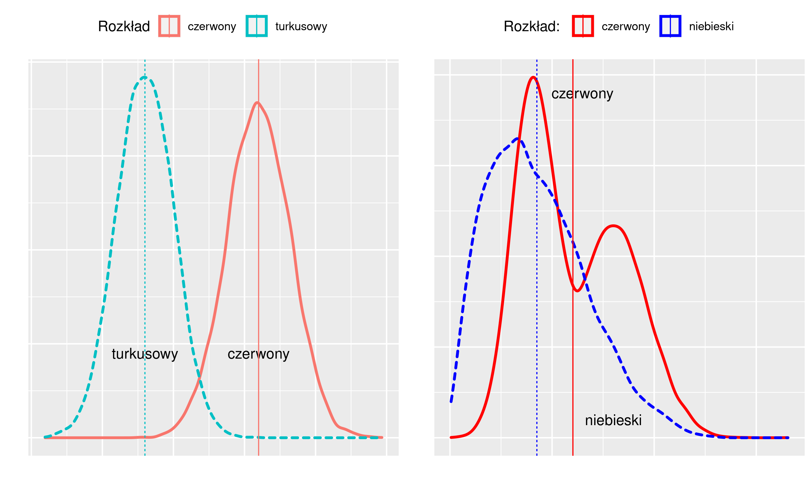
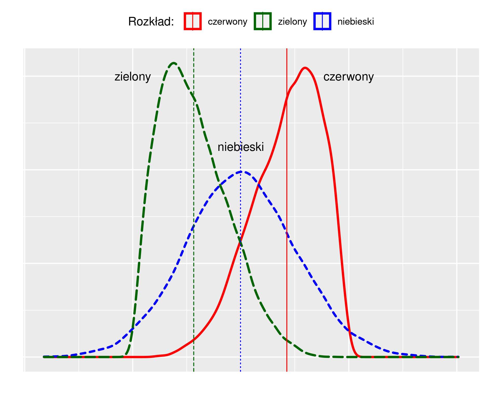

# Analiza jednej zmiennej {#analiza1z}

**Statystyka opisowa** (opis statystyczny) to zbiór metod statystycznych służących do -- surprise, surprise -- opisu
(w sensie przedstawienia sumarycznego) zbioru danych;
w zależności od typu danych (przekrojowe, czasowe, przestrzenne) oraz sposobu pomiaru
(dane nominalne, porządkowe liczbowe) należy używać różnych metod.

W przypadku **danych przekrojowych** opis statystyczny nazywany jest **analizą struktury**
i sprowadza się do opisania danych z wykorzystaniem:

* tablic (statystycznych)

* wykresów

* parametrów (takich jak średnia czy mediana)

**Rozkład cechy** (zmiennej) to przyporządkowanie
wartościom cechy zmiennej odpowiedniej **liczby wystąpień** (liczebności albo częstości 
(czyli popularnych procentów).

**Analiza struktury** (dla jednej zmiennej) obejmuje:

* **określenie tendencji centralnej** (**miary położenia**:
  wartość przeciętna, mediana, dominanta);

* **zróżnicowanie wartości** (rozproszenie: odchylenie standardowe, rozstęp ćwiartkowy);

* **asymetrię** (rozłożenie wartości zmiennej wokół średniej);


## Tablice statystyczne

**Tablica statystyczna** to (w podstawowej formie) dwukolumnowa tabela zawierająca
wartości cechy oraz odpowiadające tym wartościom liczebności.

**Tablica dla cechy niemierzalnej (nominalnej albo porządkowej)**

::: {.example}
**Absolwenci studiów pielęgniarskich w ośmiu największych krajach UE**

```{r, echo=F}
members <- read.csv("eu_codes_members.csv", sep = ';', dec = ".",  header=T, na.string="NA" ) %>%
  add_row(member = 'Other', geo = "OTHER")
members.codes <- members$geo
members.big <-c ('DE', 'ES', 'FR', 'IT', 'PL', 'RO', 'NL', 'BE')

g0 <- read.csv("nursing_graduates_UE.csv", sep = ';', dec = ".",  header=T, na.string="NA" )

g1 <- g0 %>%
  filter (year == 2018 & isco08 == 'OC2221_3221' & unit == 'NR') %>%
  filter (geo %in%  members.codes) %>%
  filter (geo %in%  members.big) %>%
  mutate ( geo =  as.factor(geo)) %>%
  left_join(members, by='geo') %>%
  select (member, values)

t1 <- kable(g1, col.names = c('kraj', 'liczba'), booktabs = TRUE)
```

Tablica: Absolwenci studiów pielęgniarskich w ośmiu największych
krajach UE w roku 2018

```{r, echo=F}
t1
```

Źródło: Eurostat, tablica Health graduates (HLTH_RS_GRD)
:::

W przykładzie **jednostką badania** jest absolwent studiów pielęgniarskich w roku 2018, 
**badaną cechą** zaś **kraj w którym ukończył studia** (cecha nominalna).


**Tablica dla cechy mierzalnej liczbowej skokowej**

Cecha skokowa to taka cecha, która może przyjąć skończoną liczbę wartości.
Matematycznym odpowiednikiem cechy skokowej jest zbiór liczb całkowitych.

Jeżeli tych wartości jest mało tablica zawiera wyliczenie
wartości cechy i odpowiadających im liczebności. Jeżeli liczba wariantów
cechy jest duża tablica zawiera klasy wartości (przedziały wartości)
oraz odpowiadające im liczebności.

Liczba przedziałów jest dobierana metodą prób i błędów, tak aby:

* przedziały wartości powinny być jednakowej rozpiętości.

* Na zasadzie wyjątku dopuszcza się aby pierwszy i ostatni przedział
  były **otwarte**, tj. nie miały dolnej (pierwszy) lub górnej (ostatni) **granicy**

* nie było przedziałów z zerową liczebnością

* przedziałów nie było za dużo ani za mało (typowo 8--15)

* większość populacji nie znajdowała się w jednej czy dwóch przedziałach

::: {.example}
**Gospodarstwa domowe wg liczby samochodów**

Tablica: Gospodarstwa domowe we wsi X wg liczby samochodów w roku 2022

```{r, echo=F}
l.s <- c('0', '1', '2', '3 i więcej', 'razem')
n.s <- c(230, 280, 70, 5, 585)
samochody.L <- tibble(l.s, n.s) %>%
  mutate (p = n.s/585 * 100 )

t3 <- kable(samochody.L, col.names = c('liczba samochodów', 'liczba gospodarstw', '%'), booktabs = TRUE)
t3
```

Źródło: obliczenia własne
:::

**Tablica dla cechy mierzalnej liczbowej ciągłej**

Cecha ciągła to taka cecha, która może przyjąć nieskończoną/nieprzeliczalną liczbę wartości.
Matematycznym odpowiednikiem cechy skokowej jest zbiór liczb rzeczywistych.

Tablica zawiera klasy (przedziały) wartości
oraz odpowiadające im liczebności.

Liczba przedziałów jest dobierana metodą prób i błędów, tak aby:

* przedziały wartości powinny być jednakowej rozpiętości.

* Na zasadzie wyjątku dopuszcza się aby pierwszy i ostatni przedział
  były **otwarte**, tj. nie miały dolnej (pierwszy) lub górnej (ostatni) **granicy**

* nie było przedziałów z zerową liczebnością

* przedziałów nie było za dużo ani za mało (typowo 8--15)

* większość populacji nie znajdowała się w jednej czy dwóch przedziałach

* zwykle przyjmuje się za końce przedziałów **okrągłe liczby**
  bo dziwnie 
  by wyglądało gdyby koniec przedziału np. był równy 1,015 zamiast 1,0. 


::: {.example}
**Dzietność kobiet na świecie**

Współczynnik dzietności (*fertility ratio* albo FR) -- przeciętna liczba urodzonych dzieci przypadająca
na jedną kobietę w wieku rozrodczym (15–49 lat).
Przyjmuje się, iż FR między 2,10–2,15 zapewnia zastępowalność pokoleń.

Dane dotyczące dzietności dla wszystkich krajów świata pobrano
ze strony https://ourworldindata.org/grapher/fertility-rate-complete-gapminder)

```{r, echo=F}
dA <- read.csv("fertility_rate_2003_2018.csv", sep = ';',
  header=T, na.string="NA");
d2018 <- dA %>% filter(yr==2018)
s2018 <- summary(d2018$frate)
mean2018 <- s2018[["Mean"]]
median2018 <- s2018[["Median"]]
srednia2018 <- s2018[["Mean"]]
min2018 <- s2018[["Min."]]
max2018 <- s2018[["Max."]]
N2018 <-nrow(d2018)

q1.2018 <- quantile(d2018$frate, probs = 0.25)
q3.2018 <- quantile(d2018$frate, probs = 0.75)
```

Zbudujmy tablicę przedstawiającą rozkład współczynników dzietności w roku 2018.
Krajów jest `r N2018`. Wartość minimalna wynosi `r min2018` a wartość
maksymalna to `r max2018`. Decydujemy się na rozpiętość przedziału równą 0,5;
dolny koniec pierwszego przedziału przyjmujemy jako 1,0.


Tablica: Kraje świata według współczynnika dzietności (2018)

```{r, echo=F}
## https://www.statology.org/data-binning-in-r/
d2018 <- d2018 %>% mutate(frateClass = cut(frate, breaks=seq(1, 8, by=.5)))
##levels(d2018$frateClass)

d2018s <- d2018 %>% group_by(frateClass) %>% summarise(n=n())

t2 <- kable(d2018s, col.names = c('Wsp. dzietności', 'liczba krajów'), booktabs = TRUE)
t2
```

Źródło: https://ourworldindata.org/grapher/fertility-rate-complete-gapminder

:::


Każda tablica statystyczna **musi** mieć:

1. Część liczbową (kolumny i wiersze); 

   + żadna rubryka w części liczbowej nie może być pusta (żelazna zasada); w szczególności brak danych należy
     explicite zaznaczyć umownym symbolem
   
2. Część opisową:

   + tytuł tablicy; 
   + nazwy (opisy zawartości) wierszy; 
   + nazwy (opisy zawartości) kolumn; 
   + wskazanie źródła danych;
   + ewentualne uwagi odnoszące się do danych liczb.

Pominięcie czegokolwiek z powyższego jest **ciężkim błędem**. Jeżeli
nie ma danych (a często nie ma--z różnych powodów -- należy to zaznaczyć a nie
pozostawiać pustą rubrykę)

## Wykresy

**Wykresy statystyczne** są graficzną formą prezentacji materiału
statystycznego, są mniej precyzyjne i szczegółowe niż tablice,
natomiast bardziej sugestywne.

Celem jest pokazanie rozkładu wartości cechy w populacji: jakie wartości występują
często a jakie rzadko, jak bardzo wartości różnią się między sobą. Jak różnią
się rozkłady dla różnych, ale logicznie powiązanych populacji
(np rozkład czegoś-tam w kraju A i B albo w roku X, Y i Z).

Do powyższego celu celu stosuje się: 

* **wykres słupkowy** (skala nominalna/porządkowa)

* **wykres kołowy** (skala nominalna/porządkowa)

* **histogram** (albo wykres słupkowy dla skal nominalnych)

Uwaga: **wykres kołowy** jest
zdecydowanie gorszy od wykresu słupkowego i nie jest zalecany.
**Każdy** wykres kołowy można wykreślić jako słupkowy i w takiej postaci
będzie on bardziej zrozumiały i łatwiejszy w interpretacji.

### Skala nominalna

Wykres słupkowy (*bar chart*)

:::{.example}

```{r, echo=F, out.width="70%"}
g2 <- g0 %>%
  filter (year == 2018 & isco08 == 'OC2221_3221' & unit == 'NR') %>%
  filter (geo %in%  members.codes) %>%
  mutate(geo=recode(geo,
    'AT' = 'AT', 'BE' = 'BE', 'BG' = 'BG', 'CY' = 'OTHER', 'CZ' = 'CZ',
    'DE' = 'DE', 'DK' = 'DK', 'EE' = 'OTHER', 'EL' = 'EL',
    'ES' = 'ES', 'FI' = 'FI', 'FR' = 'FR', 'HR' = 'HR', 'HU' = 'HU',
    'IE'= 'IE', 'IT' = 'IT', 'LT' = 'OTHER', 'LU' = 'OTHER',
    'LV' = 'OTHER', 'MT' = 'OTHER', 'NL' = 'NL', 'PL' = 'PL', 'PT' = 'PT',
    'RO' = 'RO', 'SI' = 'SI', 'SK' = 'SK' )) %>%
  group_by(geo) %>%
  summarise(values=sum(values)) %>%
  mutate ( geo =  as.factor(geo)) %>%
  left_join(members, by='geo') %>%
  select (member, values)

pc4 <- ggplot(g1, aes(x = reorder(member, values), y=values )) +
  geom_bar(stat="identity", fill='blue') +
  xlab(label="") + 
  ylab(label="") +
  theme(legend.position = "none") +
  coord_flip()+ 
  ggtitle("Absolwenci studiów pielęgniarskich w ośmiu największych krajach UE w roku 2018") +
  theme(plot.title = element_text(hjust = 0.5, size=12)) +
  labs(caption="Źródło: Eurostat, tablica Health graduates (HLTH_RS_GRD)")
pc4
```
:::

Wykres kołowy (*pie chart*)

:::{.example}

```{r, echo=F, out.width="70%"}
pc2 <- g1 %>%
  mutate(pct = values/sum(values)*100)  %>%
  ggplot(aes(x="", y=pct, fill=member)) + # pct used here so slices add to 100
  geom_bar(stat="identity", width=1) +
  coord_polar("y", start=0) +
  geom_text(aes(label = values), size=3, position = position_stack(vjust=0.5)) +
  ggtitle("Absolwenci studiów pielęgniarskich w ośmiu największych krajach UE w roku 2018") +
  ##facet_wrap(~pie, ncol = 2) +
  theme_void() +
  theme(legend.position = "right") +
  theme(plot.title = element_text(hjust = 0.5, size=12)) +
  labs(caption="Żródło: Eurostat, tablica Health graduates (HLTH_RS_GRD)")
pc2
```
:::

Wykres słupkowy i kołowy przedstawiają dokładnie to samo.

Wykres kołowy wygląda zapewne efektowniej (z uwagi na paletę kolorów)
ale jest mniej efektywny. Wymaga legendy w szczególności, która utrudnia 
interpretację treści (nieustannie trzeba porównywać koło z legendą żeby ustalić
który kolor to który kraj.)

Jeżeli zwiększymy liczbę krajów wykres kołowy staje się zupełnie nieczytelny
(brakuje rozróżnialnych kolorów a wycinki koła są zbyt wąskie żeby cokolwiek
wyróżniały):

:::{.example}

```{r, echo=F, out.width="70%"}
pc21 <- g2 %>%
  mutate(pct = values/sum(values)*100)  %>%
  ggplot(aes(x="", y=pct, fill=member)) + # pct used here so slices add to 100
  geom_bar(stat="identity", width=1) +
  coord_polar("y", start=0) +
  geom_text(aes(label = values), size=3, position = position_stack(vjust=0.5)) +
  ##facet_wrap(~pie, ncol = 2) +
  theme_void() +
  theme(plot.title = element_text(hjust = 0.5, size=12)) +
  ggtitle("Absolwenci studiów pielęgniarskich w krajach UE w roku 2018") +
  theme(legend.position = "right") +
  labs(caption="Żródło: Eurostat, tablica Health graduates (HLTH_RS_GRD)")
pc21
```

Wykres słupkowy dalej jest natomiast OK:

```{r, echo=F, out.width="70%"}
pc41 <- ggplot(g2, aes(x = reorder(member, values), y=values )) +
  geom_bar(stat="identity", fill='blue') +
  xlab(label="") + 
  ylab(label="") +
  theme(legend.position = "none") +
  coord_flip()+ 
  ggtitle("Absolwenci studiów pielęgniarskich w krajach UE w roku 2018") +
  theme(plot.title = element_text(hjust = 0.5, size=12) ) +
  labs(caption="Żródło: Eurostat, tablica Health graduates (HLTH_RS_GRD)")
pc41
```
:::

### Skala liczbowa

Histogram to coś w rodzaju wykresu słupkowego tylko na jednej osi zamiast
wariantów cechy są przedziały wartości.

:::{.example}

```{r message=FALSE, echo=FALSE, out.width="70%"}
h2018 <- ggplot(d2018, aes(x = frate)) + 
 geom_histogram(binwidth = 0.25, fill=default_cyan) +
 ylab("liczba krajów") +
 xlab("współczynnik dzietności") +
 ggtitle("Kraje świata według współczynnika dzietności (2018)") +
 theme(plot.title = element_text(hjust = 0.5, size=12) ) +
 labs(caption="źródło: https://ourworldindata.org/grapher/fertility-rate-complete-gapminder") +
 coord_cartesian(ylim = c(0, 30), xlim=c(0, 8))
h2018

```
:::

Podobnie jak tablice, rysunki powinny być opatrzone tytułem
oraz zawierać źródło wskazujące na pochodzenie danych
(zobacz przedstawione przykłady.)

## Statystyczka Florence Nightingale {#fnightingale}

Nie każdy kto wie kim była Florence Nightingale, wie że
była ona także statystykiem. W czasie wojny krymskiej nie tylko 
zorganizowała opiekę nad rannymi żołnierzami, ale również
-- aby przekonać swoich przełożonych do zwiększenia nakładów na szpitale polowe 
-- prowadziła staranną ewidencję szpitalną oraz 
zgromadzone dane potrafiła analizować, używając wykresów własnego projektu.

W szczególności słynny jest diagram Nightingale zwane także 
różą Nightingale (rys. \@ref(fig:nightingale)), które wprawdzie
(podobno) nie okazały się szczególnie użyteczny, no ale nie każdy nowy 
pomysł jest od razu genialny:

```{r nightingale, out.width="90%", fig.cap = "Róża Nightingale"}
knitr::include_graphics("./FN_diagram.jpg")
```


Jest to coś w rodzaju wykresu słupkowego tyle że zamiast słupków są wycinki koła. Wycinków jest dwanaście tyle ile miesięcy.
Długość promienia a co za tym idzie wielkość pola wycinka zależy od wielkości zjawiska,
który reprezentuje (przyczyna śmierci: rany/choroby/inne)

Wpisując Florence+Nightingale można znaleźć dużo informacji 
na temat, w tym: http://www.matematyka.wroc.pl/ciekawieomatematyce/pielegniarka-statystyczna

W 1859 roku Nightingale została wybrana jako pierwsza kobieta na członka Royal Statistical Society (Królewskie Stowarzyszenie Statystyczne) oraz została honorowym członkiem American Statistical Association (Amerykańskiego Stowarzyszenia Statystycznego).  

Więc szanowi czytelnicy wnioski są oczywiste :-) 

## Analiza parametryczna

Analiza parametryczna z oczywistych względów dotyczy tylko zmiennych
mierzonych na skali liczbowej.

### Miary położenia

Miary przeciętne (**położenia**) charakteryzują średni lub
typowy poziom wartości cechy. Są to więc takie wartości, wokół których
skupiają się wszystkie pozostałe wartości analizowanej cechy.


```{r distributions5, out.width="99%", fig.cap = "Rozkłady cechy a miary średnie"}

```

Na rysunku \@ref(fig:distributions5) po lewej mamy dwa rozkłady różniące się poziomem przeciętnym. Rozkład 
czerwony ma przeciętnie większe wartości
niż turkusowy. Są to rozkłady **jednomodalne**, czyli takie, w których rozkład cechy skupia się 
wokół jednej wartości.
Dla takich rozkładów ma sens obliczanie średniej arytmetycznej. Te średnie wartości
są zaznaczone na rysunku linią pionową.

Na rysunku po prawej mamy rozkłady **nietypowe**: **wielomodalne** (czerwony)
lub **niesymetryczne** (niebieski). W rozkładzie niesymetrycznym wartości skupiają się nie centralnie,
ale po prawej/lewej od środka przedziału zmienności/wartości średniej).

W świecie rzeczywistym zdecydowana większość rozkładów jest jednomodalna. 
Rzadkie przypadki rozkładów wielomodalnych zwykle wynikają z łącznego analizowania
dwóch różniących się wartością średnią zbiorów danych.
Oczywistym zaleceniem w takiej sytuacji jest analiza każdego zbioru oddzielnie.

Rodzaje miar położenia


* klasyczne 
  + **średnia arytmetyczna**
* pozycyjne 
  + **mediana**
  + **dominanta**
  + **kwartyle**
  + ewentualnie kwantyle, decyle, centyle (rzadziej używane)

**Średnia arytmetyczna** (*Mean*, *Arithmetic mean*) to łączna suma
wartości podzielona przez liczbę sumowanych jednostek. Jeżeli
wartość jednostki $i$ w $N$-elementowym zbiorze oznaczymy 
jako $x_i$ (gdzie: $i=1,\ldots,N$) to
średnią można zapisać jako $\bar x = (x_1 + \cdots + x_N)/N$

Uwaga: we wzorach statystycznych zmienne zwykle oznacza się małymi literami
a średnią dla zmiennej przez umieszczenie nad nią kreski poziomej czyli
$\bar x$ to średnia wartość zmiennej $x$.

**Mediana** (*Median*, kwartyl drugi) dzieli **uporządkowaną** zbiorowość na dwie równe części;
połowa jednostek ma wartości cechy mniejsze lub równe medianie, a połowa
wartości cechy równe lub większe od mediany. 
Stąd też mediana bywa nazywana wartością środkową.

Własności mediany: odporna na wartości nietypowe (w przeciwieństwie do średniej)

**Kwartyle**: coś jak mediana tylko bardziej szczegółowo. Kwartyli jest trzy i dzielą
one zbiorowość na 4 równe części, każda zawierająca 25% całości. 

Pierwszy kwartyl dzieli **uporządkowaną** zbiorowość w proporcji 25%--75%.
Trzeci dzieli **uporządkowaną** zbiorowość w proporcji 75%--25%. 
Drugi kwartyl to mediana.

**Kwantyle** (D, wartości dziesiętne), podobnie jak kwartyle, tyle że dzielą na 10 części.

**Centyle** (P, wartości setne), podobnie jak kwantyle tyle że dzielą na 100 części.
Przykładowo wartość 99 centyla i mniejszą ma 99% jednostek w populacji.

::: {.example}
**Współczynnik dzietności na świecie w roku 2018**

Średnia: `r sprintf ("%.2f", mean2018)`.
Interpretacja: średnia wartość współczynnika dzietności wyniosła
`r sprintf ("%.2f", mean2018)` dziecka.
Mediana: `r median2018`. Interpretacja mediany: współczynnik dzietności 
w połowie krajów na świecie
wynosiła `r median2018` dziecka i mniej.

Uwaga: średnia dzietność na świecie **nie wynosi** `r sprintf ("%.2f", mean2018)` dziecka
(bo po pierwsze uśredniamy kraje a nie kobiety a po drugie kraje różnią się liczbą ludności).
Podobnie dzietność połowy kobiet na świecie wyniosła
`r median2018` dziecka i mniej jest niepoprawną interpretacją mediany (z tych samych
względów jak w przypadku średniej.)

:::

**Generalna uwaga**: interpretacja średniej-średnich często jest nieoczywista i należy uważać.
(a współczynnik dzietności jest średnią: średnia liczba dzieci urodzonych przez kobietę 
w wieku rozrodczym. Jeżeli liczymy średnią dla 202 krajów, to mamy *średnią-średnich*).
Inny przykład: odsetek ludności w wieku poprodukcyjnym wg powiatów (średnia z czegoś takiego
nie da nam odsetka ludności w wieku poprodukcyjnym w Polsce, 
bo powiaty różnią się liczbą ludności.)

::: {.example}
**Współczynnik dzietności (kontynuacja)**:

Pierwszy kwartyl: `r q1.2018`; trzeci kwartyl `r q3.2018` co oznacza że
25% krajów miało wartość współczynnika dzietności nie większą niż `r q1.2018` dziecka
a 75% krajów miało wartość współczynnika dzietności 
nie większą niż `r q3.2018` dziecka.
:::

### Miary zmienności

Miary zmienności określają zmienność (dyspersję albo rozproszenie) w zbiorowości

Rodzaje miar zmienności:

* Klasyczne
  + Wariancja i odchylenie standardowe

* Pozycyjne
  + rozstęp
  + rozstęp ćwiartkowy

**Wariancja** (*variance*) jest to średnia arytmetyczna kwadratów
odchyleń poszczególnych wartości cechy od średniej arytmetycznej
zbiorowości. Co można zapisać

$$s^2 = \frac{1}{N} \left( (x_1 - \bar x)^2 + (x_2 - \bar x)^2 + 
\cdots +  (x_N - \bar x)^N \right)$$ 

Przy czym często zamiast dzielenie przez $N$ dzielimy przez $N-1$.

**Odchylenie standardowe** (*standard deviation*, sd) jest
pierwiastkiem kwadratowym z wariancji. Parametr ten określa
przeciętną różnicą wartości cechy od średniej arytmetycznej.

**Rozstęp ćwiartkowy** (*interquartile range*, IQR) ma banalnie prostą definicję:

$$
R_Q = Q_3 - Q_1
$$
gdzie: $Q_1$, $Q_3$ oznaczają odpowiednio pierwszy oraz trzeci kwartyl.

::: {.example}
**Współczynnik dzietności (kontynuacja)**

```{r, echo=F}
sd2018 <-  sd(d2018$frate)
iqr2018 <- q3.2018 - q1.2018
```

Średnie odchylenie od średniej wartości współczynnika
wynosi `r sprintf("%.2f", sd2018)` dziecka. 
Wartość rozstępu ćwiartkowego wynosi `r sprintf("%.2f", iqr2018)` dziecka.
:::

**Uwaga**: odchylenie standardowe/ćwiartkowe są miarami mianowanymi. Zawsze należy
podać jednostkę miary.

### Miary asymetrii

Asymetria (*skewness*), to odwrotność symetrii. Szereg jest symetryczny
jeżeli jednostki są rozłożone „równomiernie” wokół wartości średniej.
W szeregu symetrycznym wartości średniej i mediany są sobie równe.
Skośność może być dodatnia (*positive skew*) lub ujemna (*negative skew*). 
Czym się różni jedna od drugiej widać na rysunku \@ref(fig:skeweness).

```{r skeweness, out.width="75%", fig.cap = "Rozkłady symetryczne i asymetryczne"}

```


Miary asymetrii:

* klasyczny współczynnik asymetrii ($g$)

  + przyjmuje wartości ujemne dla asymetrii lewostronnej; a dodatnie
    dla prawostronnej. Teoretycznie może przyjąć dowolnie dużą wartość
    ale w praktyce rzadko przekracza 3 do do wartości bezwzględnej.
  + wartości większe od 2 świadczą o dużej a większe od 3 o bardzo dużej
    asymetrii

* współczynniki asymetrii Pearsona ($W_s$)
  + wykorzystuje różnice między średnia Medianą: $W_s = (\bar x - Me)/s$

* Współczynnik asymetrii (skośności) oparty na odległościach 
  między kwartylami lub decylami:
  
  + Obliczany jest według następującej 
    formuły: $W_{sq} =  \frac{(Q_3 - Q_2) - (Q_2 - Q_1)}{Q_3 - Q_1}$
 
## Porównanie wielu rozkładów

Często strukturę jednego rozkładu należy porównać z innym. Albo trzeba porównać
strukturę wielu rozkładów. Pokażemy jak to zrobić na przykładzie.

```{r}
hw <- 4

fb <- read.csv("rwc-2015-2023.csv", sep = ';', dec = ".",  header=T, na.string="NA" ) %>%
  select(year, weight, poscode )

```

::: {.example}
**Masa ciała uczestników Pucharu Świata w Rugby**

W turniejach o puchar świata w Rugby w latach 2015, 2019 i 2023 uczestniczyło łącznie `r nrow(fb)` zawodników.
W grze w rugby drużyna jest podzielona na dwie **formacje**: ataku i młyna. Należy scharakteryzować
rozkład masy ciała zawodników obu formacji.

**Zawodnicy ataku**

```{r, out.width="70%"}
backs <- c('BR', 'CE', 'FB', 'FH', 'WI', 'SH', 'HB', 'BB')
forwards <- c('PR', 'SR', 'HK', 'FF')

fb <- fb %>% mutate (poscode = recode(poscode,
'BR' = 'A',
'CE' = 'A',
'FB' = 'A',
'FH' = 'A',
'WI' = 'A',
'SH' = 'A',
'HB' = 'A',
'BB' = 'A',
'PR' = 'M',
'SR' = 'M',
'HK' = 'M',
'FF' = 'M'
                                    ) )

b <- fb %>% filter (poscode == 'A')

mean.b <- mean(b$weight, na.rm = T)  
median.b <- median(b$weight, na.rm=T) 
q1.b <- quantile(b$weight, probs=.25, na.rm  =TRUE)
q3.b <- quantile(b$weight, probs=.75, na.rm =TRUE) 
iqr.b <- IQR(b$weight, na.rm = T)
sd.b <- sd(b$weight, na.rm=T)
```

Przeciętnie zawodnik ataku ważył `r sprintf ("%.1f", mean.b)` kg; 
mediana `r sprintf("%.1f", median.b)` kg (połowa
zawodników ataku ważyła `r sprintf ("%.1f", median.b)` kg i mniej);
pierwszy/trzeci kwartyl `r q1.b`/`r q3.b` kg (1/4 zawodników
ataku ważyła `r q1.b` kg i mniej; 
1/4 zawodników ataku ważyła `r q3.b` kg i więcej;

Odchylenie standardowe `r sprintf("%.1f", sd.b)` kg (przeciętnie
odchylenie od średniej arytmetycznej wynosi `r sprintf("%.1f", sd.b)` kg);
rozstęp ćwiartkowy wynosi `r iqr.b` kg (rozstęp 50% środkowych wartości 
wynosi `r iqr.b` kg)

Histogram przy przyjęciu długości przedziału równej `r hw`kg 
(linia zielona  oznacza poziom średniej):

```{r, warning=FALSE, out.width="70%"}
h1.b <- ggplot(b, aes(x = weight)) + 
  geom_histogram(binwidth = hw, fill='deepskyblue3') +
  ylab("N") +
  xlab("kg") +
  geom_vline(xintercept = mean.b, colour="forestgreen", size=1) +
  ggtitle("Masa ciała zawodników ataku")
h1.b
```

**Zawodnicy młyna**

```{r, out.width="70%"}
f <- fb %>% filter (poscode == 'M' )

mean.f <- mean(f$weight, na.rm=T)  
median.f <- median(f$weight, na.rm=T) 
q1.f <- quantile(f$weight, probs=.25, na.rm =T)
q3.f <- quantile(f$weight, probs=.75, na.rm =T)
iqr.f <- IQR(f$weight, na.rm = T)
sd.f <- sd(f$weight, na.rm=T)
```

Średnio zawodnik młyna ważył `r sprintf ("%.1f", mean.f)` kg; 
mediana `r sprintf("%.1f", median.f)` kg (połowa zawodników
młyna ważyło `r median.f` kg i mniej);
pierwszy/trzeci kwartyl `r q1.f`/`r q3.f` kg (1/4 zawodników
młyna ważyło `r q1.f` kg i mniej; 
1/4 zawodników młyna ważyło `r q3.f` kg i więcej;

Odchylenie standardowe `r sprintf("%.1f", sd.f)` kg (przeciętnie
odchylenie od średniej arytmetycznej wynosi `r sprintf("%.1f", sd.f)` kg);
rozstęp ćwiartkowy wynosi `r iqr.f` kg (rozstęp 50% środkowych wartości 
wynosi `r iqr.f` kg)

Histogram przy przyjęciu długości przedziału równej `r hw`kg
(linia zielona  oznacza poziom średniej):

```{r, warning=FALSE, out.width="70%"}
h1.f <- ggplot(f, aes(x = weight)) + 
  geom_histogram(binwidth = hw, fill='deepskyblue3') +
  ylab("N") +
  xlab("kg") +
  geom_vline(xintercept = mean.f, colour="forestgreen", size=1) +
  ggtitle("Masa ciała zawodników młyna")
h1.f
```

**Porównanie atak vs młyn**


| Miara      | Atak         |  Młyn        |
|------------|--------------|--------------|
| średnia    | `r mean.b`   | `r mean.f`   |
| mediana    | `r median.b` | `r median.f` |
| odchyl.st  | `r sd.b`     | `r sd.f`     |
| iqr        | `r iqr.b`    | `r iqr.f`    |

średnio zawodnik młyna ważył prawie 20 kg więcej od zawodnika ataku (w przypadku mediany
jest to dokładnie 20 kg więcej). 
Zmienność mierzona wielkością odchylenia standardowego oraz IQR jest w obu grupach podobna.

```{r}
ggarrange(h1.b, h1.f, ncol = 2, nrow = 1)
```
:::

### Wykres pudełkowy

Do porównania wielu rozkładów szczególnie użyteczny jest wykres zwany pudełkowym (**box-plot**).

Pudełka na wykresie pudełkowym są rysowane według następujących zasad 
(por rysunek \@ref(fig:boxplot)):

* lewy i prawy bok pudełka jest równy kwartylom;
* linia pionowa w środku pudełka jest równa medianie;
* linie poziome (zwane wąsami) mają długość równą $Q_1 - 1,5 \textrm{IQR}$ 
  oraz $Q_3 + \textrm{IQR}$
  (dla przypomnienia: $Q_1$, $Q_3$ to kwartyle, zaś $\textrm{IQR}$ to rozstęp ćwiartkowy);
* kropki przed oraz za wąsami to wartości zmiennej większe od
  $Q_3 + 1,5 \textrm{IQR}$ lub mniejsze od $Q_1 - 1,5 \textrm{IQR}$.

```{r boxplot, out.width="80%", fig.cap = "Wykres pudełkowy"}
knitr::include_graphics("./boxPlotExample.png")
```
  
Interpretacja pudełek:

* linia pozioma w środku pudełka określa przeciętny poziom zjawiska;
* długość pudełka oraz wąsów określa zmienność (im większe wąsy/długość pudełka
  tym większa zmienność);
* kropki przed oraz za wąsami 
  to **obserwacje nietypowe** (albo **wartości odstające**).

Zatem dolny rozkład z rysunku \@ref(fig:boxplot) ma mniejszą wartość
średnią oraz większą zmienność od rozkładu górnego. Dolny
rozkład posiada też wartości odstające, a górny nie.

Zwróć uwagę na sztuczkę: wartości nietypowe nie są definiowane jako na przykład górne/dolne
1% wszystkich wartości (bo wtedy **każdy rozkład** miałby wartości nietypowe),
ale jako wartości mniejsze/większe od $Q_* \pm 1,5 \times \mathrm{IQR}$.
Wszystkie wartości rozkładów o umiarkowanej zmienności mieszczą się wewnątrz czegoś takiego.

Typowo wykres zawiera wiele pudełek a każde pudełko wizualizuje jeden rozkład. Pudełka
mogą być umieszczone jedno pod drugim, tak jak na rysunku \@(fig:boxplot) lub
jedno obok drugiego jak na przykładach poniżej.

::: {.example}
**Masa ciała rugbystów** 

```{r, out.width="70%"}
pow <- fb %>%
  na.omit() %>%  ggplot(aes(y=weight, x=poscode, fill=weight)) + 
  geom_boxplot() + 
  ylab("#") +
  ggtitle("Masa ciała zawodników młyna wg formacji") +
  xlab('')
pow
```
:::

Z wykresu od razu widać, który rozkład ma wyższą średnią, który większe
rozproszenie oraz w którym występują wartości nietypowe.

Pudełek może być więcej niż dwa oczywiście. Następny przykład
pokazuje
porównanie rozkładów masy ciała zawodników rugby na poszczególnych turniejach.

::: {.example}
**Masa ciała rugbystów**

```{r, out.width="70%"}
pox <- fb %>%
  na.omit() %>%  ggplot(aes(y=weight, x=as.factor(year), fill=weight)) + 
  geom_boxplot() + 
  ylab("#") +
  ggtitle("Masa ciała zawodników w turniejach PŚ w rugby") +
  xlab('')
pox
```
:::

Od razu widać, że przeciętnie najciężsi zawodnicy byli na turnieju w roku 2019;
największe zróżnicowanie masy
ciała występowało na turnieju w roku 2023.

## Zestawienie metod opisu statystycznego

W rozdziale przedstawiono osiem sposobów opisania rozkładu zmiennej:

1. Tablice statystyczne

2. Wykres słupkowy

3. Wykres kołowy (niezalecany)

4. Histogram

5. Wykres pudełkowy

6. Miary tendencji centralnej: średnia, mediana, kwartyle

7. Miary rozproszenia: odchylenie standardowe, rozstęp ćwiartkowy

8. Miary asymetrii
