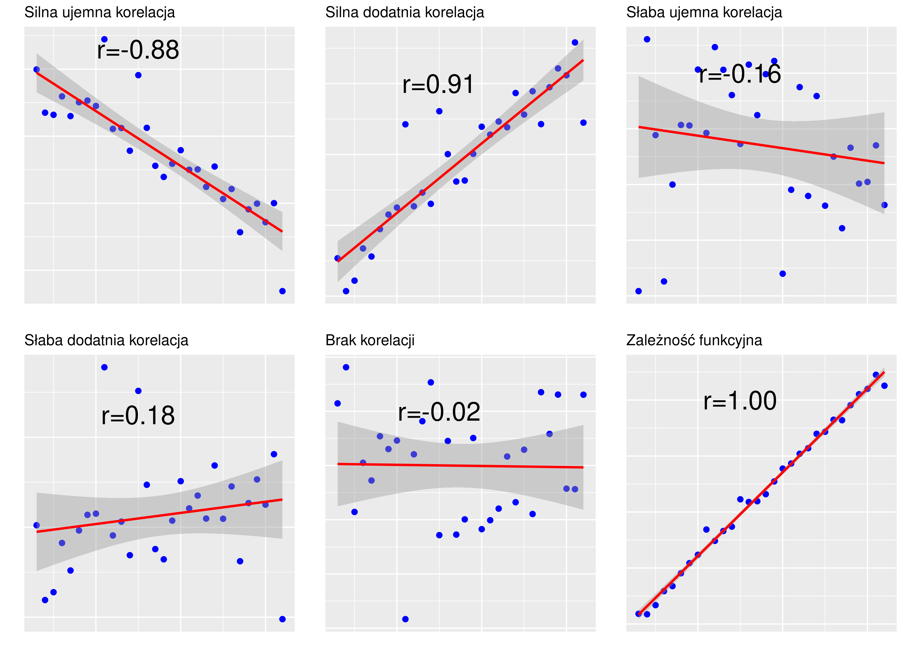
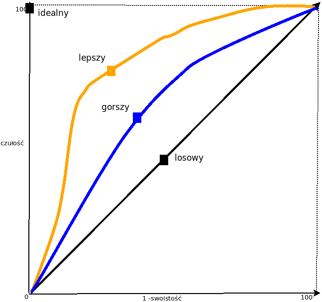

# Analiza współzależności pomiędzy zmiennymi {#causality}

Pomiędzy zjawiskami występują związki (zależności.) Nauki formułują te związki
w postaci **praw**. Jak takie **prawo naukowe** powstaje? Typowo w dwu etapach,
najpierw za pomocą **dedukcji** stawia się **hipotezę**, potem konfrontuje się 
hipotezę z danymi (podejście hipotetyczno-dedukcyjne). 
Na tym drugim etapie używa się statystyki (lub matematyki jeżeli prawo ma charakter deterministyczny)

Upraszczając *metoda hypodedukcji* sprowadza się do dedukcyjnego sformułowania hipotezy, która następnie jest empirycznie *falsyfikowana*, tj. próbuje się wykazać, że jest ona nieprawdziwa. Konsekwencje:
nie można dowieść prawdziwości żadnej hipotezy, można natomiast wykazać, że 
hipoteza jest fałszywa.

Związki między cechami mogą być: **funkcyjne** (nauki przyrodnicze) -- wartościom jednej zmiennej odpowiada tylko jedna wartość drugiej zmiennej lub
**stochastyczne** -- wartościom jednej zmiennej odpowiadają z pewnym
przybliżeniem wartości innej zmiennej.

Problem: czy istnieje związek (zależność) pomiędzy cechami? 
Przykładowo czy istnieje związek pomiędzy paleniem (przyczyna)
a chorobą nowotworową (skutek), wiekiem a prawdopodobieństwem zgonu z powodu COVID19 itd.

Jaki jest charakter zależności? Jaka jest siła zależności?

Rodzaj metod zastosowanej do empirycznej weryfikacji zależy 
w szczególności od sposobu pomiaru danych (nominalne, porządkowe, liczbowe.)
co pokazano na rysunku \@ref(fig:metodyAZ).

```{r metodyAZ, out.width="90%", fig.cap = "Metody statystycznej weryfikacji zależności pomiędzy zmiennymi"}
knitr::include_graphics("./DiagramMetod.png")
```

Optymistyczną informacją jest że metod (oznaczonych krojem pogrubionym na diagramie), 
które omawiamy dalej w rozdziale, jest raptem siedem czyli niedużo.


## Dwie zmienne nominalne

### Ryzyko względne oraz iloraz szans {#oddsSec}

Ryzyko to udział (iloraz) liczby sukcesów do liczby prób (zdarzeń pozytywnych/wyróżnionych do wszystkich). Zwykle podawany w procentach. Warto zauważyć że jest to 
empiryczny odpowiednik prawdopodobieństwa.

::: {.example}
**Podawanie witaminy C a przeziębienie/brak przeziębienia**

Eksperyment przeprowadził Linus Pauling (laureat nagrody Nobla 
za odkrycie witaminy C).

Eksperyment Paulinga polegał na tym, że podzielił 280 narciarzy na dwie grupy
po 140 osób. Przez 5--7 dni podawał witaminę C jednej grupie
oraz placebo drugiej grupie.
Obserwował zachorowania na przeziębienie przez następne dwa tygodnie.
Jeden narciarz nie dokończył eksperymentu. Historia milczy dlaczego :-)

W grupie 139 narciarzy, którym podano witaminę C
(grupa C) zachorowało 17. W grupie 140 narciarzy, którym podano placebo (grupa P)
zachorowało 31. Zatem:

* Ryzyko zachorowania w grupie C wyniosło 17/139 = 12,2%.
* Ryzyko zachorowania w grupie P wyniosło 31/140 = 22,14%

Na tzw. chłopski rozum jeżeli witamina C **nie działa**, to powinien
zachorować ten sam odsetek narciarzy w obu grupach. 
A tak nie jest jak widać...
:::

Prostymi miarami oceny siły zależności mogą być: 

* różnica  ryzyk (**risk difference**)
* ryzyko względne (**relative risk**), oraz 
* iloraz szans (**odds ratio**).

Jeżeli $r_e$ oznacza ryzyko w grupie eksperymentalnej 
(test group; grupa narażona/exposed group),
a $r_k$ w grupie kontrolnej (control group; grupa nienarażona/unexposed), 
to **różnica ryzyk** to po prostu $r_e - r_k$.
W przykładzie będzie to $22,14 - 12,2 = -9,94$%
Ta miara aczkolwiek prosta jest rzadko stosowana. 

Znacznie częściej używa się **ryzyka względnego** definiowanego jako
$RR = r_e/r_k$. W przykładzie będzie to $12,2/22,14 = 0,55$. 
Podanie witaminy C zmniejsza ryzyko zachorowania o prawie połowę. 
Oczywiste jest, że $RR < 1$ oznacza zmniejszenie
ryzyka; $RR > 1$ oznacza zwiększenia; $RR = 1$ oznacza brak zależności.

Zamiast ryzyka (czyli ilorazu liczby sukcesów do liczby prób) można używać
pojęcia szansa/szansy (**odds**) definiowanego
jako iloraz sukcesów do porażek. 

Jeżeli $o_e$ oznacza szanse w grupie eksperymentalnej 
a $o_k$ w grupie kontrolnej, to **iloraz szans** (*odds ratio*), jest
definiowany jako stosunek $\textrm{OR} = o_e/o_k$.

Przykładowo jeżeli w dwukrotnym rzucie monetą otrzymano orła i reszkę to ryzyko
otrzymania orła wynosi 1/2 = 0,5 a szansa otrzymania orła wynosi 1/1 = 1.

::: {.example}
**Narciarze Paulinga (kontynuacja)** 

Ryzyko zachorowania w grupie C wynosi 12,2 (jak wiemy); natomiast szansa, że narciarz grupie C
zachoruje wynosi 17/122 = 13,9%. (A w grupie P wynosi 28,44%).

Jak widać dla dużych ryzyk (rzut monetą) szansa 
różni się znacznie od prawdopodobieństwa, ale dla małych ryzyk obie miary mają zbliżoną wartość.

Zatem iloraz szans
dla narciarzy wyniesie 13,9/28,44 = 0,48.
Podanie witaminy C zmniejsza szansę na zachorowanie o ponad połowę. 
Albo 1/0,48 = 2,04, narciarz który nie brał witaminy C ma ponad 
dwukrotnie większą szansę na zachorowanie.
:::

Właściwości ilorazu szans: 

* jeżeli równe 1 to sukces/porażka równie prawdopodobne;
* jeżeli większe od 1 to sukces bardziej prawdopodobny;
* jeżeli jest mniejsze od 1 to porażka jest bardziej prawdopodobna.

Dane w badaniach wykorzystujących ryzyko/szanse mają często postać tabeli
dwudzielnej o wymiarach $2\times 2$, którą można przestawić następująco
(a, b, c i d to liczebności):


| Grupa                 | sukces |  porażka |
|-----------------------|--------|----------|
| grupa kontrolna       | a      |  b       |
| grupa eksperymentalna | c      |  d       |


Dla danych w tej postaci: 

* $\textrm{RR} = c(a+b)/a(c+d)$ oraz
* $\textrm{OR} = (ad)/ (bc)$ 

::: {.example}
 **Narciarze Paulinga (tabela dwudzielna)**

| Grupa                 | katar  |  zdrowy  |
|-----------------------|--------|----------|
| grupa C               | 17     |  122     |
| grupa P               | 31     |  109     |

:::

### Przedziały ufności dla ryzyka względnego oraz ilorazu szans

Ryzyko, ryzyko względne czy iloraz szans to parametry podobne do procentu kobiet
wśród kandydatów na radnych z przykładu w poprzednim rozdziale. Wiemy,
że estymatorem punktowym proporcji jest proporcja z próby. Nie będzie
wielkim odkryciem, że estymatorem punktowym ryzyka jest ryzyko z próby,
ryzyka względnego/ilorazu szans zaś ryzyko względne/iloraz szans z próby.

Standardem jest obliczanie dla ryzyka względnego oraz ilorazu szans
oprócz ocen punktowych także
przedziałów ufności czyli podawania dwóch wartości, pomiędzy którymi
z zadanym prawdopodobieństwem znajduje się nieznana wartość szacowanego
parametru.

::: {.example}
 **Narciarze Paulinga (przedziały ufności)**


```{r}
b_t <- 122
a_t <- 17
d_t <- 109
c_t <- 31

## RR
rr.e <- (a_t/(a_t + b_t)) 

rr.t <- (c_t /(c_t + d_t))

rr <- rr.e/rr.t

seRR <- sqrt(1 /a_t + 1/c_t - 1/(a_t+b_t) - 1/(c_t+d_t))

rr_low <- exp(log(rr) - 1.96 * seRR)
rr_upr <- exp(log(rr) + 1.96 * seRR)

## OR
or <- (a_t * d_t )/ (b_t * c_t )

seOR <- sqrt(1/a_t + 1/b_t + 1/c_t + 1/d_t)
or_low <- exp(log(or) - 1.96 * seOR)
or_upr <- exp(log(or) + 1.96 * seOR)
```

Końce przedziałów ufności dla ilorazu szans (ocena punktowa `r or`) wynoszą: 
[`r or_low`; `r or_upr`] zaś dla
ryzyka względnego (ocena punktowa `r rr`) przedział ufności wynosi [`r rr_low`; `r rr_upr`].

:::

**Uwaga**: nie jest specjalnie istotne jaka jest konkretna formuła obliczania
przedziałów ufności, przecież obliczenia i tak koniec-końców wykona
program komputerowy.

Przedział ufności dla ilorazu szans nie zawiera 1; 
zatem branie witaminy C zmniejsza szanse na zachorowanie;
albo zwiększa na niezachorowanie od $1/25 = 4$ do $1/0,9 = 1,1$. Żeby
to zabrzmiało ładnie i po polsku. 
Zwiększa na niezachorowanie od 300% do 10%.

Dlaczego taka znacząca rozpiętość? Bo próba jest względnie mała. Gdyby
Pauling zwerbował nie 280 a 2800 narciarzy mógłby weryfikować działanie
swojej witaminy z większą pewnością.

### Tabele wielodzielcze

Łączny rozkład dwóch lub większej liczby zmiennych można przedstawić
w tabeli. Taka tabela nazywa się dwudzielcza (dla dwóch zmiennych)
lub wielodzielcza albo wielodzielna (dla więcej niż dwóch liczby zmiennych.) 
Inne nazwy tych tabel to krzyżowe albo kontyngencji
(*cross-tabulation*, *contingency* albo *two-way tables*).

Ograniczmy się do analizy tabel dwudzielnych.

::: {.example}
**Narciarze Paulinga (kontynuacja)**

Eksperyment Paulinga można przedstawić w postaci tablicy dwudzielczej
(`P`/`C` oznacza czy narciarz zażywał witaminę czy placebo; `cold`/`nocold`
czy zachorował czy nie zachorował na katar):

```{r, message=FALSE, echo=FALSE}
vitC <- read.csv(file='vit_C.csv',sep=';',header=T)
narciarze <- table(vitC)
narciarze.table <- addmargins(narciarze)
kable(narciarze.table, col.names = c('nocold', 'cold', 'razem'))
```

Taka tabela składa się z wierszy i kolumn. Dolny wiersz (Sum czyli Razem
po polsku) zawiera łączną liczebność dla wszystkich wierszy w danej kolumnie. Podobnie prawa skrajna kolumna zawiera łączną
liczebność dla wszystkich kolumn dla danego wiersza. Dolny wiersz/Prawą
kolumnę nazywamy **rozkładami brzegowymi**.
Pozostałe kolumny oraz wiersze nazywane
są **rozkładami warunkowymi**. Rozkładów warunkowych jest tyle ile
wynosi suma $r + c$ gdzie $r$ to liczba wariantów jednej cechy
a $c$ to liczba wariantów drugiej cechy.

Przy warunku że narciarz brał witaminę C, `r narciarze[1,1]` takich osób
nie zachorowało (**nocold**) a `r narciarze[1,2]` zachorowało (**cold**). 
Drugi rozkład warunkowy: `r narciarze[2,1]` narciarzy, którzy brali placebo
nie zachorowało, a `r narciarze[2,2]` zachorowało. Są także rozkłady
warunkowe dla drugiej cechy. W grupie narciarzy, którzy zachorowali
`r narciarze[1,1]` brało witaminę C, a `r narciarze[2,1]` brało placebo.
Wreszcie w grupie narciarzy, którzy nie zachorowali
`r narciarze[2,1]` brało witaminę C, a `r narciarze[2,2]` brało placebo.
Rozkładów warunkowych jest 4 bo obie cechy mają po dwa warianty. Jest
to najmniejsza możliwa tabela wielodzielcza.

Zamiast liczebności można posługiwać się odsetkami (procentami):

```{r}
narciarze.total <- sum(narciarze)
narciarze.p <- narciarze/narciarze.total *100

narciarze.table.p <- addmargins(narciarze.p)
kable(digits=2, narciarze.table.p)
```

Narciarze, którzy brali witaminę C oraz nie zachorowali stanowią
`r  sprintf ("%.2f", narciarze.table.p[1,1])`%
wszystkich narciarzy. Mało przydatne...

Ciekawsze jest obliczenie procentów każdego wiersza osobno, tj. dzielimy
liczebności w każdej kolumnie przez liczebności rozkładu brzegowego (wartości
ostatniej kolumny):

```{r}

narciarze.p <- proportions(narciarze, margin = 1)
narciarze.p.m <- addmargins(narciarze.p, margin = 1)
n.m <- margin.table(narciarze,2) /narciarze.total
narciarze.x <- cbind(rbind(narciarze.p, n.m), c(1,1,1)) * 100
kable(digits=2, narciarze.x)
```

Otrzymaliśmy ryzyka zachorowania na katar (lub nie zachorowania). Ryzyko
zachorowania dla całej grupy wynosi
`r sprintf("%.2f", narciarze.x[3,2])`% a nie zachorowania
`r sprintf("%.2f", narciarze.x[3,1])`%. Jest przyznajmy całkiem **zdroworozsądkowym założeniem**
(uczenie hipotezą statystyczną), że jeżeli przyjmowanie witaminy nie ma związku
z zachorowaniem lub nie na katar, to w grupie tych co brali i tych co nie brali
powinniśmy mieć identyczne rozkłady warunkowe równe rozkładowi brzegowemu.
Czyli powinno przykładowo zachorować
`r  sprintf("%.2f", narciarze.x[3,2])`% narciarzy, którzy
brali witaminę C a widzimy , że zachorowało
jedynie `r sprintf("%.2f", narciarze.x[1,2])`%.

Na oko księgowego witamina C działa (bo są różnice), ale dla statystyka liczy się 
czy ta różnica jest na tyle duża, że (z założonym prawdopodobieństwem) 
można wykluczyć działanie przypadku.

Rozumowanie jest następujące: jeżeli prawdopodobieństwo wystąpienia 
tak dużej różnicy jest małe, to cechy nie są niezależne. 
Jest to istota i jedyny wniosek z czegoś co się nazywa 
testem istotności-chi-kwadrat. 
Test chi-kwadrat porównuje liczebności tablicy wielodzielnej z idealną-tablicą-wielodzielną, która zakłada niezależność jednej zmiennej od drugiej.

Można udowodnić, że taka idealna tablica powstanie przez przemnożenie dla 
każdego elementu tablicy odpowiadających mu wartości brzegowych 
a następnie podzieleniu tego przez łączną liczebność (czyli przykładowo pierwszy
element poniższej „idealnej” tablicy to `r narciarze.table[3,1]` pomnożone przez
`r narciarze.table[1,3]` i podzielone przez `r narciarze.table[3,3]`; proszę
sprawdzić,
że jest to `r sprintf("%.3f", narciarze.table[3,1] * narciarze.table[1,3] / narciarze.table[3,3])`):

```{r, message=FALSE, echo=FALSE}
chi_skiers <- chisq.test(narciarze)
narciarze.expected <- chi_skiers$expected
narciarze.ex.table <- addmargins(narciarze.expected)

chipv <- chi_skiers$p.value
chipv.txt <- sprintf("%f", chipv)
kable(digits=3, narciarze.ex.table)
```

Proszę
zwrócić uwagę że **rozkłady brzegowe** są identyczne, identyczna
jest też łączna liczebność. Różnią się tylko rozkłady warunkowe (które nie są
liczbami całkowitymi, ale tak ma być i nie jest to błąd)

Za pomocą testu chi-kwadrat obliczamy jakie jest prawdopodobieństwo wystąpienia
tak dużych lub większych różnic. Wynosi ono `r chipv.txt`.
Czyli wystąpienie tak dużych różnic
pomiędzy **oczekiwanymi** (przy założeniu o niezależności zmiennych)
liczebnościami
a obserwowanymi liczebnościami zdarza się około 4 razy na 100.

:::

Jeszcze raz przypominamy ideę testu: jeżeli prawdopodobieństwo zaobserwowanych
różnic jest małe to zakładamy że 

* albo mamy pecha i pięć razy podrzucając monetą zawsze nam spadła
reszka (prawdopodobieństwo około 0,03), albo

* że założenie co do niezależności jest fałszywe. 

Statystyk zawsze wybierze
drugie. Pozostaje tylko ustalenie co to znaczy **małe**.

Małe to takie które jest mniejsze od arbitralnie przyjętego
przez statystyka. Zwykle jest to 0,05 lub 0,01 (czasami 0,1)
co oznacza że odrzucając założenie o braku związku pomiędzy
katarem a braniem witaminy C pomylimy się pięć lub raz na 100.

**Uwaga**: proszę zwrócić uwagę że wniosek z testu niezależności jest
słabszy niż z porównania ryzyk. Tam mamy informację że zależność istnieje 
i oszacowaną jej wielkość (np. za pomocą ryzyka względnego) tutaj tylko
zweryfikowaliśmy fakt czy obie zmienne są niezależne czy też nie.

::: {.example}
**Palenie a status społeczno-ekonomiczny**

Dla pewnej grupy osób odnotowujemy ich status-społeczno-ekonomiczny
(wysoki/**high**, średni/**middle**, niski/**low**)
oraz status-względem-palenia 
(wartości: pali/**current**, palił-nie-pali/**former**, nigdy-nie-palił/**never**). 
Obie zmienne są nominalne, obie mają po trzy wartości. Można
poklasyfikować wszystkich badanych w następujący sposób:

```{r message=FALSE, echo=F}
smokerData <- read.csv(file='smoker.csv',sep=';',header=T)
#summary(smokerData)
#nrow(smokerData)
#
smoke <- table(smokerData)

smoke.table <- addmargins(smoke)
kable(smoke.table)
```

Uwaga: status-społeczno-ekonomiczny to powiedzmy miara prestiżu używana w socjologii
(można na Wikipedii doczytać co to dokładnie jest).

Tym razem tabela składa się z 3 wierszy i 3 kolumn (ostatni wiersz/kolumna się
nie liczą bo to sumy--rozkłady brzegowe)

Przedstawmy tą tabelę w postaci udziałów procentowych sumujących się
dla każdego wiersza osobno do 100% (tj. dzielimy
liczebności w każdej kolumnie przez liczebności rozkładu brzegowego (wartości
ostatniej kolumny):

```{r}
smoke.total <- sum(smoke)
smoke.p <- proportions(smoke, margin = 1)
smoke.p.m <- addmargins(smoke.p, margin = 1)
n.m <- margin.table(smoke,2) /smoke.total
smoke.x <- cbind(rbind(smoke.p, n.m), c(1,1,1)) * 100
kable(smoke.x)
```

Rozumowanie jest identyczne jak dla narciarzy Paulinga. Jeżeli nie ma zależności
pomiędzy paleniem a statusem to procenty w ostatnim wierszu powinny
być identyczne jak w wierszach 1--3 (nagłówka nie liczymy). Tym idealnym 
procentom odpowiadają następujące liczebności:

```{r, message=FALSE, echo=FALSE}
chi_smokers <- chisq.test(smoke)
smokers.expected <- chi_smokers$expected
smokers.ex.table <- addmargins(smokers.expected)

chipv <- chi_smokers$p.value
chipv.txt <- sprintf("%f", chipv)
kable(smokers.ex.table)
```

Wartość prawdopodobieństwa dla testu chi-kwadrat określająca, że przy założeniu niezależności obu zmiennych tak duża różnica między liczebnościami rzeczywistymi a idealnymi 
(porównaj stosowne tabele wyżej) jest dziełem przypadku wynosi `r chipv.txt`.
Jest to prawdopodobieństwo tak małe, że statystyk odrzuca założenie o niezależności
statusu i palenia (myląc się w przybliżeniu `r chipv.txt` ≈ raz na tysiąc)
:::

## Zmienna liczbowa i zmienna nominalna

Obliczamy średnie wartości zmiennej liczbowej **w grupach** określonych przez wartości zmiennej nominalnej,
np. wypalenie zawodowe w podziale na miejsce pracy. Grup może być dwie lub więcej.

Stawiamy hipotezę, że wartości średnie w każdej grupie są równe, wobec hipotezy alternatywnej
że tak nie jest (że są różne jeżeli grup jest dwie; co najmniej jedna jest różna jeżeli grup jest
więcej niż dwie). Stosujemy odpowiedni test statystyczny:

+ jeżeli liczba grup wynosi 2 oraz można przyjąć założenie o przybliżonej
  normalności rozkładów, to stosujemy test $t$-Studenta (dla prób niezależnych);

+ jeżeli liczba grup wynosi 2, ale nie można założyć normalności
  rozkładów to stosujemy test U-Manna-Whitneya;

+ jeżeli liczba grup jest większa niż dwie oraz można przyjąć założenie
  o normalności rozkładów to stosujemy test pn. ANOVA;
  
+ jeżeli liczba grup jest większa od dwóch oraz nie można przyjąć założenia
  o normalności rozkładów, to stosujemy test Kruskal-Wallisa.

Powyższe w postaci diagramu ze strzałkami przedstawiono na rysunku \@ref(fig:testy).

```{r testy, out.width="75%", fig.cap = "Testowanie istotności różnicy pomiędzy średnimi"}
knitr::include_graphics("./TestFlowChart.png")
```

Każdy z testów jest interpretowany identycznie:

1. Obliczana jest wartość statystyki testu $t_k$.

2. Obliczane jest prawdopodobieństwo $t \geq t_k$ czyli przyjęcia przez
   statystykę testu $t$  równej lub większej od $t_k$ (co do wartości bezwzględnej).
   To prawdopodobieństwo zwyczajowo oznacza się literą p albo p-value (czyli wartość p).
3. Jeżeli p jest mniejsze/równe od przyjętego poziomu istotności to hipotezę zerową odrzucamy;
   jeżeli p jest większe od przyjętego poziomu istotności to nie ma podstaw do odrzucenia
   hipotezy zerowej.

Odrzucenie hipotezy zerowej oznacza, że istnieje związek pomiędzy jedną a drugą zmienną.
Jeżeli nie ma podstaw do odrzucenia
   hipotezy zerowej to oznacza to że takiej zależności nie udało nam się wykazać.

Omawiając wynik należy podać się wartość $t_k$ oraz p. Statystyka testu może się
różnie nazywać i być oznaczana różnym symbolem,
np.: t (test t-Studenta), U (test U Manna-Whitneya).

### Test $t$-Studenta

Test stosujemy jeżeli porównujemy dwie średnie oraz można przyjąć
założenie że rozkład wartości w obu grupach jest normalny.

::: {.example}
**Poziom depresji a miejsce pracy**

Studenci pielęgniarstwa i ratownictwa PSW w 2023 roku wypełnili
ankietę zawierającą 
test depresji Becka, mierzący **poziom depresji** (wartość liczbowa) 
oraz pytanie o rodzaj miejsca pracy (skala nominalna). Poniżej
zestawiono średnie wartości **poziomu depresji** w podziale
na rodzaj miejsca pracy (szpital/przychodnia). 

```{r, echo=F}
s0 <- read.csv("depresjaPSW.csv", sep = ';', header = T)

s0.mp <- s0 %>%
  group_by(praca) %>%
  summarise(m = mean(P), n=n())
s0.mp.szpital <- s0.mp %>% filter (praca == 'Szpital') %>% 
  select (m) %>% unlist() %>% unname ()
s0.mp.przychodnia <- s0.mp %>% filter (praca == 'Przychodnia') %>% 
  select (m) %>% unlist() %>% unname ()

kable(s0.mp, col.names = c('m-pracy', 'średnia', 'n'))
```

Kolumna n zawiera liczebności.

Średnie różnią się 
o `r sprintf ("%.2f", s0.mp.szpital - s0.mp.przychodnia)`. 
Pytanie czy to dużo czy mało?

Przyjmijmy (na razie bez sprawdzania), że rozkłady wartości poziomu depresji
w obu grupach są (w przybliżeniu) 
normalne. Można zatem zastosować test $t$-Studenta

```{r, echo=F}
ttest.mp <- s0 %>%  t_test(P ~ praca) %>%
  select(group1, group2, n1, n2, statistic, p)
pval.mp <- ttest.mp$p
kable(ttest.mp, col.names = c('Grupa1', 'Grupa2', 'n1', 'n2', 't', 'p'))
```

Kolumna t  zawiera wartość statystyki testu $t_k$. Kolumna p
zawiera oczywiście wartość prawdopodobieństwa p.

Ponieważ wartość $p$ równa `r pval.mp`` jest większa od każdego zwyczajowo
przyjmowanego poziomu istotności (0,05 na przykład, albo 0,1) nie ma podstaw 
do odrzucenia hipotezy, że średnie w obu grupach są równe. Skoro tak, to
w konsekwencji stwierdzamy że pomiędzy poziomem depresji 
a miejscem pracy nie ma zależności.
:::

### Testowanie normalności

Statystyk nie przyjmuje założeń na słowo honoru.
Kiedy zatem można przyjąć założenie o normalności a kiedy nie?
Można to ocenić na podstawie wykresu kwantylowego. Oraz
posługując się testem Shapiro-Wilka
(bo statystycy na każde pytanie mają zawsze **jakiś** stosowny test).

::: {.example}
**Poziom depresji a miejsce pracy**

Wykres kwantylowy dla **poziomu depresji**
wygląda jak na poniższym rysunku

```{r, echo=F, warning=F, message=F}
p1.mp <- s0 %>% filter (praca == 'Szpital') %>% ggplot(aes(sample=P)) + stat_qq() + stat_qq_line() + 
  xlab ('Teoretyczny') + ylab ('Zaobserwowany') + ggtitle("Szpital")
p2.mp <- s0 %>% filter (praca == 'Przychodnia') %>% ggplot(aes(sample=P)) + stat_qq() + stat_qq_line() + 
  xlab ('Teoretyczny') + ylab ('Zaobserwowany') + ggtitle("Przychodnia")
ggarrange(p1.mp, p2.mp, ncol = 2, nrow = 1)
```

Prosta odpowiada teoretycznym wartościom kwantyli rozkładu poziomu depresji przy założeniu
że mają one rozkład normalny. Punkty odpowiadają zaobserwowanym wartościom kwantyli. 
Im bardziej punkty nie pokrywają się z prostą 
(zwłaszcza na skrajach rozkładu) tym mniej wierzymy, że rozkład jest normalny.

W tym przypadku wygląda, że rozkład w grupie Szpital **nie jest** normalny.
W grupie Przychodnia jest lepiej ale jednocześnie to lepiej jest mało wiarygodne
z uwagi na małą liczebność grupy (zaledwie 12).

Wizualne obserwacja można potwierdzić stosując test Shapiro-Wilka (S-W). 
Interpretacja tego testu jest „standardowa“, mianowicie małe wartości $p$
świadczą przeciwko hipotezie zerowej (że rozkład jest normalny).

```{r, echo=F}
sw.table <- s0 %>%
  group_by(praca) %>%
  shapiro_test(P) %>% select(praca, statistic, p)

kable(sw.table, col.names = c('m-pracy', 'S-W', 'p'))
## małe wartości świadczą przeciw $H_0$
```

Rozkład w grupie `szpital` nie jest normalny (o czym świadczy niska wartość p).
Nasze założenie co do normalności
było niepoprawne i należy do weryfikacji hipotezy o równości średniej zamiast
testu $t$-Studenta zastosować test U Manna-Whitneya.

Kolumna S-W zawiera wartości statystki testu S-W oczywiście.

:::

### Test U Manna-Whitneya

::: {.example}
**Poziom depresji a miejsce pracy** 

Ponieważ grup jest dokładnie 2 a rozkład nie jest normalny, stosujemy test U Manna-Whitneya.

```{r, echo=F}
wilcoxp.table <- wilcox_test(P ~ praca, data=s0) %>%
  select(group1, group2, n1, n2, statistic, p)
kable(wilcoxp.table, col.names = c('Grupa1', 'Grupa2', 'n1', 'n2', 'U', 'p'))
pval.u <- wilcoxp.table$p
```

Prawdopodobieństwo wystąpienia tak dużej różnicy przy założeniu, że 
średnie w obu grupach 
są identyczne wynosi `r  pval.u` (różnica jest zatem nieistotna; obie średnie są identyczne--nie ma zależności). Kolumna U zawiera wartość statystyki testu U. Przypominamy, że
dobry zwyczaj nakazuje podawać tę wartość omawiając wynik testu (więc ją podajemy).
:::

### Test ANOVA

Jeżeli liczba grup jest większa niż dwie ale można przyjąć założenie
o normalności rozkładów to stosujemy test ANOVA.

::: {.example}
**Poziom depresji a staż pracy** 

W ankiecie, którą wypełnili
Studenci pielęgniarstwa i ratownictwa PSW w 2023 roku 
było też pytanie o staż pracy. Oryginalną liczbową wartość zmiennej
staż zamieniono na zmienną w skali nominalnej o następujących
czterech wartościach: `<6` (oznacza od 0 do 6 lat stażu pracy), `07-12` (7--12 lat), `13-18` (13--18 lat)
oraz `>19` (19 i więcej lat.)

```{r, echo=F}
s0.staz <- s0 %>%
  group_by(staz) %>%
  summarise(m = mean(P), n=n())
kable(s0.staz, col.names = c('staż (kategoria)', 'średnia', 'n'))
```

Zakładając, że rozkłady w grupach są normalne, do weryfikacji hipotezy o równości wszystkich
średnich możemy zastosować test ANOVA. Na poniższym wydruku kolumna F zawiera
wartość statystki test ANOVA a kolumna p jak zwykle wartość prawdopodobieństwa p:

```{r, message=F, warning=F}
anova.test <- anova_test(P ~ staz, data=s0)
anova.test
p.anova <- anova.test$p
```

Wartość p równa `r p.anova` świadczy że nie istotnych różnic pomiędzy średnimi, co oznacza
że pomiędzy poziomem depresji a kategoriami stażu pracy nie ma zależności.

Czy zastosowanie testu ANOVA było poprawne? Żeby się o tym przekonać trzeba
zastosować (znowu) test Shapiro-Wilka:

```{r, echo=F}
sw.table.staz <- s0 %>%
  group_by(staz) %>%
  shapiro_test(P) %>% select(staz, statistic, p)
##sw.table.staz
kable(sw.table.staz, col.names = c('m-pracy', 'S-W', 'p'))
```

Wobec takiego wyniku testu do oceny istotności różnic
należy zastosować bardziej ogólny test Kruskala-Wallisa
:::

### Test Kruskala-Wallisa

::: {.example}
**Poziom depresji a staż pracy** 

Na poniższym wydruku wartość statystyki testu jest oznaczona jako
`Kruskal-Wallis chi-squared` a wartość p symbolem `p-value`:

```{r, echo=F}
kw <- kruskal.test(P ~ staz, data = s0)
kw
pval <- kw['p.value']
```

Prawdopodobieństwo tak dużych różnic w wartościach średnich
przy założeniu, że  średnie we wszystkich grupach są identyczne wynosi
`r  pval` (różnice są zatem nieistotne;
wszystkie średnie są identyczne--nie ma zależności)
:::

## Dwie zmienne liczbowe 

### Korelacyjny wykres rozrzutu 

Wykres rozrzutu (*scatter plot*) znany także jako korelogram, albo wykres XY,
to prosty wykres kreślony w układzie kartezjańskim, w którym każdej obserwacji 
(składającej się z dwóch liczb) odpowiada kropka o współrzędnych XY. 

O występowaniu związku świadczy układanie się kropek według jakiegoś
kształtu (krzywej). O braku związku
świadczy chmura punktów niepodobna do żadnej krzywej.

Punkty układające się według prostej świadczą o zależności liniowej
(wyjątek: linia pozioma lub pionowa o czym dalej) zaś
punkty układające się według krzywej świadczą
o zależności nieliniowej.

::: {.example}
**Zamożność a konsumpcja mięsa**

Organizacja Narodów Zjednoczonych do spraw Wyżywienia i Rolnictwa znana jako FAO
udostępnia dane dotyczące konsumpcji żywności 
na świecie (https://www.fao.org/faostat/en/#home). Bank światowy
udostępnia dane dotyczące dochodu narodowego (https://data.worldbank.org/). 

Konsumpcja mięsa jest mierzona jako średnia konsumpcja w kilogramach w każdym kraju (*per capita* się mówi);
Dochód podobnie jako średnia wielkość dochodu narodowego *per capita*. 
Dane dotyczą roku 2013.

```{r message=FALSE, echo=FALSE, out.width="90%"}
## Dane FAO/WorldBank
meatCons <- read.csv(file='meatCons_vs_GDP.csv',sep=';',header=T)
ggplot(meatCons, aes(x = gdp2013, y = y2013)) +
  geom_point(color="steelblue", size=1) +
  geom_smooth(method = "lm", se = F) +
  geom_smooth(method = "loess", color="red", se = F)
```

Przy dużej dozie wyobraźni można dostrzec relację liniową pomiędzy
konsumpcją mięsa a GDP co oznaczono na wykresie linią prostą. Można też założyć, że
relacja pomiędzy konsumpcją mięsa a GDP ma charakter nieliniowy (linia krzywa).
Liniowa czy nieliniowa, relacja jest na pewno mocno przybliżona co jest najbardziej
pewnym wnioskiem, który można wysnuć z wykresu rozrzutu.

:::

###  Pomiar siły zależności: współczynnik korelacji liniowej Pearsona {#PearsonCoeff}

Kowariancja to średnia arytmetyczna iloczynów odchyleń wartości zmiennych $X$, $Y$
od ich wartości średnich. Dla $n$ obserwacji na zmiennych $X$ oraz $Y$
można powyższe zapisać w postaci następującej formuły:

$$\mathrm{cov} (xy) = \frac{1}{n} \left( (x_1 - \bar x) (y_1 - \bar y)  + ... +
(x_n- \bar x) (y_n - \bar y) \right)$$

Kowariancja zależy od rozproszenia (im większe tym większa), 
ma też dziwną jednostkę (jednostkaX · jednostkaY) oraz zależy 
od wybranych skal (tony vs gramy na przykład.)

Z powyższych powodów do pomiaru związku pomiędzy cechami używa się
standaryzowanego współczynnika kowariancji, 
zwanego **współczynnikiem korelacji liniowej Pearsona**, (*Pearson
correlation coefficient*). Standaryzacja polega na podzieleniu wartości
kowariancji przez iloczyn odchyleń standardowych $s_x$ oraz $s_y$.

$$r_{xy} = \frac{\mathrm{cov}(xy) }{s_x \cdot s_y}$$

Współczynnik jest miarą niemianowaną, przyjmującą wartości ze zbioru $[-1;1]$; 
Skrajne wartości $\pm 1$
świadczą o związku funkcyjnym (wszystkie punkty układają się na linii prostej);
wartość zero świadczy o braku związku co odpowiada linii poziomej lub pionowej
(por. rysunek \@ref(fig:correlations5)).

```{r correlations5, out.width="99%", fig.cap = "Wykresy rozrzutu dla korelacji o różnej sile"}

```

Interpretacja opisowa: wartości powyżej 0,9 świadczą o silnej zależności.

::: {.example}
**Zamożność a konsumpcja mięsa (kontynuacja)**

```{r, results=F, echo=F, message=F}
rpm <- cor(meatCons$y1980, meatCons$y2013, method = "pearson")
rpm.out <- cor.test(meatCons$y1980, meatCons$y2013, method="pearson")
rpm.p <- rpm.out["p.value"]
```

Współczynnik korelacji liniowej wynosi `r rpm` (umiarkowana korelacja).

Czy ta wartość jest istotnie różna od zera? Jest na to stosowny
test statystyczny, który sprowadza się do określenia jakie jest
prawdopodobieństwo otrzymania r = `r rpm` przy założeniu że 
prawdziwa wartość r wynosi zero. Otóż w naszym przykładzie
to prawdopodobieństwo wynosi `r sprintf ("%e", rpm.p)` 
(czyli jest ekstremalnie małe -- r jest istotnie różne od zera).
:::

### Macierz korelacji

Wstępnym etapem analizy zależności między zmiennymi jest często
hurtowa ocena współczynników korelacji w postaci kwadratowej **macierzy korelacji**. 

::: {.example}
**Korelacja pomiędzy wiekiem, edukacją, szczęściem a stanem zdrowia**

Mohammadi S. i inni badali zależność pomiędzy wiekiem, poziomem edukacji, szczęściem a stanem zdrowia.
(The relationship between happiness and self-rated health: A population-based study of 19499 Iranian adults;
https://doi.org/10.1371/journal.pone.0265914)

```{r, message=F}
h0 <- read.csv("iran_happiness.csv", sep = ',', dec = ".",  header=T, na.string="NA" ) %>%
  select (age, edu, Happiness, Health) %>%
  na.omit()
cor(h0, use = "complete.obs")
```

Albo w bardziej efektownej postaci tekstowo-graficznej: 

```{r, message=F, out.width="75%"}
library("corrplot")
corrplot.mixed(cor(h0))
```

Ze wszystkich zmiennych analizowanych w badaniu Mohammadiego i innych
jedynie zależność pomiędzy wiekiem a wykształceniem
(raczej trywialna) oraz szczęściem i zdrowiem (raczej oczywista) okazały się 
znacząco różne od zera.

:::

### Pomiar siły zależności: regresja liniowa

**Regresja liniowa** zakłada, że istnieje związek przyczyna-skutek
i ten związek można opisać linią prostą (stąd liniowa). Skutek jest
jeden i nazywa się go **zmienną zależną** a przyczyn może być wiele i noszą
nazwę **zmiennych niezależnych** (albo **predyktorów**).
W przypadku gdy związek dotyczy dwóch zmiennych mówi się o **regresji prostej**.
Przykładowo zależność
pomiędzy spożywaniem kawy w czasie sesji egzaminacyjnej a wynikiem egzaminu
można formalnie zapisać jako:

$$ \textrm{wynik} = b_0 + b_1 \cdot \textrm{kawa}$$

Współczynnik $b_1$ określa wpływ spożycia kawy na wynik egzaminu.
W szczególności jeżeli $b_1 = 0$ to
nie ma związku między spożywaniem kawy a wynikiem egzaminu.

### Regresja prosta {#regProsta}

Równanie regresji dla zmiennych $Y$ (skutek) oraz $X$ (przyczyna) można zapisać następująco:

$$Y = b_0 + b_1 \cdot X + e $$

$Y = b_0 + b_1 \cdot X$ to **część deterministyczna**,
a $e$ oznacza **składnik losowy**.
O tym składniku zakładamy, że średnia jego wartość wynosi zero.
Można to sobie wyobrazić, że w populacji jest jakaś prawdziwa zależność
$Y = b_0 + b_1 \cdot X$ pomiędzy $X$ a $Y$, która w próbie
ujawnia się z błędem o charakterze losowym. Ten błąd może wynikać
z pominięcia jakiejś ważnej zmiennej (model
to zawsze uproszczenie rzeczywistości), przybliżonego charakteru linii
prostej jako zależności pomiędzy $X$ a $Y$ (prosta ale nie do końca prosta)
albo błędu pomiaru.

Współczynnik $b_1$ (nachylenia prostej) określa wielkość efektu
w przypadku regresji, tj. siły zależności pomiędzy zmiennymi.

Współczynnik $b_1$ ma prostą interpretację: jeżeli wartość zmiennej $X$
rośnie o jednostkę to wartość zmiennej $Y$ zmienia
się przeciętnie o $b_1$ jednostek zmiennej Y. 
Wyraz wolny zwykle nie ma sensownej interpretacji
(formalnie jest to wartość zmiennej $Y$ dla $X=0$)

Oznaczmy przez $y_i$ wartości obserwowane (zwane też empirycznymi)
a przez $\hat y_i$ *wartości teoretyczne* (leżące na prostej linii regresji).

Wartości $b_0$ oraz $b_1$ wyznacza się minimalizując sumę kwadratów
odchyleń wartości teoretycznych od wartości empirycznych, tj.:

$$(\hat y_1 - y_1)^2 + (\hat y_2 - y_2)^2 + ... +  (\hat y_n - y_n)^2$$

Rozwiązując powyższy **problem minimalizacyjny** otrzymujemy wzory
definiujące parametry $b_0$ oraz $b_1$. Metoda wyznaczania parametrów
linii prostej w oparciu o minimalizację sumy kwadratów odchyleń 
nosi nazwę **metoda najmniejszych kwadratów**.

Przypominamy, że **estymatorem** nazywamy metodę oszacowania parametru na podstawie próby.
Ponieważ traktujemy $b_0$ oraz $b_1$ jako parametry jakieś populacji generalnej
to wzory na $b_0$ oraz $b_1$ statystyk nazwie estymatorami parametrów
$b_0$ oraz $b_1$. W konsekwencji tego $b_0$ oraz $b_1$ posiadają jakąś wartość średnią oraz wariancję.

Przypominamy dalej, że wartość średnia **dobrego estymatora** powinna wynosić zero (bo wtedy nie ma błędu systematycznego)
oraz że wariancja estymatora powinna maleć wraz ze wzrostem liczebności próby. Można udowodnić
że estymatory parametrów $b_0$ oraz $b_1$
uzyskane **metodą najmniejszych kwadratów** posiadają obie właściwości.

Graficznie **kryterium minimalizacyjne** przedstawia rysunek \@ref(fig:KMNK).


```{r KMNK, out.width="80%", fig.cap = "Metoda najmniejszych kwadratów"}
knitr::include_graphics("./kmnk_roznice.png")
```

Suma podniesionych do kwadratu odległości pomiędzy czerwonymi
(leżącymi na linii prostej w wersji czarno-białej)
i niebieskimi kropkami ma być minimalna. Kropki niebieskie to
wartości empiryczne; kropki czerwone to wartości teoretyczne.
Zadanie wyznaczenie
parametrów takiej prostej oczywiście realizuje program komputerowy.

Można udowodnić, że bez względu czy punkty na wykresie układają się
w przybliżeniu wzdłuż prostej czy nie, zawsze **jakaś prosta** zostanie
dopasowana (jeżeli tylko punktów jest więcej niż jeden.) 
Jak ocenić w sposób bardziej konkretny a nie tylko na oko jakość dopasowania
prostej do wartości empirycznych?

**Ocena dopasowania: wariancja resztowa oraz średni błąd szacunku**

Oznaczając *resztę* jako: $e_i = y_i - \hat y_i$, definiujemy **wariancję
resztową**  jako:

$$s_e^2 = \frac{e_1^2 + e_2^2 + ... e_n^2}{n-k}$$.

Gdzie $n$ oznacza liczbę obserwacji (liczebność próby), a $k$ liczbę
szacowanych parametrów bez wyrazu wolnego czyli jeden w regresji
prostej (a więcej niż jeden w regresji wielorakiej o czym dalej.)

Pierwiastek kwadratowy z **wariancji resztowej**.
nazywamy **średnim błędem szacunku**  (*mean square error*, MSE)

**Ocena dopasowania: współczynniki zbieżności i determinacji**

Suma kwadratów reszt (albo odchyleń wartości teoretycznych
od wartości empirycznych,
albo suma kwadratów błędów vel **resztowa suma kwadratów**):

$$\mathrm{RSK} = (y_1 - \hat y_1)^2 + (y_2 - \hat y_2)^2 + ... +  (y_n - \hat y_n)^2$$.

Suma kwadratów odchyleń **wartości empirycznych**
od średniej (**ogólna suma kwadratów**):

$$\mathrm{OSK} = (y_1 - \bar y)^2 + (y_2 - \bar y)^2 + ... +  (y_n - \bar y)^2$$

Suma kwadratów odchyleń **wartości teoretycznych**
od średniej (**wyjaśniona suma kwadratów**):

$$\mathrm{WSK} = (\hat y_1 - \bar y)^2 + (\hat y_2 - \bar y)^2 + ... +  (\hat y_n - \bar y)^2$$

Można wykazać, że $\mathrm{OSK} = \mathrm{WSK} + \mathrm{RSK}$ zatem (po podzieleniu obu stron
równania przez $\mathrm{OSK}$ otrzymujemy:

$$ 1 =  \mathrm{WSK}/\mathrm{OSK} + \mathrm{RSK}/\mathrm{OSK}$$

**Współczynnik zbieżności** oznaczany jako $R^2$ to $\mathrm{WSK}/\mathrm{OSK}$.

**Współczynnik determinacji** oznaczany jako $\Phi^2$ (duża grecka litera Fi) to $RSK/OSK$.

Współczynniki przyjmują wartość z przedziału $[0,1]$ lub $[0, 100]$% jeżeli
ich wartości zostaną pomnożone przez 100.

Interpretacja współczynnika zbieżności: udział (procent) zmienność wyjaśnianej
przez linię regresji. Im $R^2$ jest bliższe jedności (lub 100% jeżeli
jest współczynnik zbieżności jest wyrażony w procentach) tym lepiej.

**Ocena dopasowania: istotność parametru $b_1$**

Jeżeli: $Y= 0 \cdot X + b_0$, to $Y = b_0$ czyli nie ma zależności
pomiędzy $X$ oraz $Y$.
Wartości $b_1$ bliskie zero wskazują na słabą zależność
pomiędzy cechami.

Przypominamy, że **estymator** parametru $b_1$ ma średnią równą prawdziwej wartości $b_1$.
Dodatkowo zakładamy, że rozkład tego estymatora jest normalny, co 
pozwala wiarygodnie oszacować wariancję tegoż estymatora.
W konsekwencji znamy jego dokładny rozkład, bo przypominamy, że rozkład
normalny jest określony przez dwa parametry: średnią oraz właśnie wariancję (lub
odchylenie standardowe czyli pierwiastek z wariancji).

Można teraz zadać pytanie jeżeli faktycznie $b_1=0$, to jakie jest prawdopodobieństwo, że
współczynnik $\hat b_1$ oszacowany
na podstawie $n$ obserwacji będzie (co do wartości bezwzględnej) większy niż $b_e$.
Albo inaczej: otrzymaliśmy $b_e$, jakie jest prawdopodobieństwo
otrzymania takiej wartości (lub większej co do wartości bezwzględnej)
przy założeniu, że istotnie $b_1=0$.

Jeżeli takie prawdopodobieństwo jest duże, to uznajemy, że być może $b_1 = 0$,
a jeżeli małe to będziemy skłonni uznać, że $b_1 \not= 0$. 
Duże/małe przyjmujemy arbitralnie, zwykle
jest to $0,1$, $0,05$ lub $0,01$. Tak zgadza się, to prawdopodobieństwo
to **poziom istotności**

W każdym programie komputerowym na wydruku wyników linii regresji są podane wartości
prawdopodobieństwa $b_1 > b_e$ (co do wartości bezwzględnej). Jeżeli jest
ono mniejsze
niż ustalony **poziom istotności** to $b_1$ ma wartość istotnie różną od zera.
Oprócz wartości prawdopodobieństwa drukowana jest także wartość
błędu standardowego  parametru zwykle oznaczana jako `SE` (*standard error*). Wartość
`SE` nie jest wprawdzie potrzebna do oceny istotności (wystarczy prawdopodobieństwo), ale
dobry zwyczaj nakazuje podawać także tę wartość w raporcie.

Testowanie istotności współczynnika regresji jest ważnym kryterium oceny
jakości dopasowania.
Regresja z **nieistotnym** współczynnikiem nie
może być podstawą do interpretowania zależności pomiędzy $X$ oraz $Y$.

::: {.example}
**Waga a wzrost rugbystów**

```{r message=FALSE, echo=FALSE}
rwc <- read.csv("rwc-2015-2023.csv", sep = ';', dec = ".",  header=T, na.string="NA" ) %>%
  filter (year == 2023) %>%
select(year, weight, height )

n0 <- nrow(rwc)
```

Zależność między wagą (`weight`) a wzrostem (`height`):

$$ \textrm{height} = b_0 + b_1 \textrm{weight}$$
Oszacowanie tego równania na próbie `r n0` uczestników
Pucharu Świata w rugby w 2023 roku
daje następujące wyniki:

```{r, warning=F, message=F, out.width="75%"}

ggplot(rwc, aes(x = weight, y = height)) + geom_point() +
  geom_smooth(method='lm', se=F)
```

```{r, warning=F, message=F}
#
lm.0 <- lm(data=rwc, height ~ weight ); 
lmc <- coef(lm.0)
coeff_b <- lmc["weight"]
lmr <- summary(lm.0)$r.squared

lmsum0 <- summary(lm.0)
lm.0.coef <- as.data.frame(coef(summary(lm.0)))

## wielkości standaryzowane
##lm.0.std <- round(coef(lm.beta(lm.0)), 2)
##lm_std_txt <- sprintf ("%f", lm.0.std )
## Przedziały ufności
lm.0.ci <- round(confint(lm.0), 2)
lm_ci_txt <- sprintf ("%.3f %.3f", lm.0.ci[,1], lm.0.ci[,2] )

## zestawienie tabelaryczne wyników
lm.0.coef.df <- tibble::rownames_to_column(lm.0.coef, "Parametr") %>%
  mutate(ci=lm_ci_txt)

kable(lm.0.coef.df, row.names = F, digits=3,
      col.names = c('Zmienna', 'B', 'SE', 'z', 'p', 'CI95') )

```

Pierwsza kolumna `Zmienna` zawiera nazwy zmiennych (`(Intercept)` oznacza wyraz wolny).
Druga kolumna oznaczona jako `B` zawiera oszacowane wartości (oceny) parametrów linii regresji.
Kolumna `SE` zawiera oceny błędu standardowego estymatorów parametrów linii regresji.
Kolumna `p` zawiera prawdopodobieństwo $b>b_e$.

Wzrost wagi zawodnika o 1kg
skutkuje przeciętnie większym wzrostem o `r sprintf("%.3f", coeff_b)` cm. Współczynnik determinacji
wynosi `r sprintf ("%.2f", lmr * 100)`%. 
Współczynnik nachylenia prostej jest istotny ponieważ wartość $p$ (tak mała, że w tabeli
oznaczona jako 0)
jest grubo poniżej zwyczajowego poziomu istotności (p < 0,05). 

Kolumna `CI95` zawiera 95% przedziały ufności: z 95% prawdopodobieństwem wartość współczynnika nachylenia
prostej znajduje się w przedziale `r  sprintf ("%.3f--%.3f", lm.0.ci[2,1], lm.0.ci[2,2])`.
:::

::: {.example}
**Zamożność a konsumpcja mięsa**

```{r message=FALSE, echo=FALSE }
meatCons <- read.csv(file='meatCons_vs_GDP.csv',sep=';',header=T)
n0 <- nrow(meatCons)
```

Następujący równanie opisuje zależność pomiędzy dochodem narodowym na głowę (tys USD *per capita*)
a konsumpcją mięsa w kilogramach:

$$\textrm{konsumpcja} = b_0 + b_1 \textrm{gdp}$$
Model oszacowano dla `r nrow(n0)` krajów świata w roku 2013 na podstawie danych
pobranych z bazy FAO Food Balance Sheet oraz Banku Światowego, otrzymując
następujące wyniki:

```{r, message=F, out.width="75%"}
meatCons <- meatCons %>% mutate (gdp2013 = gdp2013 / 1000)
ggplot(meatCons, aes(x = gdp2013, y = y2013)) + geom_point() +
  geom_smooth(method='lm', se=F)
```

```{r, message=F, warning=F}
lm.0 <- lm(data=meatCons, y2013 ~ gdp2013 ); 
##summary(lm.0)

lmc <- coef(lm.0)
coeff_b <- lmc["gdp2013"]
lmr <- summary(lm.0)$r.squared

lmsum0 <- summary(lm.0)
lm.0.coef <- as.data.frame(coef(summary(lm.0)))

## wielkości standaryzowane
##lm.0.std <- round(coef(lm.beta(lm.0)), 2)
##lm_std_txt <- sprintf ("%f", lm.0.std )
## Przedziały ufności
lm.0.ci <- round(confint(lm.0), 2)
lm_ci_txt <- sprintf ("%.3f %.3f", lm.0.ci[,1], lm.0.ci[,2] )

## zestawienie tabelaryczne wyników
lm.0.coef.df <- tibble::rownames_to_column(lm.0.coef, "Parametr") %>%
  mutate(ci=lm_ci_txt)

kable(lm.0.coef.df, row.names = F, digits=3,
      col.names = c('Zmienna', 'B', 'SE', 'z', 'p', 'CI95') )

```

Każdy tysiąc USD *per capita* więcej dochodu narodowego (GDP) oznacza przeciętny 
wzrost spożycia mięsa o `r sprintf("%.3f", coeff_b)`  kg.  Przeciętna różnica wartości teoretycznych
od empirycznych wynosi 21,04 kg (średni błąd szacunku). 
Współczynnik zbieżności wynosi `r sprintf ("%.2f", lmr * 100)`%.
Współczynnik nachylenia prostej (którego wartość 
wynosi `r sprintf("%.3f", coeff_b)`) jest statystycznie istotny.

:::

Nie ma przykładów zastosowania regresji prostej w literaturze przedmiotu,
bo jest ona zbyt dużym uproszczeniem rzeczywistości. Jest to jednak
dobry punkt startu do bardziej skomplikowanego modelu **regresji wielorakiej**.

## Zmienna liczbowa i zmienne liczbowe lub nominalne

### Regresja wieloraka

Jeżeli zmiennych niezależnych jest więcej niż jedna,
to mówimy o **regresji wielorakiej**. Przykładowo
zależność
pomiędzy wynikiem egzaminu, spożyciem kawy czasem nauki oraz predyspozycjami
opisuje następujący model regresji:

$$\textrm{wynik} = b_0 + b_1 \cdot \textrm{kawa} + b_2 \cdot \textrm{czas} + b_3 \cdot \textrm{predyspozycje} $$

Współczynnik $b_1$ określa wpływ spożycia kawy,
$b_2$ czasu poświęconego na naukę,
a $b_3$ predyspozycji
(intelektualnych, mierzonych np. średnią ocenę ze studiów). Ogólnie
model
regresji wielorakiej zapisać można jako: 

$$Y = b_0 + b_1 \cdot X_1 + b_2 \cdot X_2 + ... + b_k \cdot X_k $$


Wpływ każdej
zmiennej $X_i$ na zmienną zależną $Y$ jest określony przez odpowiedni współczynnik $b_i$.
Zmienne $X_i$ mogą być zmiennymi liczbowymi lub nominalnymi.

Podobnie jak w przypadku regresji prostej do oceny stopnia dopasowania modelu do danych
wykorzystuje się: średni błąd szacunku, współczynnik zbieżności $R^2$ oraz
weryfikuje się istotność współczynników $b_i$.

**Standaryzacja współczynników regresji**

Ponieważ współczynniki regresji $b_1, …, b_k$ mogą być wyrażone w różnych jednostkach miary,
bezpośrednie porównanie jest niemożliwe; mały współczynnik może w rzeczywistości być ważniejszy niż większy.
Jeżeli chcemy porównywać wielkości współczynników to trzeba je **zestandaryzować**.

Standaryzowany współczynnik regresji dla $i$-tej zmiennej
obliczony jest poprzez pomnożenie współczynnika regresji $b_i$ przez $s_{xi}$
i podzielenie przez $s_y$:

$$\beta_i = b_i \frac{s_{xi}}{s_y}$$

Dla przypomnienia $s_{xi}$
to odchylenie standardowe zmiennej $X_i$, a $s_y$ to odchylenie standardowe zmiennej $Y$.
Interpretacja współczynnika standaryzowanego jest cokolwiek dziwaczna:
zmiana zmiennej $X_i$ o jedno odchylenie standardowe ($s_{xi}$)
skutkuje zmianą zmiennej $Y$ o $b_i$ jej odchylenia standardowego $s_y$.
Na szczęście współczynniki regresji standaryzuje się nie w celu lepszej interpretacji,
tylko w celu umożliwienia porównania ich względnej wielkości (*wielkości efektu*).
W publikacjach medycznych zwykle używa się litery $b$ na oznaczenie współczynników niestandaryzowanych
a litery $\beta$ na oznaczenie współczynników standaryzowanych.

**Wielkość efektu**

Współczynniki regresji to miara wielkości efektu, która wskazuje na siłę zależności między zmiennymi.
Standaryzacja pozwala na porównanie wielkości efektu zmiennych mierzonych w różnych jednostkach miary.
Standaryzacja przydaje się także w przypadku posługiwania się skalami pomiarowymi mierzącymi
przekonania i postawy, które z definicji są bezjednostkowe. 

**Wybór zmiennych objaśniających**

Zwykle jest tak, że do objaśniania kształtowania się wartości zmiennej $Y$ kandyduje wiele potencjalnych
predyktorów $X_k$.
Model zawierający wszystkie $X_k$ predyktory niekoniecznie będzie najlepszy.
Nie wdając się w omawianie szczegółowych zasad poprzestaniemy na dwóch kryteriach:

1. Model prostszy jest lepszy od modelu bardziej skomplikowanego jeżeli adekwatnie objaśnia zmienność $Y$
   (zasada brzytwy Ockhama, por. https://pl.wikipedia.org/wiki/Brzytwa_Ockhama).

2. Model powinien zawierać tylko zmienne o współczynnikach, których wartości są statystycznie różne od zera.

Regresja krokowa (*stepwise regression*) jest metodą  wyboru najlepszych predyktorów
spośród większego zbioru zmiennych. Występuje w dwóch wariantach  **dołączania** i **eliminacji**.
Ponieważ **eliminacja** wydaje się prostsza omówimy tylko ten wariant.

W metodzie eliminacji początkowym modelem jest model zawierający wszystkie potencjalne $X_k$ predyktory.
Następnie testujemy istotność wszystkich współczynników regresji i usuwamy
ze zbioru predyktorów ten, który jest „najbardziej nieistotny“ (ma największą wartość $p$)
Procedurę powtarzamy dla modelu bez usuniętej zmiennej.
Procedurę przerywamy gdy wszystkie współczynniki regresji są statystycznie istotne.

::: {.example}
**Zależność pomiędzy ciśnienie skurczowym, BMI oraz wiekiem**


$$\textrm{ciśnienie} = b_0 + b_1 \textrm{BMI} + b_2\textrm{wiek}$$

Dane pochodzą z badania: Zależność pomiędzy BMI i wiekiem a występowaniem cukrzycy
wśród dorosłych osób w Chinach. Badanie kohortowe (Chen i inni, *Association of body mass index
and age with incident diabetes in Chinese adults: a population-based cohort study.*
BMJ Open. 2018 Sep 28;8(9):e021768. doi: 10.1136/bmjopen-2018-021768. PMID: 30269064; PMCID: PMC6169758.)

Oryginalny zbiór danych liczy 60 tysięcy obserwacji. Dla celów przykładu losowo wybrano 90, 490
oraz 4490 obserwacji. Zobaczymy jaki ma wpływ wielkość próby na wynik szacowania modelu.

Oszacowanie równania dla próby o wielkości 90 obserwacji daje następujące wyniki:

```{r}
##s0 <- read.csv("RC_Health_Care_samples.csv", sep = ';', header = T )
s0 <- read.csv("RC_Health_Care_samples.csv", sep = ';', header = T ) %>%
  mutate (
      genderF = case_when (gender == 2 ~ 1, TRUE ~ 0 ),
      current.smoker = case_when(smoking.status == 1 ~ 1,  
                         TRUE ~ 0),
      ever.smoker = case_when(smoking.status == 2 ~ 1,  
                                     TRUE ~ 0),
          current.drinker = case_when(drinking.status == 1 ~ 1,  
                                     TRUE ~ 0),
          ever.drinker = case_when(drinking.status == 2 ~ 1,  
                                  TRUE ~ 0)
          )

###
s1 <- s0 %>% filter (sample == 's')
s2 <- s0 %>% filter (sample == 'm')
s3 <- s0 %>% filter (sample == 'b')

lm.1 <- lm(data=s1, SBP ~ BMI + age  ); 
lmsum1 <- summary(lm.1)
lm.1.coef <- as.data.frame(coef(summary(lm.1)))
lmr <- summary(lm.1)$r.squared

## wielkości standaryzowane
lm.1.std <- round(coef(lm.beta(lm.1)), 2)
lm_std_txt <- sprintf ("%.3f", lm.1.std )
## Przedziały ufności
lm.1.ci <- round(confint(lm.1), 2)
lm_ci_txt <- sprintf ("%.3f %.3f", lm.1.ci[,1], lm.1.ci[,2] )

## zestawienie tabelaryczne wyników
lm.1.coef.df <- tibble::rownames_to_column(lm.1.coef, "Parametr") %>%
  mutate(std=lm_std_txt,  ci=lm_ci_txt)

kable(lm.1.coef.df, row.names = F, digits=3,
      col.names = c('Zmienna', 'B', 'SE', 'z', 'p', 'Beta', 'CI95') )

```

Współczynnik zbieżności wynosi `r sprintf ("%.2f", lmr * 100)`%. 
Kolumna `Beta` zawiera standaryzowane
oceny parametrów regresji. Tej kolumny na poprzednich wydrukach
(punkt \@ref(regProsta))
nie było, bo w przypadku regresji 
prostej standaryzacja jest zabiegiem raczej zbędnym. Dla wyrazu wolnego
nie ma wartości standaryzowanej (co oznaczono jako `NA` czyli *not available*),
ale to żadna strata -- oceny tego parametru nie są interpretowane.
Wpływ `BMI` na wielkość ciśnienia jest nieco niższy niż `age`.

Oszacowanie równania dla próby o wielkości 490 obserwacji daje następujące
wyniki:

```{r}
lm.2 <- lm(data=s2, SBP ~ BMI + age  ); 
lmsum2 <- summary(lm.2)

lm.2.coef <- as.data.frame(coef(summary(lm.2)))
lmr <- summary(lm.2)$r.squared
## wielkości standaryzowane
lm.2.std <- round(coef(lm.beta(lm.2)), 2)
lm_std_txt <- sprintf ("%.3f", lm.2.std )
## Przedziały ufności
lm.2.ci <- round(confint(lm.2), 2)
lm_ci_txt <- sprintf ("%.3f %.3f", lm.2.ci[,1], lm.2.ci[,2] )

## zestawienie tabelaryczne wyników
lm.2.coef.df <- tibble::rownames_to_column(lm.2.coef, "Parametr") %>%
  mutate(std=lm_std_txt,  ci=lm_ci_txt)

kable(lm.2.coef.df, row.names = F, digits=3,
      col.names = c('Zmienna', 'B', 'SE', 'z', 'p', 'Beta', 'CI95') )
```

Współczynnik zbieżności wynosi `r sprintf ("%.2f", lmr * 100)`%. 
Wpływ `BMI` na wielkość ciśnienia jest teraz wyższy niż `age`. Przedziały ufności są węższe
co wynika z większej liczebności próby.

Oszacowanie równania dla próby o wielkości 4490 obserwacji daje następujące
wyniki:

```{r}
lm.3 <- lm(data=s3, SBP ~ BMI + age  ); 
lmsum3 <- summary(lm.3)

lm.3.coef <- as.data.frame(coef(summary(lm.3)))
lmr <- summary(lm.3)$r.squared
## wielkości standaryzowane
lm.3.std <- round(coef(lm.beta(lm.3)), 2)
lm_std_txt <- sprintf ("%.3f", lm.3.std )
## Przedziały ufności
lm.3.ci <- round(confint(lm.3), 2)
lm_ci_txt <- sprintf ("%.3f %.3f", lm.3.ci[,1], lm.3.ci[,2] )

## zestawienie tabelaryczne wyników
lm.3.coef.df <- tibble::rownames_to_column(lm.3.coef, "Parametr") %>%
  mutate(std=lm_std_txt,  ci=lm_ci_txt)

kable(lm.3.coef.df, row.names = F, digits=3,
      col.names = c('Zmienna', 'B', 'SE', 'z', 'p', 'Beta', 'CI') )
```

Współczynnik zbieżności wynosi `r sprintf ("%.2f", lmr * 100)`%.
Przedziały ufności są jeszcze węższe. Ocena `age` 
z 95% prawdopodobieństwem znajduje się w przedziale [0.290 0.350]
a w pierwszym oszacowaniu dla znacznie mniejszej próby było to [0.240 0.730].
Przedział jest ponad 8 razy węższy...
:::

### Zmienne zero-jedynkowe

Zamiast (celem wykazania związku między zmienną liczbową a nominalną) porównywać 
średnie w grupach możemy wykorzystać metodę regresji
wielorakiej. Zmienna nominalna jest zamieniana na jedną lub więcej
zmiennych binarnych, które przyjmują tylko dwie wartości 0 lub 1.

Przykładowo rodzaj miejsca pracy (skala nominalna; dwie wartości: szpital, przychodnia)
można zamienić na zmienną binarną `praca` przypisując 1 = szpital, oraz
0 = przychodnia (lub odwrotnie). Załóżmy że poziom stresu zależy od stażu pracy, satysfakcji
(obie mierzone na skali liczbowej)
i rodzaju miejsca pracy. Możemy to zapisać jako następujące równanie regresji:

$$\textrm{stres} = b_0 + b_1\textrm{staż} + b_2 \textrm{satysfakcja} + b_3 \textrm{praca}$$
Jaka jest interpretacja współczynnika $b_3$? Zakładając że 0 = przychodnia, $b_3$ oznacza 
przeciętną zmianę wielkości stresu
spowodowaną pracą w szpitalu w porównaniu do pracy w przychodni. Jeżeli ten współczynnik jest istotny
statystycznie, to istnieje zależność pomiędzy stresem a miejscem pracy. Czyli zamiast
stosować test $t$-Studenta i porównywać średnie w grupach,
możemy oszacować model regresji z wykorzystaniem stosownej
zmiennej zero-jedynkowej a następnie sprawdzić czy współczynnik stojący przy tej zmiennej jest istotny.

Jeżeli zmienna nominalna ma $n$ wartości należy ją zamienić na $n-1$ zmiennych zero-jedynkowych.
Załóżmy że stress zależy także od wykształcenia, mierzonego w skali nominalnej
(średnie, licencjat, magisterskie.) Tworzymy dwie zmienne:
magister (jeden jeżeli respondent ma wykształcenie magisterskie lub 0 jeżeli nie ma) 
oraz licencjat (jeden jeżeli respondent ma licencjat lub 0 jeżeli nie ma). Równanie
regresji ma postać:

$$\textrm{stres} = b_0 + b_1\textrm{staż} + b_2 \textrm{satysfakcja} + b_3 \textrm{praca}
+ b_4 \textrm{magister} + b_5 \textrm{licencjat} $$

Jeżeli $\textrm{magister} = 0$ oraz $\textrm{licencjat} = 0$ to osoba ma wykształcenie średnie.

Interpretacja: $b_4$ (jeżeli istotne) oznacza przeciętną zmianę wielkości stresu osoby z wykształceniem magisterskim w porównaniu do osoby z wykształceniem średnim. Podobnie $b_5$ oznacza przeciętną zmianę 
wielkości stresu osoby z wykształceniem licencjackim 
w porównaniu do osoby z wykształceniem średnim.

::: {.example}
**Zależność pomiędzy ciśnienie skurczowym, BMI, wiekiem, płcią, paleniem i piciem**

Poprzednio rozważany model zależności pomiędzy  ciśnienie skurczowym, BMI oraz wiekiem 
rozszerzymy o trzy zmienne: płeć (kobieta/mężczyzna),
status względem picia alkoholu (pije, pił, nigdy nie pił)
oraz status względem palenia (palił, pali, nigdy nie palił). 
Zwróćmy uwagę że zmienne mierzące status względem palenia/picia mają nie dwie a trzy wartości. 
Należy każdą zamienić na dwie zmienne binarne, wg schematu:

`current.smoker` (pali) = 1 jeżeli pali, 0 w przeciwnym przypadku

`ever.smoker` (kiedyś palił) = 1 jeżeli palił ale nie pali, 0 w przeciwnym przypadku

Zmienna płeć `genderF` = 1 jeżeli kobieta, lub 0 jeżeli mężczyzna. Zauważmy, że nazwa zmiennej
dwuwartościowej wskazuje która wartość jest zakodowana jako 1. Przykładowo `genderF` (*female* żeby się
trzymać języka angielskiego) wskazuje że jedynką jest kobieta.
Taka konwencja ułatwia interpretację. Gdybyśmy zamiast `genderF` nazwali zmienną `gender` to na pierwszy
rzut oka nie było by wiadomo co zakodowano jako jeden. A tak wiadomo od razu jak
interpretować parametr stojący przy tej zmiennej: zmiana wielkości ciśnienia u kobiet w porównaniu do mężczyzn.

Rozważany model ma postać:

\begin{align}
SBP &= b_0 + b_1 \textrm{BMI} + b_2 \textrm{age} + b_3 \textrm{genderF} + b_4 \textrm{current.smoker} + \\
&+  b_5 \textrm{ever.smoker} + b_6 \textrm{current.drinker} + b_7 \textrm{ever.drinker}
\end{align}

Oszacowanie tego równania dla próby o wielkości 90 obserwacji daje następujące wyniki:

```{r}
lm.1 <- lm(data=s1, SBP ~ BMI + age + genderF + current.smoker + ever.smoker + current.drinker + ever.drinker );
lmsum1 <- summary(lm.1)
##lmsum1
##lm.beta(lm1)
lmr <- summary(lm.1)$r.squared

lm.1.coef <- as.data.frame(coef(summary(lm.1)))
## wielkości standaryzowane
lm.1.std <- round(coef(lm.beta(lm.1)), 2)
lm_std_txt <- sprintf ("%.3f", lm.1.std )
## Przedziały ufności
lm.1.ci <- round(confint(lm.1), 2)
lm_ci_txt <- sprintf ("%.3f %.3f", lm.1.ci[,1], lm.1.ci[,2] )

## zestawienie tabelaryczne wyników
lm.1.coef.df <- tibble::rownames_to_column(lm.1.coef, "Parametr") %>%
  mutate(std=lm_std_txt,  ci=lm_ci_txt)

kable(lm.1.coef.df, row.names = F, digits=3,
      col.names = c('Zmienna', 'B', 'SE', 'z', 'p', 'Beta', 'CI') )

```

Współczynnik zbieżności wynosi `r sprintf ("%.2f", lmr * 100)`%. Tylko dwie na siedem zmiennych
są istotne. Zwróćmy uwagę że nieistotnie zmienne mają przedziały ufności zawierające zero. W konsekwencji
z 95% prawdopodobieństwem wartości tych współczynników mogą być raz ujemne raz dodatnie -- nie mamy
nawet pewności co do kierunku zależności między zmienną objaśniającą a ciśnieniem.
Zmienne, które okazały się istotne jednocześnie mają największą wielkość efektu (kolumna `Beta`)
i nie jest to przypadek.

Oszacowanie tego samego równania dla próba o wielkości 4490 obserwacji daje następujące
wyniki:

```{r}
lm.3 <- lm(data=s3, SBP ~ BMI + age + genderF + current.smoker + ever.smoker + current.drinker + ever.drinker );
lmsum3 <- summary(lm.3)
lmr <- summary(lm.3)$r.squared
lmr7 <- lmr
##lmsum1
##lm.beta(lm1)

lm.3.coef <- as.data.frame(coef(summary(lm.3)))
## wielkości standaryzowane
lm.3.std <- round(coef(lm.beta(lm.3)), 2)
lm_std_txt <- sprintf ("%.3f", lm.3.std )
## Przedziały ufności
lm.3.ci <- round(confint(lm.3), 2)
lm_ci_txt <- sprintf ("%.3f %.3f", lm.3.ci[,1], lm.3.ci[,2] )

## zestawienie tabelaryczne wyników
lm.3.coef.df <- tibble::rownames_to_column(lm.3.coef, "Parametr") %>%
  mutate(std=lm_std_txt,  ci=lm_ci_txt)

kable(lm.3.coef.df, row.names = F, digits=3,
      col.names = c('Zmienna', 'B', 'SE', 'z', 'p', 'Beta', 'CI') )

```

Współczynnik zbieżności wynosi `r sprintf ("%.2f", lmr * 100)`%. Zwiększenie
liczebności próby z 90 do 4490 obserwacji spowodowało, że tylko dwie z siedmiu zmiennych 
mają nieistotne wartości. Analizując wartości standaryzowane możemy ustalić
które zmienne mają największy wpływ na wielkość ciśnienia krwi.

Ktoś mógłby dojść do wniosku że wszystko da się **uistotnić**
wystarczy zwiększyć wielkość próby. Teoretycznie tak, praktycznie nie. 
W praktyce nie interesuje nas niewielka wielkość 
efektu (znikomy wpływ czegoś na coś). Dodatkowo zebranie dużej próby może
być kosztowne czyli w praktyce niemożliwe -- nie mamy dość dużo pieniędzy.
Można teoretycznie określić jaka wielkość próby pozwoli nam na ocenę jakiej
wielkości efektu. Sposób postępowania jest wtedy następujący: określamy
jaka wielkość efektu ma **znaczenie praktyczne**, na tej podstawie określamy
niezbędną minimalną liczebność próby. Takie zaawansowane podejście
wykracza poza ramy tego podręcznika.
:::

::: {.example}
**Regresja krokowa**

W modelu zależność pomiędzy ciśnienie skurczowym, BMI, wiekiem, płcią, paleniem i piciem
(próba 4490) zmienne `ever.drinker` oraz `ever.smoker` są nieistotne przy czym współczynnik
przy zmiennej `ever.drinker` ma wartość $p$ równą 0,309 zaś przy zmiennej
`ever.smoker` ma wartość 0,05324. Usuwamy zmienną `ever.drinker` (bo wartość $p$ jest większa)
i szacujemy równanie regresji dla sześciu pozostałych zmiennych. Otrzymujemy:

```{r}
lm.3 <- lm(data=s3, SBP ~ BMI + age + genderF + current.smoker + ever.smoker + current.drinker );
lmsum3 <- summary(lm.3)
lmr <- summary(lm.3)$r.squared
##lmsum1
##lm.beta(lm1)

lm.3.coef <- as.data.frame(coef(summary(lm.3)))
## wielkości standaryzowane
lm.3.std <- round(coef(lm.beta(lm.3)), 2)
lm_std_txt <- sprintf ("%.3f", lm.3.std )
## Przedziały ufności
lm.3.ci <- round(confint(lm.3), 2)
lm_ci_txt <- sprintf ("%.3f %.3f", lm.3.ci[,1], lm.3.ci[,2] )

## zestawienie tabelaryczne wyników
lm.3.coef.df <- tibble::rownames_to_column(lm.3.coef, "Parametr") %>%
  mutate(std=lm_std_txt,  ci=lm_ci_txt)

kable(lm.3.coef.df, row.names = F, digits=3,
      col.names = c('Zmienna', 'B', 'SE', 'z', 'p', 'Beta', 'CI') )

```

Współczynnik przy zmiennej `ever.smoker` dalej uparcie jest nieistotny. Usuwamy
teraz tę zmienną. Otrzymujemy:

```{r}
lm.3 <- lm(data=s3, SBP ~ BMI + age + genderF + current.smoker + current.drinker );
lmsum3 <- summary(lm.3)
lmr <- summary(lm.3)$r.squared
##lmsum1
##lm.beta(lm1)

lm.3.coef <- as.data.frame(coef(summary(lm.3)))
## wielkości standaryzowane
lm.3.std <- round(coef(lm.beta(lm.3)), 2)
lm_std_txt <- sprintf ("%.3f", lm.3.std )
## Przedziały ufności
lm.3.ci <- round(confint(lm.3), 2)
lm_ci_txt <- sprintf ("%.3f %.3f", lm.3.ci[,1], lm.3.ci[,2] )

## zestawienie tabelaryczne wyników
lm.3.coef.df <- tibble::rownames_to_column(lm.3.coef, "Parametr") %>%
  mutate(std=lm_std_txt,  ci=lm_ci_txt)

kable(lm.3.coef.df, row.names = F, digits=3,
      col.names = c('Zmienna', 'B', 'SE', 'z', 'p', 'Beta', 'CI') )

```

Wszystkie współczynniki mają istotnie różnie od zera wartości. Wartość
współczynnika zbieżności ostatecznego modelu wynosi `r sprintf ("%.2f", lmr * 100)`%.
Usuwając nieistotne zmienne z modelu obniżyliśmy wartość
współczynnika zmienności o 
`r round(lmr7, 4) * 100`%  -  `r round(lmr, 4) * 100`%  =  `r round(lmr7 - lmr, 4) * 100`%, czyli
tyle co nic.

:::

## Przypadek specjalny: regresja logistyczna

Jeżeli zmienna $Y$ jest zmienną **dwuwartościową**, czyli taką która przyjmuje tylko dwie 
wartości (np. chory/zdrowy), to metoda regresji nie może być zastosowana. 
Przykładowo jeżeli zakodujemy te wartości jako chory=0 i zdrowy=1,
to zastosowanie regresji
doprowadzi do obliczenia (teoretycznych) wartości $Y$ różnych od $0$ i $1$.
Taki wynik nie ma sensownej interpretacji...

Ale zamiast szacować regresję $Y$ względem ($X$/$X$-ów) można szacować
regresję względem ryzyka dla $Y$ (czyli prawdopodobieństwa że $Y$ przyjmie wartość 1).
Tutaj znowu pojawia się jednak trudność, bo ryzyko może przyjąć tylko wartości
z przedziału $[0,1]$.
Nie wchodząc w matematyczne zawiłości
model zapisuje się jako (ln oznacza logarytm naturalny):

$$\ln(\frac{p}{1-p}) = b_0 + b_1 \cdot x_1  + \ldots + b_k \cdot x_k$$

Zauważmy, że $o = \frac{p}{1-p}$ to nic innego jak szansa (*odds*, por. punkt \@ref(oddsSec)).
Parametr $b_i$ jest miarą wpływu zmiennej $X_i$ na zmienną $Y$.
Jeżeli $X_i$ wzrośnie o jednostkę, to logarytm ilorazu szans
wzrośnie o $\ln(o)$ (przy założeniu, że pozostałem zmienne $X$ mają
pewne ustalone wartości a zmienia się tylko $X_i$).
Jeżeli $X_i$ jest zmienną **dwuwartościową**
to interpretacja jest jeszcze prostsza: jest to logarytm ilorazu szans
dla wartości $X_i=1$ względem $X_i=0$. 

Zwykle zamiast **logarytmu ilorazu szans** wolimy interpretować zmianę w kategoriach
**ilorazu szans**. Aby otrzymać ów iloraz należy wykonać następujące 
przekształcenie ($\exp$ oznacza podstawę logarytmu naturalnego):

$$o = \exp^{\ln(o)}$$

Dla przypomnienia: zwykle iloraz szans wyraża się
w procentach, czyli mnoży przez 100. Jeżeli ta liczba jest większa od 100 oznacza
to wzrost szansy, a jeżeli mniejsza od 100, spadek szansy.


**Ocena dopasowania**

Nie ma w przypadku regresji logistycznej możliwości obliczenia sumy
kwadratów reszt (*residual sum of squares*) oraz współczynnika zbieżności.
Model ocenia się 
używając jako kryterium dewiancję (*deviance*). Dewiancja to miara, której
wielkość zależy od proporcji pomiędzy liczbą sukcesów obliczonych
z modelu a liczbą sukcesów zaobserwowanych (jak dokładnie dewiancja
jest liczona nie jest dla nas istotne).

Wyjaśnijmy to na przykładzie
prostego modelu pomiędzy wystąpieniem osteoporozy a płcią. Model ma postać:

$$\ln(o) = b_0 + b_1 \textrm{płeć}$$

Po oszacowaniu $b_0$ oraz $b_1$ możemy łatwo obliczyć $\ln(o)$.
Wiedząc że $\ln(o)=\frac{p}{1-p}$ możemy stąd obliczyć prawdopodobieństwo, które
jak widać będzie różne dla kobiet i mężczyzn.
Po pomnożeniu tych prawdopodobieństw przez liczebności dostajemy
(teoretyczne) liczebności sukcesów (tj. wystąpienia osteoporozy).
Dewiancja będzie tym większa im różnica między tymi
teoretycznymi liczebnościami a liczebnościami empirycznymi będzie większa.

Jako minimum porównuje się wielkość dewiancji szacowanego modelu
z modelem zerowym (*null model*), tj. modelem w którym po prawej stronie
równania występuje tylko stała:

$$\ln(o) = b_0$$

W tym modelu prawdopodobieństwo osteoporozy jest identyczne dla
kobiet i mężczyzn, zatem w oczywisty sposób dewiancja tego modelu
będzie większa. Pytanie jest czy różnica jest istotna statystycznie.
Jeżeli jest większa to przyjmuje się, że szacowany model jest lepszy od modelu
trywialnego (warunek minimum przydatności.)

Jeżeli model zawiera wiele zmiennych w tym zmienne liczbowe, idea
liczenia dewiancji jest podobna, ale oczywiście szczegóły są już bardziej
skomplikowane. Szczegóły te nie są  wszakże dla nas istotne bo zajmuje się 
tym program komputerowy.

**Minimalne kryteria oceny przydatności modelu regresji logistycznej**:
istotnie mniejsza od modelu zerowego dewiancja oraz istotnie różne
od zera parametry przy zmiennych niezależnych (predyktorach)

**Ocena skuteczności klasyfikacji**

Model regresji logistycznej nie oblicza wartości zmiennej prognozowanej,
bo ta nie jest liczbą, tylko **klasyfikuje**, tj. ustala (albo prognozuje) wartość
zmiennej nominalnej w kategoriach „sukces”/„porażka”.
Ważnym kryterium oceny jakości modelu  jest ocena jakości
klasyfikacji, to jest ocena na ile model poprawnie
przypisuje przypadkom kategorie zmiennej prognozowanej. Im mniejsza
rozbieżność pomiędzy wartościami rzeczywistymi, a prognozowanymi tym oczywiście lepiej.

Tę jakość klasyfikacji ocenia się za pomocą dwóch wskaźników:
czułość (*sensitivity*) oraz swoistość (*specifity*). 

1. Odsetek sukcesów zaklasyfikowanych jako „sukces” (**Czułość**); określany
   także jako TPR (*true-positive-rate*).
2. Odsetek porażek zaklasyfikowanych jako „porażka” (**Swoistość**);
   określany także jako TNR (*true-negative-rate*).

Klasyfikacja w modelu regresji logistycznej wygląda następująco.
Jeżeli prawdopodobieństwo obliczone z modelu
jest wyższe-lub-równe niż założona **wartość graniczna** ($p_g$), to zakładamy „sukces”,
jeżeli tak nie jest, to zakładamy „porażkę”. 
Wartość graniczna jest ustala albo
arbitralnie albo na podstawie jakieś dodatkowej (pozastatystycznej) informacji.
Domyślnie za wartość graniczną przyjmuje się zwykle $p_g = 0,5$, co oznacza że
wartości $p \geq 0,5$ zostaną zamienione na „sukces”
a wartości $p < 0,5$ zostaną zamienione na „porażkę”.

**Ocena dopasowania: krzywa ROC**

Czułości oraz swoistości zależą od prawdopodobieństwa granicznego.
Im wyższa
jest wartość prawdopodobieństwa granicznego  tym mniej będzie „sukcesów“.

Krzywa ROC przedstawia w układzie współrzędnych XY wartości
czułości oraz swoistości dla różnych wartości granicznych.
Współczynnik AUC (*area under curve*) to wielkość pola pod
krzywą wyrażona w procentach pola kwadratu o boku 100%.
AUC zawiera się w przedziale 50--100. Im większa wartość współczynnika tym lepiej.
Model który klasyfikuje czysto losowo 
ma wartość AUC równą 50% (por. rysunek \@ref(fig:ROCcurve)).

```{r ROCcurve, out.width="75%", fig.cap = "Krzywa ROC"}

```

::: {.example}
**Osteoporoza i witamina D**

```{r}
vd0 <- read.csv("vitD.csv", sep = ',', dec = ".",  header=T, na.string="NA" ) %>%
  select(d=vitamin_D_level, age, gender, osteoporosis) %>%
  mutate (genderF = recode(gender, 
                         '1' = 1, 
                         '2' = 0))
sample.size=nrow(vd0)
```

Al Zarooni A.A.R i inni badali wpływ różnych czynników na ryzyka na
wystąpienie osteoporozy (Risk factors for vitamin D deficiency
in Abu Dhabi Emirati population; https://doi.org/10.1371/journal.pone.0264064),
takich jak deficyt witaminy D, wiek oraz płeć w grupie `r sample.size` osób.

Zacznijmy od modelu zerowego tj. takiego w którym ryzyko/prawdopodobieństwo/szansa
wystąpienia osteoporozy jest takie same bez względu na wielkości innych zmiennych.
Odpowiada to następującemu równaniu:

$$\ln(o) = b_0$$

W tabeli zestawiono wartości parametrów oszacowanego modelu, ilorazy szans, przedziału ufności
oraz prawdopodobieństwo

```{r, out.width="75%"}
## Najpierw Model zerowy
glm.0 = glm(osteoporosis ~ NULL, data = vd0, family = "binomial")
## Tylko część wydruku
gml.0.coef <- as.data.frame(coef(summary(glm.0)))
intercept <- gml.0.coef[1,1]
logit <- intercept
prob0 <- exp(logit)/(1+exp(logit)) 
## About 6.6%
## Dodanie kolumny zamiast nazw wierszy
gml.0.coef.df <- tibble::rownames_to_column(gml.0.coef, "Parametr")
kable(gml.0.coef.df, row.names = F,
      col.names = c('Parametr', 'Ocena', 'SE', 'z', 'p') )
```

Można obliczyć że (teoretyczne) prawdopodobieństwo wystąpienia osteoporozy
wyniosło `r prob0`. Krzywa ROC dla modelu zerowego wygląda następująco:

```{r, message=F, out.width="75%"}
pred.0 <- predict(glm.0, type = "response")
y.pred.0 <- ifelse(pred.0 < 0.5, 0, 1)
roc_obj <- roc(vd0$osteoporosis, pred.0, legacy.axes = T)
##plot(roc_obj, main = "ROC Curve for the Logistic Regression Model", legacy.axes = T)
auc<- auc_value <- auc(roc_obj)

ggroc(roc_obj,
      legacy.axes = T,
      colour = 'steelblue', size = 2) +
  geom_abline(intercept = 0, slope = 1) +
  ggtitle(paste0('ROC Curve ', '(AUC = ', auc, ')'))
```

Model zerowy jak sama nazwa wskazuje może tylko służyć do porównania
z bardziej skomplikowanymi modelami.

Takim bardziej skomplikowanym modelem będzie przykładowo 
zależność pomiędzy wystąpieniem osteoporozy a płcią, którą
można opisać następującym równaniem regresji:

$$\ln(o) = b_0 + b_1 \textrm{kobieta}$$

Zmienna `kobieta` przyjmuje wartość 1 jeżeli osoba była kobietą
oraz zero w przypadku jeżeli była mężczyzną.
Dla przypomnienia $o$ jest szansą wystąpienia osteoporozy.

W tabeli zestawiono wartości parametrów oszacowanego modelu, ilorazy szans, przedziału ufności
oraz prawdopodobieństwo

```{r, message=F, out.width="75%"}
## Model1

glm.1 = glm(osteoporosis ~ genderF, data = vd0, family = "binomial")
## oryginalne wartości współczynników
gml.1.coef <- as.data.frame(coef(summary(glm.1)))
## OR
glm.1.or <- round(exp(coef(glm.1)), 2)
glm_or_txt <- sprintf ("%.3f", glm.1.or )
## Przedziały ufności
glm.1.ci <- round(exp(confint(glm.1)), 2)
glm_ci_txt <- sprintf ("%.3f %.3f", glm.1.ci[,1], glm.1.ci[,2] )

## zestawienie tabelaryczne wyników
gml.1.coef.df <- tibble::rownames_to_column(gml.1.coef, "Parametr") %>%
  mutate(or=glm_or_txt,  ci=glm_ci_txt)

kable(gml.1.coef.df, row.names = F, digits=3,
      col.names = c('Parametr', 'Ocena', 'SE', 'z', 'p', 'OR', 'CI') )
```

Znając wartości współczynników równania można obliczyć wartości $\ln(o)$

```{r, out.width="75%"}
## Prawdopodobieństwa
intercept <- gml.1.coef[1,1]
beta1 <- gml.1.coef[2,1]
## F=1
logit_F <- intercept + beta1
logit_M <- intercept 

probF <- exp(logit_F)/(1+exp(logit_F)) 
probM <- exp(logit_M)/(1+exp(logit_M)) 

## Istotność modelu
pchisq.glm.1 <- pchisq(glm.1$null.deviance -  glm.1$deviance, glm.1$df.null - glm.1$df.residual, lower.tail = F)
##anova(glm.0, glm.1, test = 'Chisq')
##pchisq.glm.1
```

Dewiancja modelu jest istotnie mniejsza od modelu zerowego (wartość $p$ wynosi bowiem `r pchisq.glm.1`)

Zależność pomiędzy wystąpieniem osteoporozy a płcią, wiekiem oraz poziomem witaminy D
można opisać następującym równaniem regresji:

$$\ln(o) = b_0 + b_1 \textrm{kobieta} + b_2 \textrm{wiek} + b_3 \textrm{poziomD}$$

W tabeli zestawiono wartości parametrów oszacowanego modelu, ilorazy szans, przedziału ufności
oraz prawdopodobieństwo

```{r, message=F, out.width="75%"}
glm.2 = glm(osteoporosis ~ d + age + genderF, data = vd0, family = "binomial")
## oryginalne wartości współczynników
gml.2.coef <- as.data.frame(coef(summary(glm.2)))
## OR
glm.2.or <- round(exp(coef(glm.2)), 2)
glm_or_txt <- sprintf ("%.3f", glm.2.or )
## Przedziały ufności
glm.2.ci <- round(exp(confint(glm.2)), 2)
glm_ci_txt <- sprintf ("%.3f %.3f", glm.2.ci[,1], glm.2.ci[,2] )

## zestawienie tabelaryczne wyników
gml.2.coef.df <- tibble::rownames_to_column(gml.2.coef, "Parametr") %>%
  mutate(or=glm_or_txt,
         ci=glm_ci_txt)

kable(gml.2.coef.df, row.names = F, digits=3,
      col.names = c('Parametr', 'Ocena', 'SE', 'z', 'p', 'OR', 'CI') )
```

Macierz pomyłek (*confussion matrix*)

```{r}
## Prawdopodobieństwa
##
## Predykcja
pred.2 = predict(glm.2, type = "response")
y.pred.2 = ifelse(pred.2 < 0.5, 0, 1)

table <- table(y.pred.2, vd0$osteoporosis)
dimnames(table) <- list(
  'Prognoza' = c("0", "1"),
  'Osteoporoza' = c("0", "1")
)

table

czulosc <- table[4] / (table[3]+table[4])
swoistosc <- table[1] / (table[1]+table[2])
```

Stąd: czułość `r czulosc`; swoistość `r swoistosc`

Istotność modelu

```{r}
pchisq.glm.2 <- pchisq(glm.2$null.deviance -  glm.2$deviance, glm.2$df.null - glm.2$df.residual, lower.tail = F)
##pchisq.glm.2
##anova(glm.0, glm.2, test = 'Chisq')
```

Dewiancja jest istotnie mniejsza od dewiancji modelu zerowego (p = `r pchisq.glm.2`)

Krzywa ROC

```{r, message=F, out.width="75%"}
roc_obj <- roc(vd0$osteoporosis, pred.2, legacy.axes = T)
##plot(roc_obj, main = "ROC Curve for the Logistic Regression Model", legacy.axes = T)
auc<- auc_value <- auc(roc_obj)

ggroc(roc_obj,
      legacy.axes = T,
      colour = 'steelblue', size = 2) +
  geom_abline(intercept = 0, slope = 1) +
  ggtitle(paste0('ROC Curve ', '(AUC = ', auc, ')'))

```
:::

## Przypadek specjalny: dwie zmienne co najmniej porządkowe

###  Pomiar siły zależności: współczynnik korelacji rang 

Współczynnik korelacji rang Spearmana (*Spearman's Rank-Order Correlation*)
może być stosowany
w przypadku gdy cechy są mierzone w skali porządkowej (lub lepszej czyli liczbowej).

Obliczenie współczynnika Spearmana dla $N$ obserwacji na zmiennych $XY$
polega na zamianie wartości
zmiennych $X$ oraz $Y$ na **rangi** (numery porządkowe od $1$ do $N$). 
Następnie stosowana jest formuła współczynnika korelacji 
liniowej Pearsona ($\tau_x$ oraz $\tau_y$ oznaczają **rangi**):

$$\rho_{xy} = \frac{\textrm{cov}(\tau_x, \tau_y)}{s_{\tau_x}  s_{\tau_y}}$$

Współczynnik $\rho_{xy}$ to -- podobnie jak **oryginalny** współczynnik
korelacji liniowej Pearsona -- miara niemianowana, o wartościach
ze zbioru [-1;1];

::: {.example}
**Przykład: spożycie mięsa**

Współczynnik Pearsona i Spearmana dla zależności między spożyciem mięsa w 1980
a spożyciem mięsa w 2013 roku (zmienna objaśniana):

```{r message=FALSE, echo=FALSE, warning=F}

rpm <- cor(meatCons$y1980, meatCons$y2013, method = "pearson")
rsm <- cor(meatCons$y1980, meatCons$y2013, method = "spearman")
sprintf ("współczynnik Pearsona: %.2f", rpm)
sprintf ("współczynnik Spearmana: %.2f", rsm)

rsm.out <- cor.test(meatCons$y1980, meatCons$y2013, method="spearman")
rsm.p <- rsm.out["p.value"]

```

Nie ma sensu liczenia współczynnika korelacji rang w przypadku kiedy obie
cechy są liczbami, bo wtedy należy użyć normalnego współczynnika Pearsona.
Ale nie jest to też błędem więc w powyższym przykładzie 
go liczymy :-)

Współczynnik korelacji liniowej Spearmana 
wynosi `r sprintf("%.2f", rsm)` (umiarkowana korelacja).

Czy ta wartość jest istotnie różna od zera? Jest na to stosowny
test statystyczny, który sprowadza się do określenia jakie jest
prawdopodobieństwo otrzymania $r_s$ = `r sprintf("%.2f", rsm)` przy założeniu że 
prawdziwa wartość $r_s$ wynosi zero. Otóż w naszym przykładzie
to prawdopodobieństwo wynosi `r sprintf ("%e", rsm.p)` 
(czyli jest ekstremalnie małe -- $r_s$ jest istotnie różne od zera).

:::

## Podsumowanie

Przedstawiono 7 następujących metod ustalania zależności między zmiennymi:

1. Wykres rozrzutu.

2. Tablica wielodzielcza i test chi-kwadrat.

3. Współczynnik korelacji liniowej Pearsona.

4. Współczynnik korelacji Spearmana.

5. Regresja liniowa.

6. Regresja logistyczna.

7. testy $t$-Studenta, U Manna-Whitneya, ANOVA albo test Kruskala-Wallisa.
