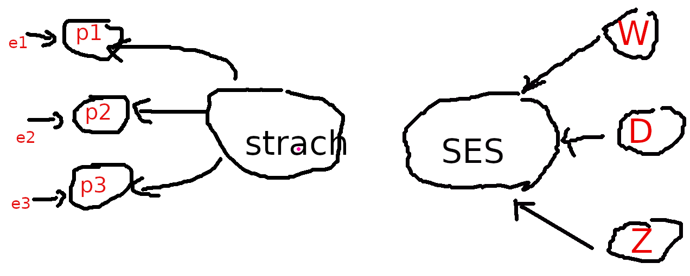

# Przykłady badań ankietowych {#surveyexamples}

Uwaga: ankieta nie jest kolejną metodą statystyczną tylko techniką zbierania danych.
Wszystkie metody już zostały przedstawione i żadnej nowej nie będzie.

## Jak zacząć badanie?

Każde badanie, w tym ankietowe.

Należy zastanowić się nad trzema sprawami: 

1. Co chcemy ustalić? 
2. Jakie dane są nam potrzebne, żeby ustalić to co chcemy ustalić. 
3. Jak te dane zebrać (czyli co i w jaki sposób zmierzyć)


**Co chcemy ustalić?**

Najlepiej jakąś zależność. Na przykład: stress a wypalenie zawodowe;
satysfakcja zawodowa a retencja; determinanty satysfakcji zawodowej

Może być od biedy opis czegoś lub porównanie czegoś z czymś. Przykłady:
nadwaga wśród studentów wydziału zdrowia PSW; analiza porównawcza
wypalenia zawodowego pielęgniarek
pracujących w różnych systemach opieki.

**Co i jak mierzyć?**
	
Jeżeli mamy zamiar badać nadwagę, to powinniśmy zmierzyć masę ciała.
Jeżeli celem jest ustalenie zależności pomiędzy stresem a wypaleniem
zawodowym to niewątpliwie powinniśmy zmierzyć stress i wypalenia.  Jak
dotąd banalnie prosto. Problem zaczyna się w momencie odpowiedzi na
pytanie **jak**?

### Mierzenie twardych faktów vs mierzenia przekonań

Możemy pytać w ankiecie o dwie rzeczy:

* **fakty** (wiek, staż, zawód, tętno, przebyte choroby);

* **przekonania**, **wartości**, **postawy**; 
  **uczucia** (strach / radość) albo **zamiary**
  (w języku attitudes/emotions/intentions).

Mierzenie **faktów** nie wymaga dodatkowych objaśnień. Problem jest
z mierzeniem **przekonań**.

**Przekonanie** to idea, którą jednostka uważa 
za prawdziwą. **Wartości** to trwałe przekonania o tym, 
co jest ważne dla jednostki.  Stają się standardami, według których jednostki dokonują wyborów.
**Postawy** to mentalne dyspozycje/nastawienie 
przed podjęciem decyzji, które skutkują 
określonym zachowaniem (zrobię to a nie tamto). Postawy 
kształtowane są wartościami i przekonaniami.

### Pomiar przekonań, wartości i postaw

Postawy/uczucia/zamiary są to pojęcia
abstrakcyjne. Często (albo zawsze) definiowane w obszarze psychologii,
nauk o zarządzaniu itp.

Pomiar *przekonań* jest dokonywany w specyficzny sposób.
**Definicja koncepcyjna** definiuje pojęcie 
(zaufanie do kogoś/czegoś to **przekonanie**, że 
*działania tego kogoś/czegoś okażą się zgodne z naszymi
oczekiwaniami*; satysfakcja to
**uczucie** *przyjemności, zadowolenia z czegoś*;
samoskuteczność to 
**przekonanie**, iż *jest się w stanie zrealizować określone działanie lub osiągnąć wyznaczone cele*).
**Definicja operacyjna** określa jak zmierzyć pojęcie
(jak zmierzyć satysfakcję)
Przejście od definicji koncepcyjnej do definicji operecyjnej bywa czasami mocno, hmm... arbitralne.

### Skala Likerta

Przykładowo chcemy się dowiedzieć czy i jak bardzo respondenci boją się COVID19. 

W najprostszej wersji się po prostu pytamy: 
**Czy pan/pani boi się COVID19?** i dajemy 
respondentowi trzy możliwe  warianty odpowiedzi: Tak/Nie/Nie wiem. 
Taki pomiar jest mocno zgrubny: ktoś 
się może bać panicznie a ktoś inny dużo mniej. 

Subtelniejszy pomiar to wybór spośród pięciu wariantów: 
bardzo się boję--boję się--trudno powiedzieć--nie boję się--zupełnie się nie boję.

Taką skalę pomiarową określamy jak wiemy jako **porządkową**. Pomiary nie są liczbami,
ale są uporządkowane.
Rangi wartości są już liczbami (np. 1--5 w przykładowej skali pięciowariantowej), 
można je np. uśredniać
Tego typu skala pomiarowa, typowa dla ankiet, nosi nazwę skali **Likerta**.
Można sobie wymyślać skalę Likerta 7-punktową i więcej. 

Naszym zdaniem powyżej 7 wariantów normalny respondent będzie miał problem 
czy się bardziej-bardziej czy jednak bardziej-bardziej-bardziej boi.

### Skala pomiarowa czyli inwentarz albo kwestionariusz

Ponieważ skala Likerta, mimo że lepsza od pytań tak/nie,  jest ciągle zgrubna, to 
uważa się powszechnie, że lepszy wynik da pomiar 
wielokrotny. 
W naukach podstawowych mierzymy (np. linijką) parę razy, a wynik uśredniamy co daje pomiar bardziej precyzyjny. Tutaj pytamy się parę razy o to samo co
ma dać podobny efekt (mniejszy średni błąd pomiaru). 
Taka seria pytań nosi też nazwę skali albo **inwentarza**.
Nie pytamy się zatem **Czy pan/pani boi się COVID19?** tylko zadajemy serię
pytań o strach względem COVID19:

::: {.example}
**strach przed COVID19**

The Fear of COVID-19 Scale: Development and Initial Validation. 
International Journal of
Mental Health and Addiction, 1–9. 
https://www.ncbi.nlm.nih.gov/pmc/articles/PMC7100496/

Lęk przed koronawirusem COVID-19
i lęk przed śmiercią – polskie adaptacje narzędzi
https://www.termedia.pl/Fear-of-COVID-19-and-death-anxiety-Polish-adaptations-of-scales,116,44937,1,1.html


1. I am most afraid of Corona

2. It makes me uncomfortable to think about Corona

3. My hands become clammy when I think about Corona

4. I am afraid of losing my life because of Corona

5. When I watch news and stories about Corona on social media, I become nervous or anxious.

6. I cannot sleep because I’m worrying about getting Corona.

7. My heart races or palpitates when I think about getting Corona

albo:

1. Boję się koronawirusa

2. Czuję dyskomfort, gdy myślę o koronawirusie

3. Pocą mi się dłonie, gdy myślę o koronawirusie

4. Boję się, że mogę stracić życie z powodu koronawirusa

5. Gdy oglądam wiadomości i czytam o koronawirusie w mediach
   społecznościowych, robię się nerwowy i niespokojny

6. Nie mogę spać, ponieważ martwię się, że ja lub moi bliscy zarażą się

7. Dostaję palpitacji serca, gdy myślę o tym, że mógłbym się zarazić.

Odpowiadający ma do wyboru pięć wariantów odpowiedzi:
**zdecydowanie nie**/**nie**/**nie mam zdania**/**tak**/**zdecydowanie tak**

:::

### Model pomiaru

Ukryty czynnik (strach) kształtuje wartości indykatorów (odpowiedzi na pytania)
Taki sposób pomiaru **ukrytego czynnika** (*latent* w języku angielskim) określa się
mianem refleksyjnego (co jest kalką od *reflexive*). Na rysunku \@ref(fig:modelP)
kierunek strzałki obrazuje zależność (czynnik→indykator)

```{r modelP, out.width="90%", fig.cap = "Modele pomiaru czynnika ukrytego"}

```

Alternatywny sposób definiowania ukrytego (w pewnym sensie, raczej złożonego)
czynnika nosi nazwę **formatywnego** (albo indeksu): czynnik jest sumą indykatorów.
Przykładem może być SES: 
status socjo-ekonomiczny będący agregatem wykształcenia (W), dochodu (D) 
oraz zawodu (Z).


W założeniu indykatory są jednakowo dobrymi miarami
czynnika refleksyjnego i jako takie powinny być mocno
skorelowane (mierzą to samo). 
Natomiast składniki czynnika formatywnego nie powinny
być skorelowane, raczej każdy powinien mierzyć **inny
aspekt** czynnika. Ktoś może być profesorem 
za przeproszeniem filozofii, nie mieć pracy i kiepskie
dochody. 
Tylko jeden z trzech aspektów podwyższa mu SES;
albo świetnie zarabiająca prostytutka bez matury.

Jeżeli w czynniku refleksyjnym pominiemy jeden z trzech indykatorów, to nic się
nie stanie oprócz tego, że pomiar będzie mniej precyzyjny. Jeżeli
w czynniku formatywnym pominiemy indykator, to popełniamy gruby błąd, bo pomijamy
istotny składnik całości.

Dobrą wiadomością jest, że najprostszy sposób pomiaru traktuje czynniki
refleksyjne i formatywne jednakowo: wartością czynnika jest suma albo ewentualnie średnia 
wartości indykatorów. Jeżeli indykatory są mierzone za pomocą skali Likerta
suma (albo średnia) wartości rang po prostu. W skali strachu przed COVID ten kto się najbardziej
boi powinien odpowiedzieć 7 razy **zdecydowanie tak** co odpowiada 
sumie 35 rang (jeżeli rangujemy od 1 do 5). 
Ten który się wcale nie boi zaś będzie miał 7.

Małym utrudnieniem mogą być **pytania odwrócone**. Jeżeli pytamy
o strach przed COVID i w każdym pytaniu jak bardzo ktoś się boi, albo jak
bardzo mu serce bije, ale w jednym z pytań zapytamy **nie boję się COVID**,
to ranga 5 odpowiada uczuciu **braku strachu**. Rangi w pytaniach odwróconych
należy przeliczyć (odwrócić): 1 zamienić na 5, 2 na 4 itd...
Jeżeli używamy cudzych skal to w opisie powinno być wskazane, które
pytania są odwrócone.

**Zalecany schemat postępowania jeżeli w ankiecie mają być mierzone
przekonania** (strach, samoskuteczność, wypalenie zawodowe, stress czy satysfakcja):

* Dokształcamy się nieco z psychologii mimo wszystko.

* Robimy przegląd literatury i znajdujemy skalę, którą ktoś już wymyślił żeby
  mierzyć to co my chcemy zmierzyć, bo **raczej nie należy wymyślać własnych skal**.

* Robimy ankietę (w Internecie) i zbieramy dane.

* Wykonujemy analizę statystyczną.

Banalnie proste co udowodnimy na przykładach

## Wiedza na temat szkodliwości palenia i jej uwarunkowania wśród studentów PSW

```{r, out.width=ex.out.width}
s0 <- read.csv("palenie_PSW.csv", sep = ',',  header=F, skip=1, na.string="NA", fileEncoding = "UTF-8",
   col.names = c('time', 
   'status', 'palenie.staz', 
   'palenie.rzucenie', 
   'uzaleznienie', 
   'P5',
   'P6', 'P7', 'P8', 'P9', 'P10', 'P11', 'P12', 
   'ocena.wiedzy', 'wzorce.palenia', 'plec', 'wiek', 'staz', 'miejsce.pracy'))

s1 <- s0 %>%
   mutate(
staz=recode(staz,
'0-3 lat'   = '06 i mniej',
'4-6 lat'   = '06 i mniej',
'7-9 lat'   = '07-12',
'8-12 lat'  = '07-12',
'10-12 lat' = '07-12',
'13-15 lat' = '13-18',
'16-18 lat' = '13-18',
'19-21 lat' = '19 i więcej',
'22-24 lat' = '19 i więcej',
'25 lat i więcej' = '19 i więcej') ) %>%
#
##T12. Uważasz, że bardziej szkodliwe dla zdrowia jest: [JW]
# "Każda forma kontaktu"
mutate (P5 = case_when( str_detect(P5, "Każda forma kontaktu") ~ 1, TRUE ~ 0)) %>%
##==
# "Palenie czynne"
# "Palenie bierne"
# "Nie wiem"
#
##T16
mutate (
 P9A = case_when( str_detect(P9, "Przewlekła obturacyjna choroba płuc") ~ 1, TRUE ~ 0),
 P9B = case_when( str_detect(P9, "Astma oskrzelowa") ~ 1, TRUE ~ 0),
 P9C = case_when( str_detect(P9, "Alergie wziewne") ~ 1, TRUE ~ 0),
 P9D = case_when( str_detect(P9, "Przewlekłe zapalenie oskrzeli") ~ 1, TRUE ~ 0),
 P9E = case_when( str_detect(P9, "Infekcje dróg oddechowych") ~ 1, TRUE ~ 0),
 ##
 P9F = case_when( str_detect(P9, "Gruźlica") ~ -1, TRUE ~ 0),
 P9G = case_when( str_detect(P9, "Zapalenie płuc") ~ -1, TRUE ~ 0),
 P9H = case_when( str_detect(P9, "Palenie nie powoduje") ~ -1, TRUE ~ 0),
 P9I = case_when( str_detect(P9, "Nie wiem") ~ -1, TRUE ~ 0),
#
#T17
#
 P10A = case_when( str_detect(P10, "Nadciśnienie tętnicze krwi") ~ 1, TRUE ~ 0),
 P10B = case_when( str_detect(P10, "Zawał mięśnia sercowego") ~ 1, TRUE ~ 0),
 P10C = case_when( str_detect(P10, "Udar mózgu") ~ 1, TRUE ~ 0),
 P10D = case_when( str_detect(P10, "Choroba niedokrwienna serca") ~ 1, TRUE ~ 0),
 P10E = case_when( str_detect(P10, "Miażdżyca tętnic obwodowych") ~ 1, TRUE ~ 0),
 P10F = case_when( str_detect(P10, "Zaburzenie rytmu serca") ~ 1, TRUE ~ 0),
 P10G = case_when( str_detect(P10, "Choroba Buergera") ~ 1, TRUE ~ 0),
 ##
 P10H = case_when( str_detect(P10, "Hipercholesterolemia") ~ -1, TRUE ~ 0),
 P10I = case_when( str_detect(P10, "Tętniak aorty") ~ -1, TRUE ~ 0),
 P10J = case_when( str_detect(P10, "Palenie nie powoduje") ~ -1, TRUE ~ 0)) %>%
# 
#T18. Czy palenie papierosów powoduje choroby układu pokarmowego? [JW]
#"Tak"
#==
mutate (P11 = case_when( str_detect(P11, "Tak") ~ 1, TRUE ~ 0)) %>%
#"Nie"
#"wiem"
#
#T19. Jaki według Ciebie ma wpływ palenie papierosów na narządy zmysłów?
#
mutate (
 P12A = case_when( str_detect(P12, "Upośledza węch i smak") ~ 1, TRUE ~ 0),
 P12B = case_when( str_detect(P12, "Powoduje podrażnienie spojówek") ~ 1, TRUE ~ 0),
 P12C = case_when( str_detect(P12, "Obniża apetyt") ~ 1, TRUE ~ 0),
 P12D = case_when( str_detect(P12, "Niszczy struny głosowe") ~ 1, TRUE ~ 0),
 P12E = case_when( str_detect(P12, "Zmniejsza ostrość wzroku") ~ 1, TRUE ~ 0),
 ##
 P12F = case_when( str_detect(P12, "Palenie nie ma") ~ -1, TRUE ~ 0)) %>%
  mutate (
    P.total = P5 + 
          P9A + P9B + P9C + P9D + P9E + P9F + P9G + P9H + P9I +
          P10A + P10B + P10C + P10D + P10E + P10F + P10G + P10H + P10I +
          P11 +
          P12A + P12B + P12C + P12D + P12E + P12F )

```

### Cel

Celem jest ocena wielkości zjawiska palenia tytoniu oraz
poziom wiedzy na temat szkodliwości palenia tytoniu
wśród
studentów RM/PO PSW oraz zweryfikowanie wpływu wybranych czynników warunkujących ten nałóg.

**Postawiono następujące hipotezy badawcze**:

1. Jaka jest wielkość zjawiska palenie tytoniu wśród studentów PSW?

2. Jaka jest wiedza na temat szkodliwości palenia tytoniu wśród studentów PSW?

3. Czy palenie jest skorelowane z płcią, stażem pracy i miejscem pracy?

4. Czy wiedza na temat szkodliwości palenie jest skorelowana z płcią, stażem pracy i miejscem pracy?

5. Czy palenie jest skorelowane z wiedzą na temat szkodliwości palenia?


### Metoda

Badanie ankietowe wśród studentów RM oraz PO przeprowadzono w styczniu 2023.
Ankieta zawierała pytania dotyczące palenia tytoniu (pali/nie pali/palił, jak długo pali itd),
test wiedzy na temat szkodliwości palenia oraz pytania
o rodzaj miejsca pracy, staż pracy i płeć itd.

Pięć następujących pytań oceniało wiedzę ankietowanego na temat szkodliwości palenia:

* Czy bardziej szkodliwe dla zdrowia jest czynne czy bierne palenie? (JW),
* Jakie według Ciebie choroby układu oddechowego mogą być spowodowane
  bezpośrednio przez palenie papierosów? (WW)
* Czy palenie papierosów powoduje choroby układu pokarmowego? (JW)
* Jakie według Ciebie choroby kardiologiczne mogą być spowodowane
  bezpośrednio przez palenie papierosów? (WW)
* Jaki według Ciebie ma wpływ palenie papierosów na narządy zmysłów? (WW)

W przypadku pytań jednokrotnego wyboru (JW), za wskazanie poprawnej odpowiedzi respondent otrzymywał 1 punkt.
W przypadku pytań wielokrotnego wyboru (WW) za wskazanie prawidłowej odpowiedzi respondent otrzymywał 1 punkt, ale
za wskazanie nieprawidłowej
otrzymywał (minus) -1 punkt (aby nie opłacała się strategia zaznaczenia wszystkich odpowiedzi).
Maksymalna możliwa do uzyskania liczba punktów wynosiła 19.

### Zastosowane metody statystyczne

* Hipotezę 1 weryfikowano na podstawie wielkości odsetka respondentów palących.

* Hipotezę 2 weryfikowano na podstawie wielkości odsetka respondentów wykazujących się
  dobrą i bardzo dobrą wiedzą na temat palenia

* Hipotezy 3--5 zweryfikowano z wykorzystaniem tablic wielodzielnych/testu chi-kwadrat
  oraz porównania średniego poziomu depresji w grupach za pomocą testów Manna-Whitneya oraz
  Kruskala-Wallisa.


### Metryczka (analiza respondentów)

Rozkład ankietowanych wg wyniku testu 
na znajomość szkodliwości palenia przedstawiono na rysunku.

```{r, echo=F, out.width=ex.out.width}
P.total.mean <- mean (s1$P.total)
P.total.sd <- sd (s1$P.total)
P.total.median <- median(s1$P.total)
P.total.q3 <- quantile(s1$P.total, prob=.75)
P.total.N <- nrow(s1)
ex.p <- ggplot(s1, aes(x = P.total)) + 
  geom_histogram(binwidth = 2, fill='steelblue', color='navyblue') +
  ylab("liczba respondentów") +
  xlab("Wynik testu") +
  ggtitle("Studenci wg wyniku testu na znajomość szkodliwości palenia") 
ex.p
```

W badaniu wzięło udział `r P.total.N` studentów. 
Otrzymano `r P.total.N` poprawnie
wypełnionych ankiet. Średnia wartość testu oceniającego wiedzę
wyniosła `r sprintf ("%.3f", P.total.mean)` (odchylenie
standardowe `r sprintf ("%.3f", P.total.sd)`).

Rozkład ankietowanych ze względu na status względem
palenia przedstawiono na rysunku.


```{r, out.width=ex.out.width}
s0.status <- s1 %>%
  select (status) %>%
  group_by(status)%>%
  summarize(n=n())%>%
  mutate(prop=n/sum(n) * 100 )

p.status <- s0.status %>%
  ggplot(aes(x = status, y = prop )) +
  ggtitle("Studenci wg statusu palenia (%)") +
  xlab("") + ylab("%") +
  geom_bar(position = 'dodge', stat = 'identity', fill = "steelblue") +
  geom_text(data=s0.status, aes(label=sprintf("%.2f", prop), y= prop), vjust=1.5, color="white" ) 
p.status
```

Rozkład ankietowanych ze względu na płeć przedstawiono na rysunku

```{r, out.width=ex.out.width, out.height="30%"}
s0.sex <- s1 %>%
  select (plec) %>%
  group_by(plec)%>%
  summarize(n=n())%>%
  mutate(prop=n/sum(n) * 100 )

p.1 <- s0.sex %>%
  ggplot(aes(x = reorder(plec, prop), y = prop )) +
  ggtitle("Studenci wg płci (%)") +
  xlab("") + ylab("%") +
  geom_bar(position = 'dodge', stat = 'identity', fill = "steelblue") +
  geom_text(data=s0.sex, aes(label=sprintf("%.2f", prop), y= prop), hjust=1.5, color="white" ) +
  #scale_x_discrete (breaks=var.names,  labels=var.labels) +
  coord_flip()
p.1
```

Rozład ankietowanych ze względu na staż pracy przedstawiono na rysunku

```{r, out.width=ex.out.width}
s0.staz <- s1 %>%
  select (staz) %>%
  group_by(staz)%>%
  summarize(n=n())%>%
  mutate(prop=n/sum(n) * 100 )

p.3 <- s0.staz %>%
  ggplot(aes(x = staz, y = prop )) +
  ggtitle("Studenci wg stażu pracy (%)") +
  xlab("") + ylab("%") +
  geom_bar(position = 'dodge', stat = 'identity', fill = "steelblue") +
  geom_text(data=s0.staz, aes(label=sprintf("%.2f", prop), y= prop), vjust=1.5, color="white" ) 
#scale_x_discrete (breaks=var.names,  labels=var.labels) +
##coord_flip()
p.3
```

Rozkład ankietowanych ze względu na rodzaj miejsca pracy
przedstawiono na rysunku

```{r, out.width=ex.out.width}
s0.miejsce <- s1 %>%
  select (miejsce.pracy) %>%
  group_by(miejsce.pracy)%>%
  summarize(n=n())%>%
  mutate(prop=n/sum(n) * 100 )

p.4 <- s0.miejsce %>%
  ggplot(aes(x = miejsce.pracy, y = prop )) +
  ggtitle("Studenci wg miejsca pracy (%)") +
  xlab("") + ylab("%") +
  geom_bar(position = 'dodge', stat = 'identity', fill = "steelblue") +
  geom_text(data=s0.miejsce, aes(label=sprintf("%.2f", prop), y= prop), vjust=1.5, color="white" ) 
#scale_x_discrete (breaks=var.names,  labels=var.labels) +
##coord_flip()
p.4
```

### Weryfikacja hipotezy 1

```{r, echo=F}
pala_lub_palili <- s0 %>% filter (status != 'Nigdy nie paliłem/am') %>%
  summarize(n=n())
```

Palą lub paliło `r pala_lub_palili` respondentów 
(`r sprintf("%.2f", pala_lub_palili/ P.total.N *100)` %).
Żeby stwierdzić czy to jest dużo czy mało to na przykład można by porównać
z jakąś średnią ogólnopolską.

### Weryfikacja hipotezy 2

Średnia wartość uzyskana w teście wyniosła `r sprintf("%.2f", P.total.mean)`
(mediana `r P.total.median`); 3/4 respondentów nie uzyskało więcej niż
`r P.total.q3` (czyli `r sprintf("%.1f", P.total.q3/19 *100)` %).

### Weryfikacja hipotez 3--5

Czy palenie jest skorelowane z płcią?

```{r}
t.sex.f <- s1 %>%
  select (status, plec) %>% 
  table()

t.sex.t <- kable(t.sex.f)
t.sex.t

chi_test <- chisq.test(t.sex.f)
chi_test
```

Nie jest o czym świadczy wysoka wartość p (`r sprintf("%.4f", chi_test["p.value"])`)

Czy palenie jest skorelowane ze stażem pracy?

```{r}
## staż

t.staz.f <- s1 %>%
  select (status, staz) %>% 
  table()

t.staz.t <- kable(t.staz.f)
t.staz.t

chi_test <- chisq.test(t.staz.f)
chi_test
```

Nie jest o czym świadczy wysoka wartość p (`r sprintf("%.4f", chi_test["p.value"])`)


Czy palenie jest skorelowane z miejscem pracy?

```{r}
##

t.praca.f <- s1 %>%
  select (status, miejsce.pracy) %>% 
  table()

t.praca.t <- kable(t.praca.f)
t.praca.t

chi_test <- chisq.test(t.praca.f)
chi_test
```

Nie jest o czym świadczy wysoka wartość p (`r sprintf("%.4f", chi_test["p.value"])`)

Czy wiedza na temat palenia jest skorelowana z płcią:

```{r}
##########################
## Wiedza a płeć, staż, miejsce pracy

s0.pl <- s1 %>%
  group_by(plec) %>%
  summarise(m = mean(P.total), n=n())
kable(s0.pl, col.names = c('płeć', 'średnia', 'n'))
wilcoxp <- wilcox.test(P.total ~ plec, data=s1)
wilcoxp['p.value']
```

Porównujemy dwie grupy zatem stosujemy test Manna-Whitneya.
Wartość p wynosi `r sprintf("%.8f", wilcoxp['p.value'])` zatem
hipotezy o braku korelacji na poziomie 0,05 należy odrzucić.
Istnieje zależność pomiędzy wiedzą na temat palenia a płcią.

Czy wiedza na temat palenia jest skorelowana z miejscem pracy:

```{r}
s0.mp <- s1 %>%
  group_by(miejsce.pracy) %>%
  summarise(m = mean(P.total), n=n())
kable(s0.mp, col.names = c('m.pracy', 'średnia', 'n'))
wilcoxp <- wilcox.test(P.total ~ miejsce.pracy, data=s1)
wilcoxp['p.value']
```

Porównujemy dwie grupy zatem stosujemy test Manna-Whitneya.
Wartość p wynosi `r sprintf("%.8f", wilcoxp['p.value'])` -- nie ma podstaw
od odrzucenia hipotezy o braku korelacji na poziomie 0,05.

Czy wiedza na temat palenia jest skorelowana ze stażem:

```{r}
s0.st <- s1 %>%
  group_by(staz) %>%
  summarise(m = mean(P.total), n=n())
kable(s0.st, col.names = c('staż', 'średnia', 'n'))
kw<- kruskal.test(P.total ~ staz, data = s1)
kw["p.value"]
#wilcoxp <- wilcox.test(P.total ~ staz, data=s1)
#wilcoxp['p.value']
```

Porównujemy więcej niż dwie grupy zatem stosujemy test Kruskala-Wallisa.
Wartość p wynosi `r sprintf("%.8f", kw["p.value"])` -- nie ma podstaw
od odrzucenia hipotezy o braku korelacji na poziomie 0,05.

Czy wiedza o szkodliwości palenia jest skorelowana
ze statusem względem palenia? Chcemy zastosować tablicę wielodzielczą/test chi kwadrat. Musimy zatem zamienić skalę liczbową zmiennej  mierzącej wiedzę nt szkodliwości palenia na nominalną, np tak:
0--5 mała; 6--10 średnia; 11--15 duża, 16--19 ogromna:

```{r}
## Wiedza a palenie
wiedza.status.t <- s1 %>%
  select (P.total, status) %>% 
  mutate( P.total=case_when(P.total < 6 ~ "mała",  
                         P.total < 11 ~ "średnia", 
                         P.total < 16 ~ "duża",
                         TRUE ~ "ogromna") ) %>%
  table()

ws.t <- kable(wiedza.status.t)
ws.t

chi_test <- chisq.test(wiedza.status.t)
chi_test
```

Widza i status wzg. palenia nie jest skorelowana
o czym świadczy wysoka wartość p (`r sprintf("%.4f", chi_test["p.value"])`)

Można to samo zweryfikować porównując średnie w grupach
i stosując test Kruskala-Wallisa

```{r}
## albo średnia wiedzia w grupach wg statusu

s0.sw <- s1 %>%
  group_by(status) %>%
  summarise(m = mean(P.total), n=n())
kable(s0.sw, col.names = c('status', 'średnia', 'n'))

kw<- kruskal.test(P.total ~ status, data = s1)
kw["p.value"]
```

Wynik jest identyczny (wysoka wartość p `r sprintf("%.f", kw["p.value"])`).

### Wnioski

* Ponad połowa studentów pali lub paliła.

* Istnieje zależność pomiędzy wiedzą o szkodliwości palenia a płcią.

* Nie ma związku pomiędzy statusem względem palenia a płcią, miejscem pracy i stażem.

* Nie ma związku pomiędzy wiedzą o szkodliwości palenia a miejscem pracy i stażem.

## Depresja i jej uwarunkowania wśród studentów PSW

### Cel

Celem jest ustalenie czy depresja jest istotnym problemem wśród
studentów RM/PO PSW oraz 
zweryfikowanie wybranych czynników warunkujących depresję.

### Metoda

Badanie ankietowe wśród studentów RM oraz PO przeprowadzono w styczniu 2023.
Ankieta zawierała test samooceny depresji Becka oraz pytania
o rodzaj miejsca pracy, staż pracy i płeć.

Test samooceny depresji Becka składa się z 21 pytań. W każdym pytaniu
możliwe są 4 warianty odpowiedzi, odpowiadające zwiększonej intensywności objawów depresji,
którym w związku z tym przypisuje się wartości od zera do 3 punktów. Maksymalna liczba punktów
w teście wynosi 63 a minimalna 0.

Interpretacja wyników testu Becka: 0--19 brak/łagodna depresja;
20--25 umiarkowana; 26--63 cieżka depresja.

Postawiono następujące hipotezy badawcze:

1. Depresja stanowi duży problem wśród studentów PSW.

2. Problem depresji zależy od miejsca pracy.

3. Problem depresji zależy od stażu pracy.

4. Problem depresji zależy od płci.

### Zastosowane metody statystyczne

* Hipotezę 1 oceniono na podstawie odsetka respondentów wykazujących ciężką postać depresji.

* Hipotezy 2--4 zweryfikowano z wykorzystaniem tablic wielodzielczych/testu chi-kwadrat
  oraz porównania średniego poziomu depresji w grupach za pomocą testów Manna-Whitneya oraz
  Kruskala-Wallisa


```{r, echo=F}
s0 <- read.csv("depresja_PSW_2023.csv", sep = ',',  header=F, skip=1, na.string="NA",
   col.names = c('time', 'P1', 'P2', 'P3', 'P4', 'P5',
   'P6', 'P7', 'P8', 'P9', 'P10',
   'P11', 'P12', 'P13', 'P14', 'P15',
   'P16', 'P17', 'P18', 'P19', 'P20', 'P21', 'praca', 'staz', 'plec', 'x1'),
               fileEncoding = "UTF-8") %>%
   mutate(
staz=recode(staz,
'0-3 lat'   = '06 i mniej',
'4-6 lat'   = '06 i mniej',
'7-9 lat'   = '07-12',
'8-12 lat'  = '07-12',
'10-12 lat' = '07-12',
'13-15 lat' = '13-18',
'16-18 lat' = '13-18',
'19-21 lat' = '19 i więcej',
'22-24 lat' = '19 i więcej',
'25 lat i więcej' = '19 i więcej'),
P1=recode(P1,
 'Nie jestem smutny ani przygnębiony.'=0,
 'Odczuwam często smutek, przygnębienie'=1,
 'Przeżywam stale smutek, przygnębienie i nie mogę uwolnić się od tych przeżyć.'=2,
 'Jestem stale tak smutny i nieszczęśliwy, że jest to nie do wytrzymania.'=3),
###
P2=recode(P2,
 'Nie przejmuję się zbytnio przyszłością.'=0,
 'Często martwię się o przyszłość.'=1,
 'Obawiam się, że w przyszłości nic dobrego mnie nie czeka.'=2,
 'Czuję, że przyszłość jest beznadziejna i nic tego nie zmieni.'=3),
###
P3=recode(P3,
 'Sądzę, że nie popełniam większych zaniedbań.'=0,
 'Sądzę, że czynię więcej zaniedbań niż inni.'=1,
 'Kiedy spoglądam na to, co robiłem, widzę mnóstwo błędów i zaniedbań.'=2,
 'Jestem zupełnie niewydolny i wszystko robię źle.'=3),
###
P4=recode(P4,
 'To, co robię, sprawia mi przyjemność.'=0,
 'Nie cieszy mnie to, co robię.'=1,
 'Nic mi teraz nie daje prawdziwego zadowolenia.'=2,
 'Nie potrafię przeżywać zadowolenia i przyjemności; wszystko mnie nuży.'=3),
##
P5=recode(P5,
 'Nie czuję się winnym ani wobec siebie, ani wobec innych.'=0,
 'Dość często miewam wyrzuty sumienia.'=1,
 'Często czuję, że zawiniłem.'=2,
 'Stale czuję się winny.'=3),
##
P6=recode(P6,
 'Sądzę, że nie zasługuję na karę'=0,
 'Sądzę, że zasługuję na karę'=1,
 'Spodziewam się ukarania'=2,
 'Wiem, że jestem karany (lub ukarany)'=3),
##
P7=recode(P7,
 'Jestem z siebie zadowolony'=0,
 'Nie jestem z siebie zadowolony'=1,
 'Czuję do siebie niechęć'=2,
 'Nienawidzę siebie'=3),
##
P8=recode(P8,
 'Nie czuję się gorszy od innych ludzi'=0,
 'Zarzucam sobie, że jestem nieudolny i popełniam błędy'=1,
 'Stale potępiam siebie za popełnione błędy'=2,
 'Winię siebie za wszelkie zło, które istnieje'=3),
##
P9=recode(P9,
 'Nie myślę o odebraniu sobie życia'=0,
 'Myślę o samobójstwie — ale nie mógłbym tego dokonać'=1,
 'Pragnę odebrać sobie życie'=2,
 'Popełnię samobójstwo, jak będzie odpowiednia sposobność'=3),
##
P10=recode(P10,
 'Nie płaczę częściej niż zwykle'=0,
 'Płaczę częściej niż dawniej'=1,
 'Ciągle chce mi się płakać'=2,
 'Chciałbym płakać, lecz nie jestem w stanie'=3),
##
P11=recode(P11,
 'Nie jestem bardziej podenerwowany niż dawniej'=0,
 'Jestem bardziej nerwowy i przykry niż dawniej'=1,
 'Jestem stale zdenerwowany lub rozdrażniony'=2,
 'Wszystko, co dawniej mnie drażniło, stało się obojętne'=3),
##
P12=recode(P12,
 'Ludzie interesują mnie jak dawniej'=0,
 'Interesuję się ludźmi mniej niż dawniej'=1,
 'Utraciłem większość zainteresowań innymi ludźmi'=2,
 'Utraciłem wszelkie zainteresowanie innymi ludźmi'=3),
P13=recode(P13,
 'Decyzje podejmuję łatwo, tak jak dawniej'=0,
 'Częściej niż kiedyś odwlekam podjęcie decyzji'=1,
 'Mam dużo trudności z podjęciem decyzji'=2,
 'Nie jestem w stanie podjąć żadnej decyzji'=3),
P14=recode(P14,
 'Sądzę, że wyglądam nie gorzej niż dawniej'=0,
 'Martwię się tym, że wyglądam staro i nieatrakcyjnie'=1,
 'Czuję, że wyglądam coraz gorzej'=2,
 'Jestem przekonany, że wyglądam okropnie i odpychająco'=3),
P15=recode(P15,
 'Mogę pracować jak dawniej'=0,
 'Z trudem rozpoczynam każdą czynność'=1,
 'Z wielkim wysiłkiem zmuszam się do zrobienia czegokolwiek'=2,
 'Nie jestem w stanie nic zrobić'=3),
##
P16=recode(P16,
 'Sypiam dobrze, jak zwykle'=0,
 'Sypiam gorzej niż dawniej'=1,
 'Rano budzę się 1–2 godziny za wcześnie i trudno jest mi ponownie usnąć'=2,
 'Budzę się kilka godzin za wcześnie i nie mogę usnąć'=3),
##
P17=recode(P17,
 'Nie męczę się bardziej niż dawniej'=0,
 'Męczę się znacznie łatwiej niż poprzednio.'=1,
 'Męczę się wszystkim, co robię.'=2,
 'Jestem zbyt zmęczony, aby cokolwiek robić.'=3),
##
P18=recode(P18,
 'Mam apetyt nie gorszy niż dawniej'=0,
 'Mam trochę gorszy apetyt'=1,
 'Apetyt mam wyraźnie gorszy'=2,
 'Nie mam w ogóle apetytu'=3),
##
P19=recode(P19,
 'Nie tracę na wadze (w okresie ostatniego miesiąca)'=0,
 'Straciłem na wadze więcej niż 2 kg'=1,
 'Straciłem na wadze więcej niż 4 kg'=2,
 'Straciłem na wadze więcej niż 6 kg'=3),
P20=recode(P20,
 'Nie martwię się o swoje zdrowie bardziej niż zawsze'=0,
 'Martwię się swoimi dolegliwościami, mam rozstrój żołądka, zaparcie, bóle'=1,
 'Stan mojego zdrowia bardzo mnie martwi, często o tym myślę'=2,
 'Tak bardzo martwię się o swoje zdrowie, że nie mogę o niczym innym myśleć'=3),
P21=recode(P21,
'Moje zainteresowania seksualne nie uległy zmianom'=0,
'Jestem mniej zainteresowany sprawami płci (seksu)'=1,
'Problemy płciowe wyraźnie mniej mnie interesują'=2,
'Utraciłem wszelkie zainteresowanie sprawami seksu'=3)) %>%
  mutate (P=P1+P2+P3+P4+P5+P6 + P7 + P8 + P9 +P10 + 
            P11+P12+P13+P14+P15+P16 + P17 + P18 + P19 +P20 + P21,
          Depresja = case_when( P < 20 ~ "B", P < 26 ~ "Ł", TRUE ~ "C")) 

```

### Metryczka


```{r, echo=F}
s0.N <- nrow(s0)
##summary(s0$P)
s0.mean <- mean(s0$P)
s0.sd <- sd(s0$P)
```

W badaniu wzięło udział `r s0.N` studentów. Otrzymano `r s0.N` poprawnie
wypełnionych ankiet. Średnia wartość testu Becka wyniosła `r sprintf ("%.3f", s0.mean)` (odchylenie
standardowe `r sprintf ("%.3f",  s0.sd)`)

Rozkład ankietowanych wg wyniku testu Becka przedstawiono na rysunku.

```{r, out.width=ex.out.width}
ex.p <- ggplot(s0, aes(x = P)) + 
  geom_histogram(binwidth = 2, fill='steelblue', color='navyblue') +
  ylab("liczba respondentów") +
  xlab("Wynik testu") +
  ggtitle("Studenci wg wyniku testu Becka") 
ex.p
```

Rozkład ankietowanych ze względu na płeć przedstawiono na rysunku.

```{r, out.width=ex.out.width, out.height="30%"}
###
s0.sex <- s0 %>%
  select (plec) %>%
  group_by(plec)%>%
  summarize(n=n())%>%
  mutate(prop=n/sum(n) * 100 )


p.1 <- s0.sex %>%
  ggplot(aes(x = reorder(plec, prop), y = prop )) +
  ggtitle("Studenci wg płci (%)") +
  xlab("") + ylab("%") +
  geom_bar(position = 'dodge', stat = 'identity', fill = "steelblue") +
  geom_text(data=s0.sex, aes(label=sprintf("%.2f", prop), y= prop), hjust=1.5, color="white" ) +
  #scale_x_discrete (breaks=var.names,  labels=var.labels) +
  coord_flip()
p.1
```

Rozkład ankietowanych ze względu na staż przedstawiono na rysunku.

```{r, out.width=ex.out.width}
##
s0.staz <- s0 %>%
  select (staz) %>%
  group_by(staz)%>%
  summarize(n=n())%>%
  mutate(prop=n/sum(n) * 100 )

p.3 <- s0.staz %>%
  ggplot(aes(x = staz, y = prop )) +
  ggtitle("Studenci wg stażu pracy (%)") +
  xlab("") + ylab("%") +
  geom_bar(position = 'dodge', stat = 'identity', fill = "steelblue") +
  geom_text(data=s0.staz, aes(label=sprintf("%.2f", prop), y= prop), vjust=1.5, color="white" ) 
  #scale_x_discrete (breaks=var.names,  labels=var.labels) +
  ##coord_flip()
p.3
```


### Weryfikacja hipotezy 1

```{r, echo=F, out.width=ex.out.width}
s0.dep <- s0 %>%
  select (Depresja) %>%
  group_by(Depresja)%>%
  summarize(n=n())%>%
  mutate(prop=n/sum(n) * 100 )


p.2 <- s0.dep %>%
  ggplot(aes(x = reorder(Depresja, prop), y = prop )) +
  ggtitle("Studenci wg stanu psychicznego (%)") +
  xlab("") + ylab("%") +
  geom_bar(position = 'dodge', stat = 'identity', fill = "steelblue") +
  geom_text(data=s0.dep, aes(label=sprintf("%.2f", prop), y= prop), hjust=1.5, color="white" ) +
  #scale_x_discrete (breaks=var.names,  labels=var.labels) +
  coord_flip()
p.2
```

Ciężką postać depresji wykazuje zaledwie 3% studentów. Należy odrzucić hipotezę
że depresja stanowi poważny problem wśród studentów RM/PO PSW.

### Weryfikacja hipotez 2--4

Aby móc zastosować metody tablicy wielodzielczej i testu chi-kwadrat
oryginalne wartości liczbowe depresji zamieniono
na skalę porządkową: 0--19 brak/łagodna depresja (B);
20--25 umiarkowana (Ł); 26--63 ciężka depresja (C).

### Depresja a płeć 

Tablica wielodzielcza i test chi-kwadrat:

```{r, echo=F}
dep.sex.f <- s0 %>%
  select (Depresja, plec) %>% 
  table()

dep.sex.t <- kable(dep.sex.f)
dep.sex.t

chi_test <- chisq.test(dep.sex.f)
chi_test
```

Nie stwierdzono zależności pomiędzy depresją a płcią (p = `r sprintf ("%.3f", chi_test["p.value"])`).

### Depresja a staż 

Tablica wielodzielcza i test chi-kwadrat:

```{r, echo=F}
## tablica 
## depresja staż

dep.staz.f <- s0 %>%
  select (Depresja, staz) %>% 
  table()

dep.staz.t <- kable(dep.staz.f)
dep.staz.t

chi_test <- chisq.test(dep.staz.f)
chi_test
```

Nie stwierdzono zależności pomiędzy depresją a stażem pracy (p = `r sprintf ("%.4f", chi_test["p.value"])`).

Jeżeli depresję mierzymy na (oryginalnej) skali liczbowej
można porównać wartości średnie i zastosować test Kruskala-Wallisa.

```{r}
s0.staz <- s0 %>%
  group_by(staz) %>%
  summarise(m = mean(P), n=n())
kable(s0.staz, col.names = c('staż', 'średnia', 'n'))


kw<- kruskal.test(P ~ staz, data = s0)
kw["p.value"]
```

Wynik jest ten sam (brak zależności)

### Depresja a rodzaj miejsca pracy  

Tablica wielodzielcza i test chi-kwadrat:

```{r}
##
dep.praca.f <- s0 %>%
  select (Depresja, praca) %>% 
  table()

dep.praca.t <- kable(dep.praca.f)
dep.praca.t

chi_test <- chisq.test(dep.praca.f)
chi_test
```

Nie stwierdzono zależności pomiędzy depresją
a miejscem pracy (p = `r sprintf ("%.4f", chi_test["p.value"])`).


Jeżeli depresję mierzymy na skali liczbowej
można porównać wartości średnie i zastosować test Manna-Whitneya

```{r, echo=F}
## Depresja ~ praca
s0.mp <- s0 %>%
  group_by(praca) %>%
  summarise(m = mean(P), n=n())
kable(s0.mp, col.names = c('m-pracy', 'średnia', 'n'))
wilcoxp <- wilcox.test(P ~ praca, data=s0)
wilcoxp['p.value']
```

Wynik jest ten sam (brak zależności)

### Wnioski

* Depresja nie jest istotnym problemem wśród studentów RM/PO PSW.

* Nie ma związku pomiędzy depresją a stażem, płcią i miejscem pracy.

## Satysfakcja, przywiązanie i zamiar odejścia

### Cel

Czy satysfakcja z pracy, satysfakcja z wynagrodzenia, 
konflikt personalny ze współpracownikami oraz 
konflikt personalny z przełożonym warunkują
przywiązanie do miejsca
pracy oraz zamiar zmiany miejsca pracy (zamiar odejścia) w środowisku
pielęgniarek/pielęgniarzy.

**Postawiono następujące hipotezy badawcze**:

1. Wysoka satysfakcja z pracy oraz satysfakcja z wynagrodzenia zmniejszają
   zamiar zmiany miejsca pracy.
 
2. Konflikt personalny zwiększa zamiar zmiany miejsca pracy.

3. Duże przywiązanie do miejsca pracy zmniejsza zamiar zmiany miejsca pracy.

4. Zamiar zmiany miejsca pracy zależy od płci i stażu pracy.

5. Praca na oddziale ratunkowym lub intensywnej terapii zwiększa
   zamiar zmiany miejsca pracy

6. Zmianę miejsca pracy zależy od satysfakcji z pracy, satysfakcji z wynagrodzenia
   konfliktu personalnego, przywiązania do miejsca pracy,
   pracy na oddziale ratunkowym lub intensywnej terapii, 
   stażu i poziom satysfakcji.

### Metoda

Badanie ankietowe wśród studentów RM oraz PO przeprowadzono w 2023/2024 roku.
Zamiar zmiany pracy (ZZP),
przywiązanie do miejsca pracy (przywiązanie organizacyjne PO),
satysfakcja z pracy (SP),
satysfakcja z wynagrodzenia (SW),
konflikt personalny ze współpracownikami (KPW)
oraz konflikt personalny z przełożonym (KPP) były mierzone za pomocą
stosownych skal pomiarowych. Ankietowani byli także pytani
o płeć, staż oraz 
czy pracują na oddziale ratunkowym/intensywnej terapii (`roddzial`).

### Zastosowane metody statystyczne

* Do weryfikacji hipotez 1--5 wykorzystano model regresji liniowej.

* Do weryfikacji hipotezy 6 wykorzystano model regresji logistycznej.

### Wyniki

Pomniemy część opisową wyników żeby się nie powtarzać i przejdziemy
od razu do weryfikacji hipotez 1--6.

Macierz korelacji dla zmiennych `zzp`, `sp`, `sw`, `kpw`, `kpp` oraz `po`:

```{r}
d1 <- read.csv("satisfaction_intention_commitment_PSW.csv",  sep = ';',  dec = ".", header=T, na.string="NA")
## zzp sp ssp sw kpw kpp poA poN poT po plec staz kierunek zmiana roddzial staz.klasa

## Macierz korelacji
macierz.k <- d1 %>% select (zzp, sp, sw, kpw, kpp, po, staz) %>%
  na.omit() %>% cor(use = "complete.obs")
round(macierz.k,4)
```

Można zaobserwować wiele obiecująco wysokich wartości współczynnika korelacji
(`zpp`/`sp`, `zpp`/`kpw`, `pp`/`kpp`) ale też niektóre są beznadziejnie niskie (np. `zpp`/`staż`).


**Regresja liniowa**

Zakładamy, że `zzp` jest objaśniana przez `sp`, `sw`, `kpw`, `kpp`, `po`, `staz`, `plec` oraz `roddzial`.
(Odważnie dołączamy `staz` mimo że w świetle analizy macierzy korelacji raczej nie jest to dobry pomysł.)
Oszacowanie tego modelu daje następujące wyniki:

```{r}
lm.1 <- lm(data=d1, zzp ~ sp + sw + kpw + kpp + po + staz + plec + roddzial)
##summary(lm1)
lmsum1 <- summary(lm.1)
lmr <- summary(lm.1)$r.squared

lm.1.coef <- as.data.frame(coef(summary(lm.1)))
## wielkości standaryzowane
lm.1.std <- round(coef(lm.beta(lm.1)), 2)
lm_std_txt <- sprintf ("%.3f", lm.1.std )
## Przedziały ufności
lm.1.ci <- round(confint(lm.1), 2)
lm_ci_txt <- sprintf ("%.3f %.3f", lm.1.ci[,1], lm.1.ci[,2] )
## zestawienie tabelaryczne wyników
lm.1.coef.df <- tibble::rownames_to_column(lm.1.coef, "Parametr") %>%
  mutate(std=lm_std_txt,  ci=lm_ci_txt)

kable(lm.1.coef.df, row.names = F, digits=3,
      col.names = c('Zmienna', 'B', 'Błąd stand', 'z', 'p', 'Beta', 'CI') )

```

Współczynnik zbieżności wynosi `r sprintf ("%.2f", lmr * 100)`%. 
Tylko dwie zmienne `sp` oraz `kpw` okazały się istotne.

Stosując metodę regresji krokowej usuwamy iteracyjnie (jedną na raz) wszystkie zmienne
nieistotne. Kolejno należało wyeliminować `sw`, `kpp`, `po`, `staz`, `plec` oraz `roddzial`.
W modelu ostatecznym `zzp` jest objaśniana przez `sp` oraz `kpw`:

```{r}
lm.7 <- lm(data=d1, zzp ~ sp  + kpw )
##summary(lm.7)
lmsum1 <- summary(lm.7)
lmr <- summary(lm.7)$r.squared

lm.7.coef <- as.data.frame(coef(summary(lm.7)))
## wielkości standaryzowane
lm.7.std <- round(coef(lm.beta(lm.7)), 2)
lm_std_txt <- sprintf ("%.3f", lm.7.std )
## Przedziały ufności
lm.7.ci <- round(confint(lm.7), 2)
lm_ci_txt <- sprintf ("%.3f %.3f", lm.7.ci[,1], lm.7.ci[,2] )
## zestawienie tabelaryczne wyników
lm.7.coef.df <- tibble::rownames_to_column(lm.7.coef, "Parametr") %>%
  mutate(std=lm_std_txt,  ci=lm_ci_txt)

kable(lm.7.coef.df, row.names = F, digits=3,
      col.names = c('Zmienna', 'B', 'Błąd stand', 'z', 'p', 'Beta', 'CI') )

```

Współczynnik zbieżności wynosi `r sprintf ("%.2f", lmr * 100)`%. 
Satysfakcja jest większym predyktorem zamiaru zmiany pracy (kolumna Beta).

**Regresja logistyczna**

Żeby zademonstrować przykład wykorzystania regresji logistycznej przyjmijmy, że jak ktoś bardzo chce
zmienić pracę to ją zmieni.
Niech to **bardzo chce** będzie wtedy kiedy wartość `zzp` wynosi co najmniej 12.
Zmienną `zzp` należy w tym celu przekodować na zmienną dwuwartościową (nazwijmy ją `zp`), która 
przymuje wartość 0 jeżeli `zzp` jest większe
równe od 12 lub wartość 1 jeżeli `zzp` jest mniejsze od 12.
Model nie objaśnia teraz zależności pomiędzy zamiarem, ale prognozuje
zmianę miejsca pracy (zmieni=0, nie zmieni=1).

Zakładamy, że `zp`, podobnie jak w przypadku zamiaru,
jest objaśniana przez `sp`, `sw`, `kpw`, `kpp`, `po`, `staz`, `plec` oraz `roddzial`.

```{r, message=FALSE, warning=FALSE}
## Logistyczna
e1 <- d1  %>% mutate (zp=case_when(zzp < 12 ~ 1,  TRUE ~ 0))

glm.1 <- glm(zp ~ sp + sw + kpw + kpp + po + staz + plec + roddzial, 
             data = e1, family = "binomial")
##summary(glm.1)
## oryginalne wartości współczynników
gml.1.coef <- as.data.frame(coef(summary(glm.1)))
## OR
glm.1.or <- round(exp(coef(glm.1)), 2)
glm_or_txt <- sprintf ("%.3f", glm.1.or )
## Przedziały ufności
glm.1.ci <- round(exp(confint(glm.1)), 2)
glm_ci_txt <- sprintf ("%.3f %.3f", glm.1.ci[,1], glm.1.ci[,2] )

## zestawienie tabelaryczne wyników
gml.1.coef.df <- tibble::rownames_to_column(gml.1.coef, "Parametr") %>%
  mutate(or=glm_or_txt,  ci=glm_ci_txt)

kable(gml.1.coef.df, row.names = F, digits=3,
      col.names = c('Parametr', 'Ocena', 'Błąd stand', 'z', 'p', 'OR', 'CI') )
```

Wartości większości współczynników okazały się nieistotne. Mówięc konkretniej na poziomie
istotności 0,05 tylko `sp` jest istotna (`roddzialtak` jest także istotny ale na poziomie 0,1).

Postępując podobnie jak w przypadku  „normalnej” regresji eliminujemy
iteracyjnie wszystkie zmienne nieistotne ostatecznie dochodząc
do modelu w którym odejście z pracy objaśnia tylko satysfakcja:

```{r, message=F, warning=F}
glm.2 <- glm(zp ~ sp , data = e1, family = "binomial")
##summary(glm.2)
##
gml.2.coef <- as.data.frame(coef(summary(glm.2)))
## OR
glm.2.or <- round(exp(coef(glm.2)), 2)
glm_or_txt <- sprintf ("%.3f", glm.2.or )
## Przedziały ufności
glm.2.ci <- round(exp(confint(glm.2)), 2)
glm_ci_txt <- sprintf ("%.3f %.3f", glm.2.ci[,1], glm.2.ci[,2] )

## zestawienie tabelaryczne wyników
gml.2.coef.df <- tibble::rownames_to_column(gml.2.coef, "Parametr") %>%
  mutate(or=glm_or_txt,  ci=glm_ci_txt)

kable(gml.2.coef.df, row.names = F, digits=3,
      col.names = c('Parametr', 'Ocena', 'Błąd stand', 'z', 'p', 'OR', 'CI') )
```

Macierz pomyłek:

```{r}
pred.2 = predict(glm.2, type = "response")
y.pred.2 = ifelse(pred.2 < 0.5, 0, 1)

table <- table(y.pred.2, e1$zp)
dimnames(table) <- list(
  'Prognoza' = c("0", "1"),
  'zp' = c("0", "1"))
table

czulosc <- table[4] / (table[3]+table[4])
swoistosc <- table[1] / (table[1]+table[2])
```

Stąd: czułość `r sprintf("%.2f", czulosc)`; swoistość `r sprintf("%.2f", swoistosc)`.

Krzywą ROC przedstawiono na rysunku:

```{r, message=F, warning=F, out.width="70%"}
roc_obj <- roc(e1$zp, pred.2, legacy.axes = T)
##plot(roc_obj, main = "ROC Curve for the Logistic Regression Model", legacy.axes = T)
auc<- auc_value <- auc(roc_obj)

ggroc(roc_obj,
      legacy.axes = T,
      colour = 'steelblue', size = 2) +
  geom_abline(intercept = 0, slope = 1) +
  ggtitle(paste0('ROC Curve ', '(AUC = ', auc, ')'))
```

### Wnioski

* Satysfakcja jest większym predyktorem zamiaru zmiany pracy niż konflikt personalny 
  ze współpracownikami.
  Pozostałe czynniki okazały się nieistotne (hipotezy 1--5).

* Satysfakcja jest jedynym czynnikiem  istotnie wpływającym na zmianę miejsca pracy.
  Pozostałe czynniki okazały się nieistotne (hipoteza 6).


## Formularze ankiet

### Skala Depresji Becka

**Pytania**

Pytanie 1

0. Nie jestem smutny ani przygnębiony.
1. Odczuwam często smutek, przygnębienie
2. Przeżywam stale smutek, przygnębienie i nie mogę uwolnić się od tych przeżyć.
3. Jestem stale tak smutny i nieszczęśliwy, że jest to nie do wytrzymania.

Pytanie 2

0. Nie przejmuję się zbytnio przyszłością.
1. Często martwię się o przyszłość.
2. Obawiam się, że w przyszłości nic dobrego mnie nie czeka.
3. Czuję, że przyszłość jest beznadziejna i nic tego nie zmieni.

Pytanie 3

0. Sądzę, że nie popełniam większych zaniedbań.
1. Sądzę, że czynię więcej zaniedbań niż inni.
2. Kiedy spoglądam na to, co robiłem, widzę mnóstwo błędów i zaniedbań.
3. Jestem zupełnie niewydolny i wszystko robię źle.

Pytanie 4

0. To, co robię, sprawia mi przyjemność.
1. Nie cieszy mnie to, co robię.
2. Nic mi teraz nie daje prawdziwego zadowolenia.
3. Nie potrafię przeżywać zadowolenia i przyjemności; wszystko mnie nuży.

Pytanie 5

0. Nie czuję się winnym ani wobec siebie, ani wobec innych.
1. Dość często miewam wyrzuty sumienia.
2. Często czuję, że zawiniłem.
3. Stale czuję się winny.

Pytanie 6

0. Sądzę, że nie zasługuję na karę
1. Sądzę, że zasługuję na karę
2. Spodziewam się ukarania
3. Wiem, że jestem karany (lub ukarany)

Pytanie 7

0. Jestem z siebie zadowolony
1. Nie jestem z siebie zadowolony
2. Czuję do siebie niechęć
3. Nienawidzę siebie

Pytanie 8

0. Nie czuję się gorszy od innych ludzi
1. Zarzucam sobie, że jestem nieudolny i popełniam błędy
2. Stale potępiam siebie za popełnione błędy
3. Winię siebie za wszelkie zło, które istnieje

Pytanie 9

0. Nie myślę o odebraniu sobie życia
1. Myślę o samobójstwie — ale nie mógłbym tego dokonać
2. Pragnę odebrać sobie życie
3. Popełnię samobójstwo, jak będzie odpowiednia sposobność

Pytanie 10

0. Nie płaczę częściej niż zwykle
1. Płaczę częściej niż dawniej
2. Ciągle chce mi się płakać
3. Chciałbym płakać, lecz nie jestem w stanie

Pytanie 11

0. Nie jestem bardziej podenerwowany niż dawniej
1. Jestem bardziej nerwowy i przykry niż dawniej
2. Jestem stale zdenerwowany lub rozdrażniony
3. Wszystko, co dawniej mnie drażniło, stało się obojętne

Pytanie 12

0. Ludzie interesują mnie jak dawniej
1. Interesuję się ludźmi mniej niż dawniej
2. Utraciłem większość zainteresowań innymi ludźmi
3. Utraciłem wszelkie zainteresowanie innymi ludźmi

Pytanie 13

0. Decyzje podejmuję łatwo, tak jak dawniej
1. Częściej niż kiedyś odwlekam podjęcie decyzji
2. Mam dużo trudności z podjęciem decyzji
3. Nie jestem w stanie podjąć żadnej decyzji

Pytanie 14

0. Sądzę, że wyglądam nie gorzej niż dawniej
1. Martwię się tym, że wyglądam staro i nieatrakcyjnie
2. Czuję, że wyglądam coraz gorzej
3. Jestem przekonany, że wyglądam okropnie i odpychająco

Pytanie 15

0. Mogę pracować jak dawniej
1. Z trudem rozpoczynam każdą czynność
2. Z wielkim wysiłkiem zmuszam się do zrobienia czegokolwiek
3. Nie jestem w stanie nic zrobić

Pytanie 16

0. Sypiam dobrze, jak zwykle
1. Sypiam gorzej niż dawniej
2. Rano budzę się 1–2 godziny za wcześnie i trudno jest mi ponownie usnąć
3. Budzę się kilka godzin za wcześnie i nie mogę usnąć

Pytanie 17

0. Nie męczę się bardziej niż dawniej
1. Męczę się znacznie łatwiej niż poprzednio.
2. Męczę się wszystkim, co robię.
3. Jestem zbyt zmęczony, aby cokolwiek robić.

Pytanie 18

0. Mam apetyt nie gorszy niż dawniej
1. Mam trochę gorszy apetyt
2. Apetyt mam wyraźnie gorszy
3. Nie mam w ogóle apetytu

Pytanie 19

0. Nie tracę na wadze (w okresie ostatniego miesiąca)
1. Straciłem na wadze więcej niż 2 kg
2. Straciłem na wadze więcej niż 4 kg
3. Straciłem na wadze więcej niż 6 kg

Pytanie 20

0. Nie martwię się o swoje zdrowie bardziej niż zawsze
1. Martwię się swoimi dolegliwościami, mam rozstrój żołądka, zaparcie, bóle
2. Stan mojego zdrowia bardzo mnie martwi, często o tym myślę
3. Tak bardzo martwię się o swoje zdrowie, że nie mogę o niczym innym myśleć

Pytanie 21

0. Moje zainteresowania seksualne nie uległy zmianom
1. Jestem mniej zainteresowany sprawami płci (seksu)
2. Problemy płciowe wyraźnie mniej mnie interesują
3. Utraciłem wszelkie zainteresowanie sprawami seksu

**Treść pytań* (nie prezentowana ankietowanym):
Odczuwanie smutku i przygnębienia (1),
Martwienie się o przyszłość (2),
Uważasz, że zaniedbujesz swoje obowiązki? (3),
Jesteś zadowolony z siebie? (4),
Czy często masz poczucie winy? (5),
Czy zasługujesz na karę? (6),
Zadowolenie z siebie (7),
Czy czujesz się gorszy od innych? (8),
Czy masz myśli samobójcze? (9),
Często chce Ci się płakać? (10),
Jesteś ostatnio bardziej nerwowy i rozdrażniony? (11),
Czy zmieniło się coś w Twoim zainteresowaniu innymi ludźmi? (12),
Czy ostatnio miewasz większe problemy z podejmowaniem różnych decyzji? (13),
Czy uważasz, że wyglądasz gorzej i mniej atrakcyjnie niż kiedyś? (14),
Czy masz większe trudności z wykonywaniem różnych prac i zadań? (15),
Masz kłopoty ze snem? (16),
Czy męczysz się bardziej niż zwykle? (17),
Czy masz kłopoty z apetytem? (18),
W ciągu ostatniego miesiąca nie stosowałem diety, aby schudnąć,
lecz straciłem na wadze (19),
Czy ostatnio bardziej martwisz się swoim stanem zdrowia? (20),
Czy masz kłopoty z potencją? (21).

**Interpretacja wyników**

| Punkty     | Depresja      |
|------------|---------------|
| 0--11      |  Brak         |
| 12--19     |  Łagodna      |
| 20--25     |  Umiarkowana  |
| 26--63     |   Ciężka      |

**Źródło**:
https://psychiatra.bydgoszcz.eu/publikacje-dla-pacjenta/depresja/skala-depresji-becka/
oraz
http://centrum-psychologiczne.com/files/files/Skala_Depresji_Becka_word.pdf

### Ankieta Palenie

Poziom wiedzy personelu pielęgniarskiego na temat szkodliwości palenia tytoniu

**Pytania**

1. Płeć
□ Kobieta
□ Mężczyzna

2. Wiek

3. Pochodzenie
□ wieś
□ Miasto do 20 tys. mieszkańców
□ Miasto powyżej 20 tyś mieszkańców

4. Wykształcenie
□ Średnie medyczne
□ Licencjat pielęgniarstwa
□ Magister pielęgniarstwa
□ Inne wyższe

5. Staż pracy
□ Mniej niż rok
□ 1-10 lat
□ 10-15 lat
□ Więcej niż 15 lat

6. Miejsce pracy
□ Oddział zabiegowy
□ Oddział zachowawczy
□ Przychodnia/poradnia

7. Czy kiedykolwiek paliłeś/aś papierosy?
□ Paliłem/łam
□ W dalszym ciągu palę
□ Nigdy nie paliłem/am

8. Od ilu lat palisz?
□ Nie palę/Nie dotyczy
□ Mniej niż rok
□ 1-10 lat
□ 11-15 lat
□ Więcej niż 15 l

9. Czy zdarza Ci się palić w miejscu pracy?
□ Tak
□ Nie
□ Nie dotyczy

10. Czy próbowałeś kiedykolwiek rzucić palenie?
□ Tak, udało się
□ Tak, ale wróciłem/am do nałogu
□ Nie
□ Nie dotyczy

11. Czy paląc przyznajesz się do uzależnienia
□ Tak
□ Nie
□ Nie dotyczy

12. Uważasz, że bardziej szkodliwe dla zdrowia jest:
□ Palenie czynne - dym tytoniowy wdychany bezpośrednio przez palacza
□ Palenie bierne-boczny strumień dymu
☒ Każda forma kontaktu z dymem jest równie szkodliwa
□ Nie wiem/Nie mam zdania

13. Czy uważasz,że przepisy prawa powinny zabraniać palenia w obecności dzieci
poniżej 15 roku życia?
□ Tak
□ Nie
□ Nie wiem/nie mam zdania

14. Czy przerwa na papierosa pomaga Ci w sytuacjach stresowych?
□ Tak
□ Nie
□ Nie dotyczy

15. Czy palenie nikotyny sprawia Ci przyjemność?
□ Tak
□ Nie
□ Nie dotyczy

16. Jakie według Ciebie choroby układu oddechowego mogą być spowodowane
bezpośrednio przez palenie papierosów?(wielokrotnego)
☒ Przewlekła obturacyjna choroba płuc
☒ Astma oskrzelowa
☒ Alergie wziewne
□ Gruźlica
□ Zapalenie płuc
☒ Przewlekłe zapalenie oskrzeli
☒ Infekcje dróg oddechowych
□ Palenie nie powoduje chorób układu oddechowego
□ Nie wiem

17. Jakie według Ciebie choroby kardiologiczne mogą być spowodowane
bezpośrednio przez palenie papierosów? (wielokrotnego)
☒ Nadciśnienie tętnicze krwi
☒ Zawał mięśnia sercowego
☒ Udar mózgu
☒ Choroba niedokrwienna serca
☒ Miażdżyca tętnic obwodowych
☒ Zaburzenie rytmu serca
☒ Choroba Buergera
□ Hipercholesterolemia
□ Tętniak aorty
□ Palenie nie powoduje chorób kardiologicznych

18. Czy palenie papierosów powoduje choroby układu pokarmowego?
☒ Tak
□ Nie
□ Nie wiem

19. Jaki według Ciebie ma wpływ palenie papierosów na narządy zmysłów? (wielokrotnego)
☒ Upośledza węch i smak
☒ Powoduje podrażnienie spojówek
☒ Obniża apetyt
☒ Niszczy struny głosowe
☒ Zmniejsza ostrość wzroku
□ Palenie nie ma negatywnego wpływu na narządy zmysłu.

20. Jak oceniasz swoją wiedzę na temat palenia papierosów i jego wpływu na zdrowie człowieka?
□ Bardzo dobrze
□ Dobrze
□ Przeciętnie
□ Źle

21. Czy wzorce sięgania po tytoń wyniosłaś/wyniosłeś z domu rodzinnego
□ Tak
□ Nie
□ Nie dotyczy


(Prawidłowe odpowiedzi zaznaczono ☒)

**Źródło**: Na podstawie ankiety z pracy Izabeli Marendowskiej
     *Ocena poziomu wiedzy pielęgniarek na
temat szkodliwości palenia papierosów* (promotor: dr Marzena Barton);
Kwidzyn 2022.

### Ankieta satysfakcja, przywiązanie i zamiar odejścia

**Zamiar zmiany pracy/ZZP**

(Zdecydowanie się nie zgadzam/Nie zgadzam się/Trudno powiedzieć/Zgadzam się/Zdecydowanie się zgadzam.)

 1. Często poważnie rozważam odejście z obecnej pracy
 2. Zamierzam rzucić obecną pracę
 3. Zacząłem szukać innej pracy
 
**Satysfakcja z pracy/SP** 

(Zdecydowanie się nie zgadzam/Nie zgadzam się/Trudno powiedzieć/Zgadzam się/Zdecydowanie się zgadzam.)

 4. Ogólnie rzecz biorąc nie lubię swojej pracy
 5. Ogólnie rzecz biorąc jestem zadowolony ze swojej pracy
 6. Ogólnie rzecz biorąc, lubię tu pracować

**Satysfakcja z pracy/SSP/alternatywna skala**

(Zdecydowanie się nie zgadzam/Nie zgadzam się/Trudno powiedzieć/Zgadzam się/Zdecydowanie się zgadzam.)
 
 7. Pod bardzo wieloma względami moja praca bliska jest ideału
 8. Mam świetne warunki pracy
 9. Jestem zadowolony z pracy
10. Jak dotąd w pracy udawało mi się osiągać to, czego chciałem
11. Gdybym miał decydować raz jeszcze, wybrałbym tę samą pracę

**Satysfakcja z wynagrodzenia/SW**

(Zdecydowanie niesatysfakcjonująca-Niesatysfakcjonująca-TP-Satysfakcjonująca-Zdecydowanie niesatysfakcjonująca.)

12. Moja pensja na rękę jest
13. Wielkość mojej obecnej pensji jest
14. Moje obecne wynagrodzenie jest
15. Poziom mojego łącznego wynagrodzenia jest

**Konflikt ze współpracownikami/KPW**

(Raz na miesiąc lub mniej/1--2 razy w miesiącu/1--2 razy w tygodniu/1--2 razy dziennie/wiele razy dziennie.)

16. Jak często w pracy kłócisz się z innymi osobami?
17. Jak często inni ludzie krzyczą na Ciebie w pracy?
18. Jak często ludzie są wobec Ciebie niemili w pracy?
19. Jak często inni ludzie robią Ci nieprzyjemne rzeczy w pracy?

**Konflikt z przełożonym/KPP**

(Raz na miesiąc lub mniej/1--2 razy w miesiącu/1--2 razy w tygodniu/1--2 razy dziennie/wiele razy dziennie.)

20. Jak często w pracy kłócisz się z przełożonym?
21. Jak często twój przełożony krzyczy na ciebie?
22. Jak często twój przełożony jest niemiły w pracy?
23. Jak często Twój przełożony robi ci nieprzyjemne rzeczy w pracy?

**Przywiązanie do ogranizacji/PO** (`PO-1`--`PO-18`), składające się z następujących aspektów:
przywiązanie afektywne (`PO-1`--`PO-6`), przywiązanie normatywne (`PO-7`--`PO-12`), 
przywiązanie trwania (`PO-13`--`PO-18`).

(Zdecydowanie się nie zgadzam/nie zgadzam się/raczej się nie zgadzam/
trudno powiedzieć/raczej się zgadzam/zgadzam się/zdecydowanie się zgadzam.)

24. Zakład pracy, w której pracuję ma dla mnie duże znaczenie osobiste. (PO-2)
25. Czułbym się winny, gdybym teraz odszedł z mojego zakładu pracy (PO-18)
26 .Zbyt wiele straciłbym w moim życiu, decydując się teraz na odejście z mojego zakładu pracy (PO-9)
27. Mogę powiedzieć, że czuję się w moim zakładzie pracy jak w rodzinie (PO-5)
28. Gdybym dostał ofertę lepszej pracy, czułbym się nie w porządku odchodząc z mojego zakładu pracy (PO-14)
29. Byłbym bardzo zadowolony gdybym do emerytury mógł pracować w moim zakładzie pracy (PO-11)
30. Wiele zawdzięczam mojemu zakładowi pracy (PO-4)
31. Jednym z głównych powodów, dla których wciąż pracuję 
    w tym zakładzie pracy  jest wiara w znaczenie lojalności  
    dająca mi poczucie moralnego obowiązku pozostania (PO-16)
32. Czuje, że problemy mojego zakładu pracy są rzeczywiście moimi własnymi problemami (PO-6)
33. Nie odszedłbym teraz z mojego zakładu pracy, ponieważ mam zobowiązania 
    w stosunku do ludzi, którzy w niej pracują (PO-17)
34. Jedną z kilku negatywnych konsekwencji odejścia z mojego zakładu pracy 
    mógłby być brak dostępnych możliwości zatrudnienia (PO-10)
35. Byłoby mi bardzo ciężko odejść teraz z mojego zakładu pracy, nawet gdybym chciał (PO-3)
36. Ten zakład pracy zasługuje na to, żebym był wobec niego w porządku (PO-15)
37. Mam poczucie, że pozostanie w zakładzie pracy jest dla mnie koniecznością (PO-12)
38. Sprawia mi przyjemność, kiedy mogę porozmawiać o moim  zakładzie pracy z ludźmi z zewnątrz (PO-1)
39. Sądzę, że odchodząc z mojego zakładu  pracy, mam zbyt mało innych możliwości do wyboru (PO-8)
40. Nawet, gdyby to było dla mnie korzystne, nie czułbym się w porządku odchodząc 
    teraz z mojego zakładu pracy (PO-13)
41. Lepiej było, kiedy ludzie większość swojego życia zawodowego wiązali z jedną firmą (PO-7)

**Satysfakcja z pracy/SP0/skala jednopozycyjna**

42. W jakim stopniu jesteś ogólnie zadowolony ze swojej pracy?
 
(Bardzo niezadowolony/Niezadowolony/Trudno powiedzieć/Zadowolony/Bardzo zadowolony)
 
**Zamiar odejścia z pracy/ZZP0/skala jednopozycyjna**

(Nigdy/Rzadko/Czasami/Często/Bardzo często)

43. Jak często poważnie rozważałeś odejście z obecnej pracy?

**„Metryczka”**

44. Płeć (K/M)
45. Rodzaj studiów
46. Staż łączny (lata pracy)
47. Ile razy zmieniałeś miejsce pracy?
48. Praca na oddziale ratunkowym lub intensywnej terapii (T/N)


**Źródło:**
Liu Y i inni, *Turnover intention and its associated factors among nurses:  a multi-center cross-sectional study*
(Zamiar zmiany pracy oraz czynniki z nim związane wśród pielęgniarek: badanie przekrojowe.)
Front. Public Health 11:1141441 (2023)
https://www.frontiersin.org/articles/10.3389/fpubh.2023.1141441/full
oraz
Bańka A., Bazińska R., Wołowska A., *Polska wersja Meyera i Allen Skali Przywiązania do Organizacji*, Czasopismo Psychologiczne 2002, nr 8 (1), s. 65--74.

