# Praca z programem Jamovi {#intro2jamovi}

Jak wspomniano w rozdziale \@ref(#przedmiotbadan), statystkę można uprawiać (tj. liczyć statystyki w drugim tego słowa znaczeniu),
wykorzystując różne programy. My zdecydowaliśmy się promować **Jamovi**, program,
który naszym zdaniem jest najlepszym – z punktu widzenia większości
studentów nauk o zdrowiu – połączeniem ceny, możliwości, prostoty i łatwości nauki.


## Podstawy pracy z Jamovi 

Jamovi jest oprogramowaniem rozpowszechnianym na licencji typu *Open Source*,
a więc można go używać za darmo. Program jest dostępny ze strony
https://www.jamovi.org/download.html. Klikamy, ściągamy, uruchamiamy instalator.
Program jest dość duży, ale to nie jest aż tak wielki problem w czasach kiedy
pojemności dysków w domowym komputerze zaczynają się od 250 gigabajtów. Jest
też wersja Jamovi365, którą można posługiwać się w przeglądarce i wtedy nie trzeba
instalować niczego na swoim komputerze.

W podręczniku pokazujemy, jak uprawiać statystykę z tradycyjną wersją Jamovi.
Po zainstalowaniu uruchamiamy program, którego ekran startowy wygląda jak
na rysunku \@ref(fig:mainscreen).

```{r mainscreen, out.width=jamovi.screen, fig.cap = "Ekran startowy Jamovi"}
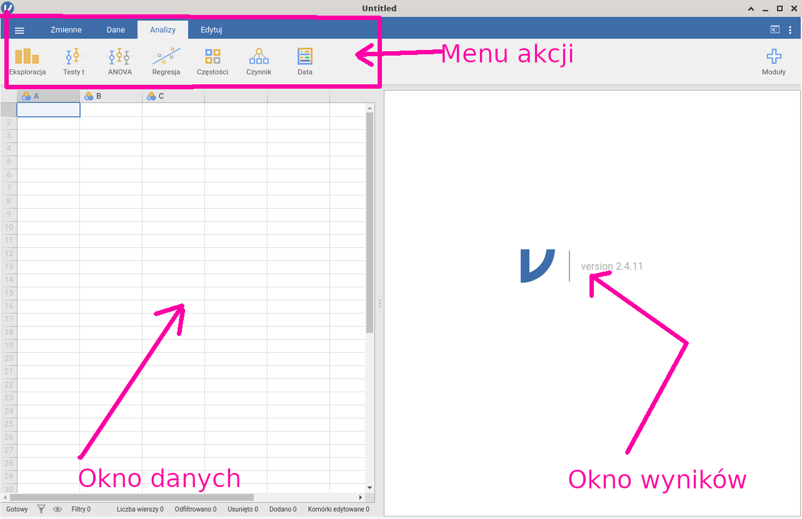
```

Menu akcji umożliwia wykonanie podstawowych akcji: 

* wczytanie danych i zapisanie danych (pierwsza pozycja menu oznaczona jako
  trzy poziome kreski);

* podgląd (w sensie skontrolowania wartości zmiennych) i modyfikację 
  danych (pozycje **Zmienne** oraz **Dane**);

* wykonanie obliczeń (pozycja **Analizy**);

* modyfikowanie raportu (pozycja **Edit**).


Typowa sesja w Jamovi:

1. Wczytanie danych z pliku o praktycznie dowolnym formacie. Jeżeli przykładowo 
   dane są wynikiem wykonania badania ankietowego z wykorzystaniem Formularzy Google'a to 
   zalecamy posługiwanie się formatem CSV.

2. Transformacja danych. Przekodowanie wartości nominalnych na rangi. Przekodowanie
   wartości liczbowych na nominalne. 
   Odwrócenie pytań odwróconych. Obliczenie sum/średnich rang dla wielu zmiennych.

3. Wykonanie obliczeń: 

   1. Analiza struktury (**Eksploracja**).
   2. Analiza zależności między zmienną liczbową a nominalną (*testy t*/**ANOVA**).
   3. Analiza zależności między zmiennymi liczbowymi: współczynnik korelacji
      liniowej/macierz korelacji (*Regresja*).
   4. Analiza zależności między zmienną liczbową a zmiennymi liczbowymi/nominalnymi:
      regresja liniowa i logistyczna (**Regresja**).
   5. Analiza zależności między zmiennymi nominalnymi: tablica wielodzielna, test
      chi-kwadrat (*Częstości*).
    
   Wykonanie obliczeń jest banalnie proste i sprowadza się do wybrania myszką odpowiednich
   zmiennych oraz procedury, która ma być wykonana. 
   Wynik obliczeń pojawia się natychmiast w **oknie wyników**. Jeżeli coś 
   nam nie wyszło, można procedurę poprawić, a poprzedni wynik usunąć z okna wynikowego.
   
4. Zapisania  danych (pozycja trzy poziome kreski). Po skończeniu pracy wynik można
   zapisać, żeby np. wysłać wykładowcy lub nie zaczynać od zera jeżeli będziemy musieli
   pracę kontynuować, bo wykładowca chciał, żebyśmy coś poprawili.
   
## Analiza ankiety satysfakcja – wiedza o paleniu – zamiar odejścia

Przykład nieco absurdalny, ale za to w zwartej postaci ilustrujący 
praktyczne sposoby transformacji danych oraz
wykorzystania wszystkich procedur omawianych w podręczniku.

### Wczytanie danych

W wyniku przeprowadzenia badania ankietowego zebrano za pomocą Formularza Google'a
dane dotyczące
satysfakcji/zamiaru odejścia oraz wiedzy nt. szkodliwości palenia tytoniu.
Wyniki wyeksportowano do arkusza kalkulacyjnego, którego początek
wygląda jak na rysunku \@ref(fig:GoogleFormsTestA):

```{r GoogleFormsTestA, out.width=jamovi.screen, fig.cap = "Fragment przykładowej ankiety"}
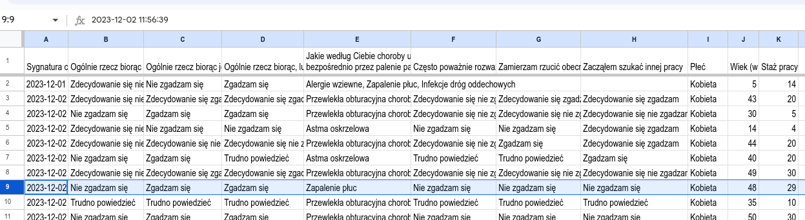
```

Ankieta składa się z 10 następujących pytań:

Ogólnie rzecz biorąc, nie lubię swojej pracy (kolumna `B`),
Ogólnie rzecz biorąc, jestem zadowolony ze swojej pracy (`C`),
Ogólnie rzecz biorąc, lubię tu pracować	(`D`),
Jakie według Ciebie choroby układu oddechowego mogą być spowodowane
  bezpośrednio przez palenie papierosów? (`E`),
Często poważnie rozważam odejście z obecnej pracy (`F`),
Zamierzam rzucić obecną pracę	(`G`),
Zacząłem szukać innej pracy (`H`),
Płeć (`I`),
Wiek (w latach) (`J`),
oraz Staż pracy (`K`).

Ponadto Formularz Google'a dodał automatycznie sygnaturę czasową
jako zawartość pierwszej kolumny (`A`).

Zmieniamy wartości w pierwszym wierszu, który powinien zawierać nazwy zmiennych.
Nazwy zmiennych powinny być jednowyrazowe i w miarę krótkie, żeby się później
można nimi wygodnie posługiwać. Jednocześnie nie powinny być za krótkie, żeby
od razu było widać, jakie dane zawiera zmienna.

Jak widać,
pytania z kolumn `B`–`D` mierzą to samo (satysfakcję),
więc zmieniamy im nazwę na bardziej zwartą `s1`, `s2` oraz `s3` (`s` od satysfakcja). 
Podobnie
ponieważ pytania z kolumn `F`–`H` też mierzą to samo (zamiar odejścia), to
też zmieniamy nazwy na coś krótszego: `zo1`, `zo2`, `zo3`. Kolumnę `E` nazywamy
`wiedza_nt_palenia` a kolumny `I`, `J` oraz `K` odpowiednio:
`plec`, `wiek` oraz `staz`.

Teraz arkusz wygląda jak na rysunku \@ref(fig:GoogleFormsTestHdr).

```{r GoogleFormsTestHdr, out.width=jamovi.screen, fig.cap = "Fragment przykładowej ankiety"}
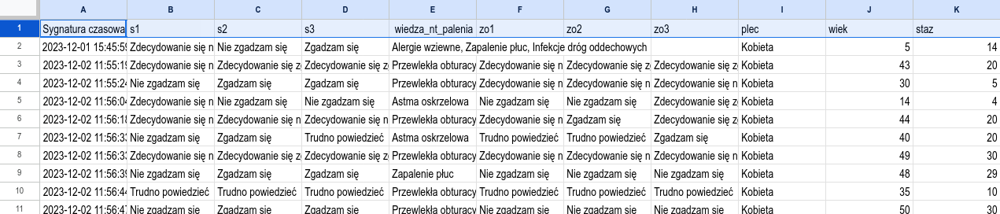
```

Arkusz eksportujemy, wybierając format CSV. Bez problemu powinniśmy
go wczytać do Jamovi (trzy poziome kreski →`Otwórz`). Jeżeli import
się powiódł, to powinniśmy zobaczyć coś podobnego do tego, co widać na rysunku \@ref(fig:dataimport).

Reasumując:

* Pytania oznaczone jako `s1`/`s2`/`s3` mierzą
  **satysfakcję z pracy**; pytania `zo1`/`zo2`/`zo3` mierzą **zamiar odejścia
  z pracy**. Pytania `s1`–`s3` oraz `zo1`–`zo3` są pytaniami jednokrotnego wyboru.
  
* Pytanie oznaczone jako `wiedza_nt_palenia` mierzy wiedzę na temat palenia tytoniu.
  Jest to przykład wykorzystania pytania z wielokrotnym wyborem.

* Pytania `plec`, `wiek`, `staz` mierzą płeć (`kobieta`/`mężczyzna`), wiek (lata ukończone)
  oraz staż pracy (lata przepracowane).
  
* Pierwsza kolumna nie jest potrzebna, ale jest dodawana przez aplikację Formularze Google.


```{r dataimport, out.width=jamovi.screen, fig.cap = "Import danych"}
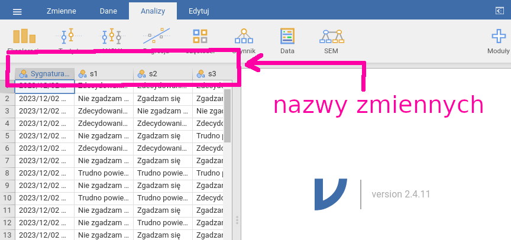
```

### Przekodowanie danych

Zwykle zawartość arkusza zawierającego wyniki ankiety wymaga przekodowania.
W naszym przykładzie należy wykonać:

* Zmienne `s1`–`s3` oraz `zo1`–`zo3` są mierzone w skali porządkowej. Wartości tych zmiennych
  chcemy zmienić (przekodować) na rangi według schematu: `Zdecydowanie się nie zgadzam` = 1;
  `Nie zgadzam się` = 2; `Trudno powiedzieć` = 3 itd.
  Dodatkowo zauważmy, że `s1` jest pytaniem odwróconym. 
  W takich pytaniach należy przeliczyć rangi według prostej formuły s1r = 6 - s1.
  
  * Miarą satysfakcji będzie suma rang s1r+s2+s3.
  * Miarą zamiaru odejścia będzie suma rang zo1+zo2+zo3.
  
* Zmienna `plec` jest mierzona w skali nominalnej. Nie musimy jest przekodowywać.

* Wartość zmiennej `wiedza_nt_palenia` należy przekodować na liczbę według schematu:
  za wybranie poprawnej odpowiedzi plus jeden punkt; za wybranie błędnej odpowiedzi 
  minus jeden punkt.
  
  * Miarą wiedzy nt. palenia będzie suma punktów uzyskanych za odpowiedzi prawidłowe
    minus suma punktów uzyskanych za odpowiedzi nieprawidłowe.
  
Uwaga: Sposób mierzenia wiedzy nt. palenia jest niepotrzebnie skomplikowany; zamiast
pytania z wielokrotnym wyborem spośród 8 możliwości/wariantów prościej jest zastosować
8 pytań Tak/Nie, po czym pytania poprawne zsumować,
pytania niepoprawne też dodać, a wartość odjąć od sumy uzyskanej dla pytań poprawnych.
My o tym wiemy, że tak jest bez sensu, ale pokazujemy jako przykład przekodowania
pytania z wielokrotnym wyborem.

* Wartości zmiennych `wiek` oraz `staz` są liczbami. Mogą być analizowane tak-jak-są
(regresja/korelacja), ale można też je przekodować na wartości nominalne
(mały-średni-duży staż) i zastosować metody z grupy zmienna--liczbowa/zmienna nominalna
(takie jak test ANOVA czy Kruskala-Wallisa).

Przekodowanie wykonujemy, wybierając **Dane** w menu głównym. 

1. Klikamy w nazwę zmiennej, którą zamierzamy przekodować. Niech to będzie `s1`. 
   Kolumna po kliknięciu zmieni kolor. 

2. Wybieramy ikonę `Przekształcenie`. Wypełniamy jak na rysunku \@ref(fig:przeksztalcenie0).

Uwaga: Jamovi nie zmieni wartości zmiennej `s1`, tylko utworzy nową zmienną
z przekodowanymi wartościami. Zmienna, na podstawie której jest tworzona
nowa zmienna, nazywa się źródłową (`s1` w naszym przykładzie jest źródłowa).

```{r przeksztalcenie0, out.width=jamovi.screen, fig.cap = "Przekształcenie"}
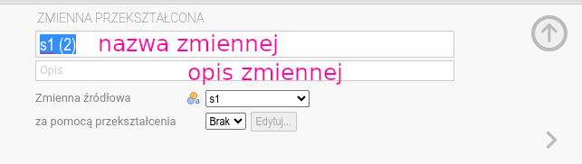
```

Wpisujemy sensowną nazwę (np. `s1p` od przekodowana). Jeśli będziemy
używać sensownych nazw, łatwiej będzie nam się pracowało. Dobrze jest
też podać w opisie, co zawiera zmienna.

Klikamy w pole wyboru na dole (obok napisu `za pomocą przekształcenia`).
Powinniśmy zobaczyć coś podobnego do tego, co widać na rysunku \@ref(fig:przeksztalcenie1).

```{r przeksztalcenie1, out.width=jamovi.screen, fig.cap = "Przekształcenie"}
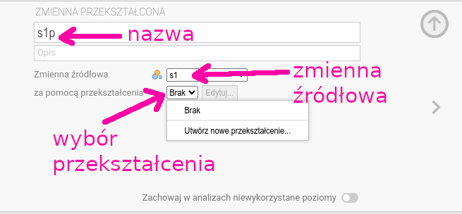
```

Wybieramy `Utwórz nowe przekształcenie`. Wpisujemy sensowną nazwę
przekształcenia (np. `Likert2R5`) oraz formułę przekształcenia:

```
IF ($source=="Zdecydowanie się nie zgadzam", 1,
 IF ($source=="Nie zgadzam się", 2,
   IF ($source=="Trudno powiedzieć", 3,
      IF ($source=="Zgadzam się", 4, 5))))
```

Formuła może wydawać się przerażająca, ale jest koncepcyjnie bardzo prosta:

```
IF (warunek, jeżeli-prawda, jeżeli-fałsz)
```

`Warunek` to fragment `$source=="Zdecydowanie się nie zgadzam"`:

* `$source` oznacza bieżącą wartość zmiennej źródłowej;

* `==` to **operator** równości; jest więcej operatorów, które można
  wybrać z menu;

* `$source=="Zdecydowanie się nie zgadzam"` oznacza, że jeżeli 
  bieżącą wartością w kolumnie źródłowej jest `Zdecydowanie się nie zgadzam`
  to wykonaj `jeżeli-prawda`; w wypadku przeciwnym wykonaj `jeżeli-fałsz`.

Część `jeżeli-prawda` to zwykle wstawienie nowej wartości; 
`jeżeli-fałsz` to często następna formuła `IF` albo wstawienie innej
nowej wartości. Przykładowo jeżeli 
bieżącą wartością w kolumnie źródłowej jest `Zdecydowanie się nie zgadzam`,
  to wstaw `1`, jeżeli nie -- to wstaw `0`:
  
```
  IF ($source=="Zdecydowanie się nie zgadzam", 1,0)
```

Ponieważ w przykładzie mamy do przekodowania nie dwie, a pięć wartości, 
musimy użyć czterech warunków, które
są zagnieżdżone jeden w drugim (por. rys. \@ref(fig:przeksztalcenie1p)).

```{r przeksztalcenie1p, out.width=jamovi.screen, fig.cap = "Przekształcenie"}
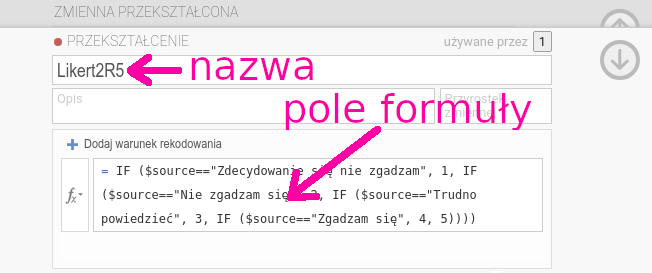
```

Naciskamy Enter i gotowe. Zostaje utworzona zmienna `s1p`
zawierająca zamiast napisów rangi.

Jeżeli uporaliśmy się z przekodowaniem `s1`,
ustawiamy kursor na `s2` w oknie danych. Naciskamy ikonę `Przekształcenie`.
Upewniamy się, że zmienną źródłową jest `s2`.
Zmieniamy nazwę nowej zmiennej na `s2p`. Klikamy
w pole wyboru przekształcenia. Poprzednio były tam tylko dwie pozycje
`Brak` oraz `Utwórz nowe przekształcenie`, teraz jest trzecia pozycja
`Likert2R5`, czyli przekształcenie, które zdefiniowaliśmy dla zmiennej `s1p`.
Wybieramy `Likert2R5`, bo zmienną `s2` chcemy przekodować dokładnie
w ten sam sposób jak `s1`. Po wybraniu przekształcenia w oknie danych
pojawia się nowa zmienna `s2p` (por. rys. \@ref(fig:przeksztalcenie3)).


```{r przeksztalcenie3, out.width=jamovi.screen, fig.cap = "Przekształcenie"}
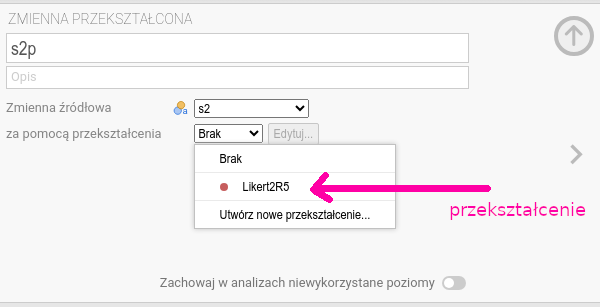
```

W podobnie łatwy sposób przekodowujemy `s3` oraz `zo1`, `zo2`, `zo3`.

**Uwaga**: polecenie `IF` wpisujemy, używając dużych liter. Słowo
`$source` wpisujemy tak jak jest to zademonstrowane (`$Source` jest błędem).

Przekodowanie pytania z możliwością wielokrotnego wyboru jest równie
proste, tyle że pisania jest więcej. Zmienna `wiedza_na_temat_palenia` może zawierać
do ośmiu następujących napisów oddzielonych średnikami:
`Przewlekła obturacyjna choroba płuc`,
`Astma oskrzelowa`,
`Alergie wziewne`,
`Gruźlica` (B),
`Zapalenie płuc` (B),
`Przewlekłe zapalenie oskrzeli`,
`Infekcje dróg oddechowych`,
`Palenie nie powoduje chorób układu oddechowego` (B).

Odpowiedzi błędne oznaczono jako (B).

W arkuszu lub oknie danych Jamovi ta zmienna wygląda jakoś tak:

```
...,Przewlekła obturacyjna choroba płuc,...
...,Przewlekła obturacyjna choroba płuc;Astma oskrzelowa;...
...,Astma oskrzelowa,
...,Astma oskrzelowa;Gruźlica;Przewlekłe zapalenie oskrzeli,...
...,Przewlekła obturacyjna choroba płuc;Astma oskrzelowa;...
```

Należy zsumować wystąpienia poprawne i wystąpienia błędne. W tym celu trzeba utworzyć tyle
nowych zmiennych, ile jest wariantów odpowiedzi, czyli w naszym przykładzie osiem. Każda
nowa zmienna jest przekodowywana za pomocą prostej formuły wykorzystującej funkcję `CONTAINS` (zawiera).
Przykładowo pierwsza (nazwijmy ją `wiedz1p`) powinna być utworzona w oparciu o następujące przekształcenie:

```
CONTAINS("Przewlekła obturacyjna choroba płuc", $source)
```

Jak to wygląda w oknie programu Jamovi, pokazano na rysunkach \@ref(fig:przeksztalcenie4)
i \@ref(fig:przeksztalcenieContains).

```{r przeksztalcenie4, out.width=jamovi.screen, fig.cap = "Przekształcenie"}
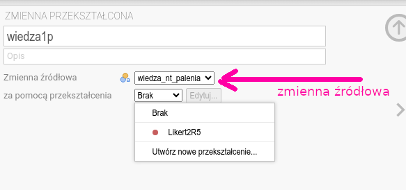
```

```{r przeksztalcenieContains, out.width=jamovi.screen, fig.cap = "Przekształcenie"}
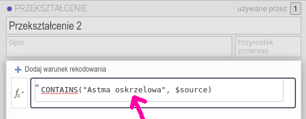
```

Funkcja CONTAINS wstawi 1, jeżeli `$source` zawiera frazę `Przewlekła obturacyjna choroba płuc`.
Oczywiście następna zmienna powinna zawierać frazę `Astma oskrzelowa`:

```
CONTAINS("Astma oskrzelowa", $source)
```
I tak dalej aż do ostatniego wariantu odpowiedzi:

```
CONTAINS('Alergie wziewne', $source)
CONTAINS('Gruźlica', $source)
CONTAINS('Zapalenie płuc', $source)
CONTAINS('Przewlekłe zapalenie oskrzeli', $source)
CONTAINS('Infekcje dróg oddechowych', $source)
CONTAINS('Palenie nie powoduje chorób układu oddechowego', $source)
```

Każda zmienna `wiedza1p`...`wiedza8p` zawiera 1, jeżeli ankietowany wskazał dany wariant lub zero jeżeli
nie wskazał.

Ostatnia sprawa to przekodowanie liczb na wartości nominalne. Przykładowo chcemy podzielić
ankietowanych na klasy stażowe: mały (do pięciu lat), średni (5–15 lat), duży (16 i więcej) staż pracy.

Wartości liczbowe stażu pracy zawiera zmienna `staz`. Aby ją przekodować
należy utworzyć nową zmienną, np. `staz.klasa` i zastosować przekształcenie:

```
IF ($source < 5, "M",
  IF ($source < 16, "S", "D"))
```

Poleceń `IF` musi być o jedno mniej niż mamy klas. Jeżeli
`staz` jest mniejszy od 5, wstawiony zostanie napis `M`, jeżeli `staz` jest mniejszy od 16,
wstawiony zostanie napis `S`, a w przeciwnym wypadku zostanie wstawiony napis `D`.

Gdyby ktoś się niepokoił, że 3 spełnia jednocześnie `$source < 5` oraz `$source < 16`,
to dodamy, że pierwszy się liczy. Przekształcenie kończy działanie po spełnieniu pierwszego warunku i nie
wykonuje dalszych porównań. Dlatego liczba 3 zostanie zamieniona na `M`, a nie na `S`.

### Wyliczenie nowych zmiennych

**Przekodowanie** to była w zasadzie zamiana sposobu mierzenia. **Wyliczenie** to utworzenie
nowej zmiennej, zwykle w oparciu o jakąś formułę matematyczną. Na przykład odwrócenie pytanie s1p
realizuje `s1pr = 6 - s1p`. Satysfakcja to suma rang z trzech pytań:
`satysfakcja =  s1pr + s2p + s3p`.

W celu wyliczenia nowych zmiennych należy wybrać Dane→Oblicz. Pojawia się okno
zmiennej wyliczonej zatytułowane `ZMIENNA WYLICZONA`.

Pierwszy pasek zawiera nazwę zmienną (domyślnie nazwę kolumny w konwencji arkusza kalkulacyjnego,
w przykładzie
jest to litera `H`). W polu definiowania zmiennej należy wpisać
stosowną formułę matematyczną. W przypadku odwracania pytania `s1p` będzie to:

```
6 - s1p
```

W przypadku liczenia łącznej satysfakcji (por. rys. \@ref(fig:zmiennaSatysfakcja)):

```
SUM(s1pr, s2p, s3p)
```

```{r zmiennaSatysfakcja, out.width=jamovi.screen, fig.cap = "Obliczanie nowej zmiennej"}
knitr::include_graphics("./jamovi_zmienna_satysfakcja_xx.png")
```

Oczywiście wcześniej musimy utworzyć zmienną `s1pr`, inaczej Jamovi zgłosi błąd.

Jeżeli nie chcemy sumy, ale np. średnią, powinniśmy użyć:

```
MEAN(s1pr, s2p, s3p)
```

Inne funkcje matematyczne są dostępne po kliknięciu w pole wyboru znajdujące się po lewej
stronie pola definiowania zmiennej.

Powiedzieliśmy, że miarą wiedzy nt. palenia będzie suma punktów uzyskanych za odpowiedzi prawidłowe minus
suma punktów uzyskanych za odpowiedzi nieprawidłowe. Odpowiedzi prawidłowe to
`w1p`, `w2p`, `w3p`, `w6p` oraz `w7p`. Odpowiedzi błędne to `w4p`, `w5p`, `w8p`. Zatem
w polu definiowania zmiennej wpisujemy:

```
SUM(w1p, w2p, w3p, w6p, w7p) - SUM(w4p, w5p, w8p)
```

Dla utrwalenia utwórzmy jeszcze zmienną `zo` mierzącą zamiar odejścia z pracy:

```
SUM(zo1, zo2, zo3)
```

Czytelnikom pozostawiamy do samodzielnego wykonania (proste) przekształcenie zmiennej liczbowej `zo`
na zmienną nominalną `zamiarO.klasa`, przyjmującą tylko dwie wartości `W` oraz `N` (co oznacza wysoki oraz
niski poziom zamiaru odejścia). Przykładowo można przyjąć wartość 12 i więcej jako *poziom wysoki*,
a mniej niż 12 jako *poziom niski*.

### Analiza struktury

Wybieramy `Analizy`→`Eksploracja`→`Statystyki opisowe`.

W wyświetlonym oknie po lewej deklarujemy, co ma być liczone. Wynik
pojawi się po prawej (por. rys. \@ref(fig:statystykiOpisoweOkno)).

```{r statystykiOpisoweOkno, out.width=jamovi.screen, fig.cap = "Statystyki opisowe"}
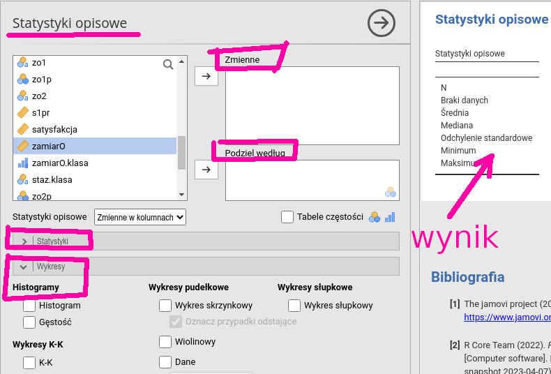
```

Ustawiamy kursor na zmiennej, która nas interesuje i klikamy w strzałkę górną.
Jeżeli chcemy podzielić wartości zmiennej na grupy według jakiejś 
zmiennej nominalnej, to ustawiamy kursor na tej zmiennej nominalnej
(np. `plec`) i klikamy strzałkę dolną.

Można analizować wiele zmiennych na raz (por. rys. \@ref(fig:statystykiSpisoweWynik)).
Wystarczy w tym celu ustawić
kursor na zmiennej i kliknąć w odpowiednią strzałkę. Zawartość okna
wynikowego zostanie automatycznie uaktualniona.

```{r statystykiSpisoweWynik, out.width=jamovi.screen, fig.cap = "Statystyki opisowe"}
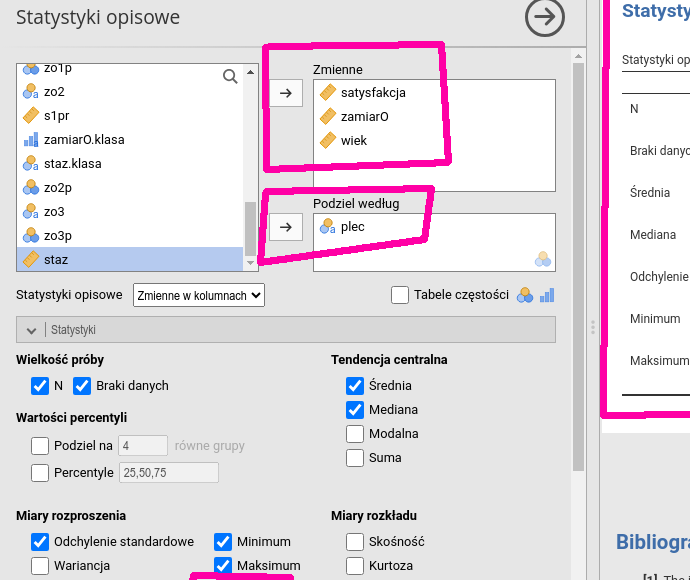
```

Poniżej okien wyboru zmiennych są zakładki określające precyzyjnie, co ma
być obliczone oraz jakie wykresy mają zostać wyrysowane.
Przykładowo domyślny wydruk nie zawiera
rozstępu ćwiartkowego. Żeby go dodać do wyniku, należy
w zakładce `Statystyki` zaznaczyć przycisk `IQR`.

### Analiza zależności: zmienne nominalne

Wybieramy `Analizy`→`Częstości`→`Próby niezależne`.

Podobnie jak w przypadku analizy struktury jest wyświetlana
lista zmiennych oraz okna i strzałki pozwalające
wygodnie wybrać to, co ma być analizowane. Jest to tak proste,
że wystarczy przyjrzeć się przykładowemu rysunkowi, żeby
wiedzieć, jak postępować. Przykładową analizę zależności
pomiędzy zmiennymi nominalnymi `zamiarOklasa` (zamiar odejścia) oraz `staz.klasa` (staż w podziale na trzy wartości)
przedstawia rysunek \@ref(fig:tabeleKrzyzowe).

```{r tabeleKrzyzowe, out.width=jamovi.screen, fig.cap = "Tabele krzyżowe"}
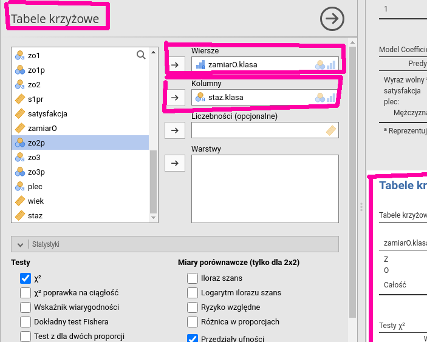
```

### Analiza zależności: zmienna liczbowa/zmienna nominalna

Jeżeli zmienna nominalna (zwana grupującą) przyjmuje dwie wartości,
wybieramy `Analizy`→`Testy t`→`Test t dla prób niezależnych`. 
Zmienne zależne to zmienne, których wartości zostaną podzielone na grupy.
Ustawiamy kursor kolejno na zmiennej, która nas interesuje i klikamy w strzałkę górną.
Ustawiamy kursor na zmiennej grupującej 
(np. `plec`) i klikamy strzałkę dolną (por. rys. \@ref(fig:testyJamovi)).

Zaznaczamy przyciski `Test Welcha`, `U Manna-Whitneya` (w sekcji **Testy**) oraz `Test normalności`
(w sekcji **Weryfikacja założeń**).

Jeżeli zmienna nominalna (grupująca) przyjmuje więcej niż dwie wartości,
wybieramy `Analizy`→​`ANOVA`→​`Jednoczynnikowa ANOVA`. Zmienne zależne
i grupujące wybieramy w identyczny sposób jak w przypadku testu Welcha (por. rys. \@ref(fig:anovaJamovi)).
Zaznaczamy przyciski `Nie zakładaj równości (test Welcha)` (w sekcji **Wariancje**) oraz `Test normalności`
(w sekcji **Weryfikacja założeń**) i `Tabela statystyk opisowych` (w sekcji **Dodatkowe statystyki**).

Jeżeli wynik testu Shapiro-Wilka wskaże, że rozkład zmiennej zależnej nie jest normalny, należy
wykonać test Kruskala-Wallisa, wybierając `Jednoczynnikowa ANOVA Test Kruskala-Wallisa`.


```{r testyJamovi, out.width=jamovi.screen, fig.cap = "Test dla prób niezależnych"}
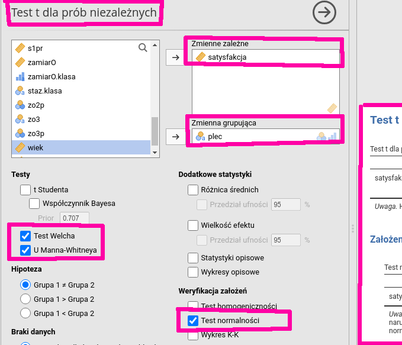
```

```{r anovaJamovi, out.width=jamovi.screen, fig.cap = "Jednoczynnikowa ANOVA"}
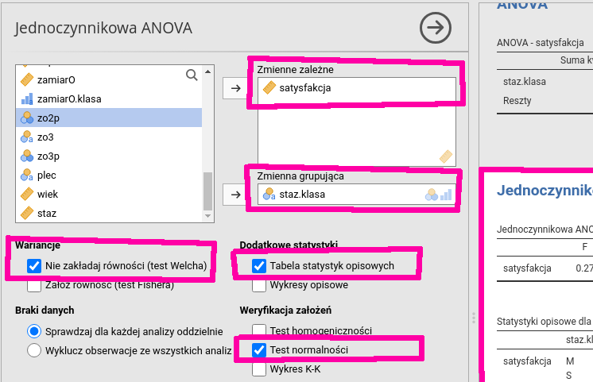
```


### Analiza zależności: zmienna liczbowa/zmienna liczbowa lub nominalna
 
Wybieramy `Analizy`→`Regresja`→`Regresja liniowa`.

Interfejs jest podobny do poprzednio opisywanych. Wybieramy
zmienną zależną (musi oczywiście być liczbowa), klikając w górną strzałkę. 
Zmienne niezależne mierzone w skali liczbowej
wybieramy, klikając w środkową strzałkę, a zmienne niezależne mierzone
w skali nominalnej -- w dolną strzałkę.
Wynik automatycznie pojawia się w lewym oknie (por. rys. \@ref(fig:regresjaLiniowa)).

```{r regresjaLiniowa, out.width=jamovi.screen, fig.cap = "Regresja liniowa"}
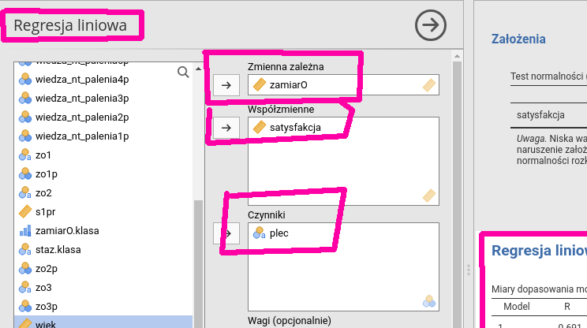
```

### Regresja logistyczna

Wybieramy  `Analizy`→`Regresja`→`Regresja logistyczna`→`Dwie wartości`.

Interfejs jest łudząco podobny do analizy regresji. Wybieramy
zmienną zależną, klikając w górną strzałkę. Zmienna ta
**musi** być zmienną dwuwartościową.

Zmienne niezależne mierzone w skali liczbowej
wybieramy, klikając w środkową strzałkę, a zmienne niezależne mierzone
w skali nominalnej, klikając w dolną strzałkę.

### Redagowanie raportu

Zwykle dobrze jest dodać jakieś dodatkowe objaśnienia do wyników
obliczeń wygenerowanych 
przez program i Jamovi nam to umożliwia.
Wybierając `Edytuj`, przechodzimy do prostego edytora umożliwiającego redagowanie raportu
w oknie wyników, a obsługa tego menu jest tak banalnie prosta, że nie wymaga 
specjalnych objaśnień.

