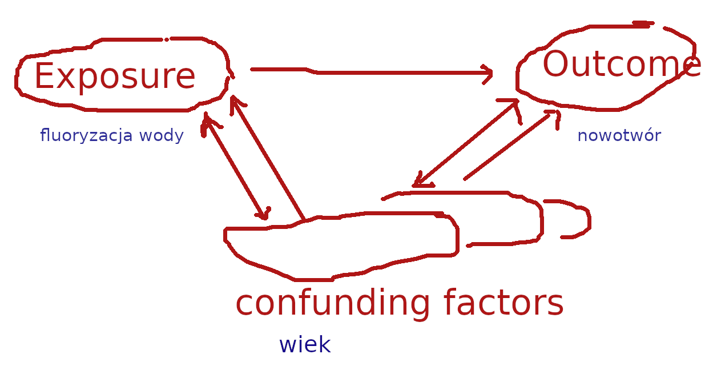

## Wprowadzenie

Impresje nt po zredagowaniu ksiązki pn Podstawy statystyki
(https://hrpunio.github.io/SMI_Bookdown/wstęp.html)

## Usuń `selnolig.sty` 

Bookdown dołącza `selnolig.sty` co powoduje że emdash/endash nie są
poprawnie drukowane. Ni cholery nie wiem po co ten pakiet jest dołączany
i co gorsza jak to wyłączyć. Radzę sobie w ten sposób, że w katalogu
z projektem umieszczam pusty plik `selnolig.sty`. Działa ale rozwiązanie
takie sobie...


## Co dodałem do preamble.tex


```
% B5 format
\usepackage[a4paper, total={125mm, 200mm}]{geometry}
```

```
\usepackage{polyglossia}  \setdefaultlanguage{polish}
```

Paginy górne. Problem stanowił spis treści, stąd potrzebny by `\ifnum\value{chapter}`.

```
\usepackage{fancyhdr}
\renewcommand{\chaptermark}[1]{ \markboth{#1}{} }
\renewcommand{\sectionmark}[1]{ \markright{#1}{} }
\renewcommand{\headrulewidth}{0.4pt}
\fancyhf{}
\fancyhead[LE,RO]{{\sffamily\fontsize{8.8}{11}\selectfont \thepage}}
%% \ifnum\value{chapter} ... \fi = remove chapter number from TOC (because it is zero)
\fancyhead[RE]{{\sffamily\fontsize{8.8}{11}\selectfont \nouppercase{\ifnum\value{chapter}=0\else\thechapter.\space\fi\leftmark}}}
\fancyhead[LO]{{\sffamily\fontsize{8.8}{11}\selectfont \nouppercase{\ifnum\value{chapter}=0\else\thesection.\space\fi\rightmark}}}
\pagestyle{fancy}
```

`Cambria` jako krój główny. Paginy górne bezszeryfowym wąskim `Roboto`:

```
\usepackage{fontspec}
\setmainfont[Ligatures=TeX]{Cambria}
%\setmainfont{Cambria}
\setmathfont{Cambria Math}
%% Sans for running-headers:
%%Dejavu Sans
%%\setsansfont{Dejavu Sans Condensed}
\setsansfont{Roboto Condensed}
```
Otoczenie `example`:

```
\usepackage[most]{tcolorbox}
\newtcolorbox{TPexample}[1][]{%
    colback=white,
    colframe=blue!50!black,
    %%boxsep=0pt,
    left=3pt,right=3pt, top=2pt, bottom=2pt,
    notitle,
    %%sharp corners,
    enhanced,
    breakable,
}
\newenvironment{example}{\begin{TPexample}%
\setlength{\abovedisplayskip}{0pt plus 3pt}%
\parskip1ex}{\end{TPexample}}
```

Przedefiniowanie LaTeXa. Zapewne można w bardziej elegancki sposób,
a ja robię to na-chama. Generalnie nic wielkiego -- zmniejszenie świateł/odstępów
i stopni pisma:

```
\makeatletter %% UWAGA zaczynam makeatletter!!!
\def\maxwidth{\ifdim\Gin@nat@width>\linewidth\linewidth\else\Gin@nat@width\fi}
\def\maxheight{\ifdim\Gin@nat@height>\textheight\textheight\else\Gin@nat@height\fi}
\renewcommand\section{\@startsection {section}{1}{\z@}%
                                   {-3.5ex \@plus -1ex \@minus -.2ex}%
                                   {2.3ex \@plus.2ex}%
                                   {\raggedright \normalfont\Large\bfseries}}
\renewcommand\subsection{\@startsection{subsection}{2}{\z@}%
                                     {-3.25ex\@plus -1ex \@minus -.2ex}%
                                     {1.5ex \@plus .2ex}%
                                     {\raggedright \normalfont\large\bfseries}}
\def\@makechapterhead#1{%
  %%\vspace*{50\p@}%
  {\parindent \z@ \raggedright \normalfont
    \ifnum \c@secnumdepth >\m@ne
      \if@mainmatter
        \large\bfseries \@chapapp\space \thechapter
        \par\nobreak
        %\vskip 5\p@
        %\medskip
      \fi
    \fi
    \interlinepenalty\@M
    \LARGE \bfseries #1\par\nobreak
    \vskip 20\p@
  }}
\def\@schapter#1{\if@twocolumn
                   \@topnewpage[\@makeschapterhead{#1}]%
                 \else
                   \@makeschapterhead{#1}%
                   \@afterheading
                 \fi}
\def\@makeschapterhead#1{%
  %%\vspace*{50\p@}%
  {\parindent \z@ \raggedright
    \normalfont
    \interlinepenalty\@M
    \huge \bfseries  #1\par\nobreak
    \vskip 20\p@
  }}
%
\renewcommand\tableofcontents{%
    \if@twocolumn
      \@restonecoltrue\onecolumn
    \else
      \@restonecolfalse
    \fi
    \chapter*{\contentsname
        \@mkboth{\contentsname}{\contentsname}}%
    \@starttoc{toc}%
    \if@restonecol\twocolumn\fi
    }
%% default latex figure options
```

Domyślne opcje otoczenia `figure` (lepiej wstawia rysunki). Dla `table`
tego nie robię bo nie wstawiam tabel wewnątrz `table`:


```
\renewcommand*{\fps@figure}{!htb}
```

Wcięcie akapitowe i odstęp między akapitami


```
\setlength\parskip{0\p@ \@plus \p@}
\setlength\parindent{15\p@}
```
Ekstra odstępy przed/po otoczeniach `tabular`/`verbatim`. Ponieważ
odstęp międzyakapitowy jest ustawiony na zero trzeba dodać światło
w ten sposób. (Ja wstawiam tablice bezpośrednio a nie wewnątrz
otoczenia table.)

```
\RequirePackage{etoolbox}
\AtBeginEnvironment{tabular}{\medskip}
\AfterEndEnvironment{tabular}{\par\medskip}
\AtBeginEnvironment{verbatim}{\medskip}
\AfterEndEnvironment{verbatim}{\par\medskip}
```

Usuń numer strony na stronie tytułowej rozdziału

```
%% remove pagenumber at chapter title page
\renewcommand\ps@plain{\let\@mkboth\@gobbletwo
     \let\@oddhead\@empty
     \def\@oddfoot{\reset@font\hfil}
     \let\@evenhead\@empty\let\@evenfoot\@oddfoot}
%
\makeatother %%% UWAGA: kończę makeatletter
```
Wstawienie strony tytułowej

```
\AtBeginDocument{%%
 \let\maketitle\relax
  %% Insert title page
 \begin{titlepage}
 \begingroup  
 %% reset
 \setkeys{Gin}{width=210mm,height=300mm}
\vbox to \textheight{\vss%
   \hbox to\textwidth{\hss
     \includegraphics[width=210mm]{Cover_03.png}\hss}
   \vss}
\vbox to \textheight{%
  \vskip20mm
  \noindent
   Na okładce: Statystyki zdrowia armii brytyjskiej z okresu wojny krymskiej\\
   Notes on matters affecting the health, efficiency,\\
   and hospital administration of the British Army\\
   by Nightingale, Florence, 1820-1910\\
   \url{https://archive.org/details/b20387118/}
   \vskip20mm
   \noindent
   Książka została zredagowana w formacie Rmarkdown/bookdown
.

   \vskip20mm
   \noindent
   Kolorowa wersja podręcznika znajduje się pod adresem:\\
   \url{https://hrpunio.github.io/SMI_Bookdown/wstęp.html}

  \vss
}
\endgroup
\end{titlepage}
\author{Tomasz Przechlewski\\ Powiślańska Szkoła Wyższa\\(Kwidzyn-Gdańsk)}%
}
```
Wstawianie dziwnych znaków (z innego fontu, gdyby były w Cambrii nie byłoby 
trzeba takich wygibasów):

```
\font\ArrowsAndBoxesFont="NotoSansTC-Regular" at 10pt
\def\ArrowOrBox#1{{\ArrowsAndBoxesFont #1}}
\edef\bbChar{□}
\edef\bbCharX{☒}
\edef\bbArrowR{→}

\catcode`☒=\active
\catcode`□=\active
\catcode`→=\active
\def☒{\ArrowOrBox{\bbCharX}} %% bb with X
\def□{\ArrowOrBox{\bbChar}} %% ballot box
\def→{\ArrowOrBox{\bbArrowR}} %% right arrow
```

Światła wokół równań matematycznych:

```
%%% Excessive skip
\setlength{\abovedisplayskip}{6pt plus 6pt}
\setlength{\belowdisplayskip}{6pt plus 6pt}
\setlength{\abovedisplayshortskip}{0pt plus 3pt}
\setlength{\belowdisplayshortskip}{0pt plus 3pt}
```

## Konfiguracja R

W pliku `index.Rmd` dodać `options(OutDec = ",")` co spowoduje, że na wydruku
zamiast kropki (dziesiętnej) będzie przecinek

````markdown
`r ''````{r setup, include=FALSE}
knitr::opts_chunk$set(echo = F, warning = F )
## This does not work in inline formulas
options(OutDec = ",")
```
````

Uwaga: drukując cokolwiek nie należy używać `sprintf`. Do drukowania
z ustaloną liczbą cyfr po przecinku należy używać `round`.

Wstawiając rysunki za pomocą `knitr::include_graphics` zawsze dodaj `out.width`

````markdown
`r ''````{r fluor, out.width="99%", fig.cap = "Fluoryzacja, wiek a nowotwór"}

```
````

bo inaczej bookdown coś tam wyliczy i wstawi wynik z przecinkiem
zamiast kropki,
a luaLaTeX się na tym wywali.

